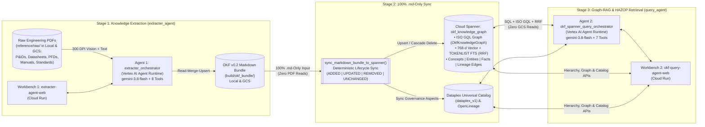

# Engineering OKF Knowledge Graph & Multi-Agent Platform (`extracter_agent` & `query_agent`)

An end-to-end **Engineering Knowledge Extraction, Cloud Spanner Graph-RAG Retrieval, and Data Lineage Platform** built with the official **Google Agent Development Kit (`google-adk`)** and powered by **`gemini-3.8-flash`** (`GEMINI_LOCATION=global`).

### What Does This Platform Do?
In complex industrial and process plants, critical engineering data is scattered across unstructured PDFs—**Piping & Instrumentation Diagrams (P&IDs)**, **Process Data Sheets**, **Process Flow Diagrams (PFDs)**, **Operating & Inspection Manuals**, and **Engineering Standards (HAZOP / Risk Assessment Matrices / SDS)**—often spanning multiple drawing sheets and competing revisions. This platform turns those raw PDFs into an interactive **Cloud Spanner Knowledge Graph** in **three stages**:

1. **Extract & Reconcile (`Agent 1: extracter_agent`):** Reads raw engineering PDFs (using 300 DPI multimodal vision with 3x2 high-resolution drawing tiling + native text parsing) and compiles them into a structured, cross-linked **Open Knowledge Format (OKF v0.2) Markdown (`.md`)** knowledge base—automatically superseding old revisions while flagging genuine cross-document discrepancies with `⚠️ CONFLICT`.
2. **Deterministic Spanner & Catalog Sync (`sync_markdown_bundle_to_spanner`):** Synchronizes the compiled `.md` files (`ADDED`, `UPDATED`, `REMOVED`, `UNCHANGED`) directly into **Google Cloud Spanner** (`OkfKnowledgeGraph` Property Graph + 768-d Vector Search + Full-Text Search) and **Google Cloud Dataplex Universal Catalog** with **zero raw PDF reads and zero LLM calls**.
3. **Graph-RAG, Lineage & HAZOP Retrieval (`Agent 2: query_agent`):** Answers engineering parameter lookups, multi-hop P&ID equipment connectivity traversals (ISO GQL), PDF provenance & conflict audits, and 5-stage HAZOP safety assessments **100% from Cloud Spanner**.

---

## ⚡ Quick Links: All Agents & Live Web Workbenches

| Component | Role | ADK Agent Runtime (`agent_runtime`) | Live Cloud Run Web UI (`cloud_run`) | Package Docs |
| :--- | :--- | :--- | :--- | :--- |
| **Agent 1: OKF Extracter Agent** | Extracts raw PDFs (`reference/raw/`) into cross-linked OKF v0.2 `.md` files with Read-Merge-Upsert & `⚠️ CONFLICT` detection | **`extracter_orchestrator`**<br>`reasoningEngines/YOUR_EXTRACTER_ENGINE_ID`<br>Model: `gemini-3.8-flash` (8 Tools) | **`extracter-agent-web`**<br>3-Pane PDF + Markdown + Extraction Chat Workbench | [`extracter_agent/README.md`](./extracter_agent/README.md) |
| **Bridge: `.md`-to-Spanner Sync** | Deterministic 100% `.md`-only lifecycle sync (`ADDED`, `UPDATED`, `REMOVED`, `UNCHANGED`) into Cloud Spanner & Dataplex | Deterministic Python Engine (`sync_markdown_bundle_to_spanner`) | Triggered via CLI (`scripts/`) or **🔄 Sync Dataplex** button in Query Workbench | [`query_agent/spanner/repository.py`](./query_agent/spanner/repository.py) |
| **Agent 2: Spanner Graph-RAG Query Agent** | 100% Cloud Spanner retrieval: ISO GQL Graph traversal, 768-d Vector + FTS (RRF), 5-Stage HAZOP, and Dataplex Catalog | **`okf_spanner_query_orchestrator`**<br>`reasoningEngines/YOUR_QUERY_ENGINE_ID`<br>Model: `gemini-3.8-flash` (7 Tools) | **`okf-query-agent-web`**<br>3-Pane Equipment Tree + Interactive Graph & Catalog + Multi-Turn ADK Chat | [`query_agent/README.md`](./query_agent/README.md) |

---

## 📑 Table of Contents
1. [High-Level Architecture & Data Flow](#-1-high-level-architecture--data-flow)
2. [Context of All Agents & How They Work Together](#-2-context-of-all-agents--how-they-work-together)
   - [Agent 1: OKF Extracter Agent (`extracter_agent`)](#21-agent-1-okf-extracter-agent-extracter_agent)
   - [Bridge: Consolidated 100% `.md`-Only Spanner Sync (`sync_markdown_bundle_to_spanner`)](#22-bridge-consolidated-100-md-only-spanner-sync-sync_markdown_bundle_to_spanner)
   - [Agent 2: OKF Spanner Graph-RAG Query Agent (`query_agent`)](#23-agent-2-okf-spanner-graph-rag-query-agent-query_agent)
3. [Step-by-Step Guide: How to Sync Data, Extract, Ingest & Query](#-3-step-by-step-guide-how-to-sync-data-extract-ingest--query)
   - [Step 1: Prepare & Sync Source PDFs (`reference/raw/` in Local & GCS)](#step-1-prepare--sync-source-pdfs-referenceraw-in-local--gcs)
   - [Step 2: Extract Raw PDFs into OKF v0.2 Markdown (`extracter_agent` & Workbench 1)](#step-2-extract-raw-pdfs-into-okf-v02-markdown-extracter_agent--workbench-1)
   - [Step 3: Ingest & Sync `.md` Bundle into Cloud Spanner & Dataplex Catalog](#step-3-ingest--sync-md-bundle-into-cloud-spanner--dataplex-catalog)
   - [Step 4: Query the Knowledge Graph, Lineage & HAZOP (`query_agent` & Workbench 2)](#step-4-query-the-knowledge-graph-lineage--hazop-query_agent--workbench-2)
4. [How to Configure, Run Locally & Deploy (`deploy.sh`)](#-4-how-to-configure-run-locally--deploy-deploysh)
   - [Unified `.env` Configuration](#41-unified-env-configuration)
   - [Deploying All or Individual Components (`./deploy.sh`)](#42-deploying-all-or-individual-components-deploysh)
   - [Running Both Workbenches Locally](#43-running-both-workbenches-locally)
5. [Testing & Live Evaluation Benchmarks](#-5-testing--live-evaluation-benchmarks)
6. [Repository Structure & Specification Links](#-6-repository-structure--specification-links)

---

## 🏗️ 1. High-Level Architecture & Data Flow



### Key Architectural Principles
- **Strict Separation of Write vs. Read Responsibilities:**
  - **`extracter_agent` (Write / Synthesis):** Handles compute-intensive 300 DPI multimodal PDF reading (including 7-image multi-scale 3x2 regional tiling on landscape CAD drawings) and cross-document reconciliation into human-readable `.md` files.
  - **`sync_markdown_bundle_to_spanner` (Deterministic Projection):** Because every extracted parameter, stream connection (`entity_metadata.connections`), instrument loop (`entity_metadata.instruments`), `⚠️ CONFLICT`, and source PDF citation (`doc_code`, `revision`, `gcs_uri`) is structured in the `.md` frontmatter and tables, syncing to Cloud Spanner requires **zero raw PDF access and zero LLM calls**.
  - **`query_agent` (Low-Latency Read / Graph-RAG):** Queries **100% Cloud Spanner and Dataplex** at runtime (zero GCS or PDF file reads during user queries).
- **Global Gemini Routing + Regional Data Residency:**
  - Both agents invoke **`gemini-3.8-flash`** via the Vertex AI global endpoint (`GEMINI_LOCATION=global`), while all data stores (Cloud Spanner, GCS, Dataplex Catalog), Agent Runtimes, and Cloud Run services reside in **`asia-southeast1`**.

---

## 🤖 2. Context of All Agents & How They Work Together

### 2.1 Agent 1: OKF Extracter Agent (`extracter_agent`)
- **What it is:** An autonomous ADK agent (`extracter_orchestrator`) that transforms raw engineering PDFs into structured **OKF v0.2 Markdown (`.md`)** concept files (`equipment/`, `instruments/`, `hazards/`, `units/`, `procedures/`, `troubleshooting/`, `hazop/`, `parameters/`, `sources/`).
- **Two Extraction Modes:**
  1. **Mode A — By-Equipment / Concept ID (`Entity-Centric`):** Ask for an equipment tag (e.g., `F-33`, `RH-E-9A`, `SI-P-6A`) or domain concept (`hazop/risk-assessment-matrix`). The agent discovers all relevant PDFs across `data_sheets/`, `pid/`, `pfd/`, `operating_manuals/`, and `standards/`, reconciles them, and writes the `.md` concept.
  2. **Mode B — By-PDF File-by-File (`Document-Centric`):** Feed raw PDFs one at a time (e.g., `pid/ML101620329-part-1.pdf`). For each PDF, the agent incrementally creates or enriches (`Read-Merge-Upsert`) every equipment, instrument, or governance concept found in that PDF without losing data extracted from earlier sheets.
- **How It Handles Revisions vs. Conflicts:**
  - **Newer Revision of the Same Document (`Rev Z0` $\rightarrow$ `Rev Z1`):** Updates the parameter value in-place (**no conflict warning**) and updates the source citation to `Rev Z1`.
  - **Same Parameter Across Continuation Sheets of One Package:** Deduplicates identical values and suppresses false conflicts on sheet-specific `Drawing Number` metadata.
  - **Disagreement Across Different Active Documents (e.g., Datasheet vs. P&ID):** Preserves **both values** side-by-side in the table and adds an explicit `⚠️ CONFLICT` callout citing both PDFs.
- **8 Registered ADK `FunctionTools` (`extracter_agent/tools/`):**

| Tool Name | Purpose |
| :--- | :--- |
| `find_raw_documents_tool` | Searches `reference/raw/` (local or GCS) by equipment tag, drawing number, or keyword. |
| `process_raw_pdf_tool` | Extracts native text + adaptive 300 DPI Gemini vision windows (`7` multi-scale 3x2 images per landscape P&ID sheet). |
| `inspect_existing_okf_concept_tool` | Reads existing `.md` concepts or lists concepts citing a specific PDF before incremental merging. |
| `generate_equipment_okf_tool` | Synthesizes or merges (`merge_existing=True`) `equipment/<TAG>.md` with structured Spanner Graph connectivity and conflict detection. |
| `generate_okf_concept_tool` | Synthesizes or merges (`merge_markdown_bodies`) non-equipment `.md` files (`hazop/`, `standards/`, `procedures/`, `instruments/`, `sources/`). |
| `build_okf_indexes_and_validate_tool` | Builds category `index.md` files, the root Master Plant Catalog `index.md`, and `log.md`, and validates the bundle. |
| `validate_okf_bundle_tool` | Verifies YAML frontmatter, footnote citations, trust tiers, and zero broken internal links. |
| `export_bundle_to_gcs_tool` | Parallel (`16`-worker) MD5-verified upload of `.md` files to Google Cloud Storage. |

---

### 2.2 Bridge: Consolidated 100% `.md`-Only Spanner Sync (`sync_markdown_bundle_to_spanner`)
- **What it is:** A single deterministic function ([`sync_markdown_bundle_to_spanner`](./query_agent/spanner/repository.py)) that keeps Cloud Spanner (`okf_knowledge_graph`) and Dataplex Universal Catalog in exact sync with the `.md` bundle directory.
- **How It Handles `.md` File Changes (`ADDED`, `UPDATED`, `REMOVED`, `UNCHANGED`):**

| `.md` File State | How It Is Detected | What Happens in Cloud Spanner (`okf_knowledge_graph`) |
| :--- | :--- | :--- |
| **`ADDED`** | `concept_id` is not in Spanner `OkfConcepts` | Parses YAML frontmatter (`title`, `description`, `unit`, `sources`, `entity_metadata.connections`), H2 chunks, entities, table facts, `⚠️ CONFLICT` rows, process/instrument edges, and PDF lineage; generates 768-d `text-embedding-005` vectors; upserts into all 9 Spanner tables. |
| **`UPDATED`** | `concept_id` exists in Spanner with `new_md5 != existing_md5` | Atomically deletes stale child chunks, facts, and edges for that concept (`delete_concepts_cascade`), then re-parses, re-embeds, and upserts the updated `.md` file. |
| **`REMOVED`** | `.md` file was deleted from the bundle (`FULL_MIRROR` mode) | Atomically cascade-deletes the concept and all its edges, chunks, facts, entities, and orphaned source documents in reverse Property Graph dependency order. |
| **`UNCHANGED`** | `new_md5 == existing_md5` | **Skipped in `< 1ms`** (zero embedding API calls, zero Spanner writes). |

---

### 2.3 Agent 2: OKF Spanner Graph-RAG Query Agent (`query_agent`)
- **What it is:** An independent ADK agent (`okf_spanner_query_orchestrator`) that answers engineering, connectivity, provenance, conflict, and process safety questions **100% from Cloud Spanner (`okf_knowledge_graph`) and Dataplex Universal Catalog**.
- **Why Cloud Spanner (Graph + Vector + Full-Text in One Database):**
  - **Spanner Property Graph (`ISO GQL`):** Traverses multi-hop upstream/downstream process lines (`CONNECTS_TO`), instrument trip loops (`MONITORS_OR_TRIPS`), and claim-to-PDF lineage (`DERIVED_FROM`).
  - **Hybrid RRF Search (`768-d Vector` + `TOKENLIST FTS`):** Combines semantic understanding (`COSINE_DISTANCE` with `text-embedding-005`) and exact alphanumeric tag matching (`SEARCH` / `SEARCH_SUBSTRING`) via Reciprocal Rank Fusion ($k=60$).
- **7 Registered ADK `FunctionTools` (`query_agent/tools/spanner_rag_tools.py`):**

| Tool Name | When the Agent Uses It |
| :--- | :--- |
| `lookup_entity_and_parameters` | Exact equipment tag (`F-33`, `RH-E-9A`), instrument tag (`PDIS-2622`), or parameter table lookups in Spanner SQL. |
| `hybrid_search_okf_spanner` | Conceptual, operating procedure, inspection manual, or hazard search using Vector + FTS Reciprocal Rank Fusion. |
| `traverse_equipment_connectivity_graph` | Multi-hop (`1..4` hops) upstream/downstream process stream and instrument loop traversal via Spanner Graph ISO GQL. |
| `trace_data_lineage_and_conflicts` | **Backward Provenance** (`Equipment/Parameter -> Source PDFs & ⚠️ CONFLICTS`) or **Forward Blast Radius** (`PDF Code -> All Impacted Concepts & Parameters`). |
| `execute_multistage_risk_and_hazop_query` | **5-Stage HAZOP & Risk Assessment Engine:** Synthesizes (1) Risk Matrix rules, (2) HAZOP scenarios, (3) Upstream causes via GQL, (4) Downstream consequences via GQL, and (5) SIS/relief safeguards + conflict alerts. |
| `read_full_okf_concept_from_spanner` | Reads the complete `.md` document and YAML frontmatter directly from Spanner `OkfConcepts` (zero GCS reads). |
| `sync_or_inspect_knowledge_catalog` | Inspects or syncs live governance aspects in **Google Cloud Dataplex Universal Catalog (`dataplex_v1`)** and **OpenLineage**. |

---

## 🛠️ 3. Step-by-Step Guide: How to Sync Data, Extract, Ingest & Query

### Step 1: Prepare & Sync Source PDFs (`reference/raw/` in Local & GCS)

All raw engineering PDF documents are organized under **5 canonical category folders** inside [`reference/raw/`](./reference/raw/README.md) (both locally and in Google Cloud Storage):

| Canonical Subfolder | What PDFs to Put Here | Included Reference Files in Git | Folder Guide |
| :--- | :--- | :--- | :--- |
| [`reference/raw/data_sheets/`](./reference/raw/data_sheets/README.md) | Process Data Sheets, Mechanical Vessel/Exchanger/Pump Data Sheets, Control Valve & Relief Valve (PSV) Sizing Packages | *(Add your equipment data sheets here)* | [`data_sheets/README.md`](./reference/raw/data_sheets/README.md) |
| [`reference/raw/pid/`](./reference/raw/pid/README.md) | Piping & Instrumentation Diagrams (P&IDs) — single-sheet or multi-sheet CAD/scanned drawing packages | `ML101620329-part-1.pdf` .. `ML101620329-part-8.pdf` (Seabrook Station LR P&IDs) | [`pid/README.md`](./reference/raw/pid/README.md) |
| [`reference/raw/pfd/`](./reference/raw/pfd/README.md) | Process Flow Diagrams (PFDs), Heat & Material Balance (H&MB) tables, and Material Selection Diagrams | *(Add your PFDs & H&MB sheets here)* | [`pfd/README.md`](./reference/raw/pfd/README.md) |
| [`reference/raw/operating_manuals/`](./reference/raw/operating_manuals/README.md) | Plant Operating Manuals, Equipment Inspection & Maintenance Manuals, Startup/Shutdown SOPs | `Inspection_Manual_for_Heat_Exchangers_1.pdf` | [`operating_manuals/README.md`](./reference/raw/operating_manuals/README.md) |
| [`reference/raw/standards/`](./reference/raw/standards/README.md) | Engineering Design Standards, HAZOP Guides, Risk Assessment Matrices (RAM), SIS Interlock Registers, Safety Data Sheets (SDS) | `HAZOP_Training_Guide.pdf`, `Risk_Assessment_Matrix.pdf` | [`standards/README.md`](./reference/raw/standards/README.md) |

#### A. Putting Source PDFs in Local (`reference/raw/<subfolder>/`)
Copy your `.pdf` files into the matching category folder under `reference/raw/`:
```bash
cp /path/to/your_datasheet.pdf        reference/raw/data_sheets/
cp /path/to/your_pid_drawing.pdf      reference/raw/pid/
cp /path/to/your_pfd.pdf              reference/raw/pfd/
cp /path/to/your_operating_manual.pdf reference/raw/operating_manuals/
cp /path/to/your_standard_or_sds.pdf  reference/raw/standards/
```
- `REFERENCE_RAW_DIR=reference/raw` (default in `.env`) points `extracter_agent` to this directory.
- Set `USE_GCS_STORAGE=false` in `.env` if you want `extracter_agent` to read strictly from your local disk, or leave `USE_GCS_STORAGE=true` to use GCS with automatic local fallback.

#### B. Syncing Source PDFs to Google Cloud Storage (`gs://$DESTINATION_GCS_BUCKET/reference/raw/`)
When running on **Vertex AI Agent Runtime (`agent_runtime`)** and **Google Cloud Run (`cloud_run`)**, `extracter_agent` discovers and streams raw PDFs from `gs://${DESTINATION_GCS_BUCKET}/${SOURCE_GCS_RAW_PREFIX}/<subfolder>/<filename>.pdf`:

```bash
source .env

# Option 1: Sync your entire local reference/raw/ tree (all 5 subfolders) to GCS
gcloud storage rsync reference/raw \
  "gs://${DESTINATION_GCS_BUCKET}/${SOURCE_GCS_RAW_PREFIX:-reference/raw}" \
  --project="${GOOGLE_CLOUD_PROJECT}" \
  --recursive \
  --exclude='(^|.*/)README\.md$'

# Option 2: Or upload a single PDF directly to a specific GCS subfolder
gcloud storage cp /path/to/your_pid_drawing.pdf \
  "gs://${DESTINATION_GCS_BUCKET}/${SOURCE_GCS_RAW_PREFIX:-reference/raw}/pid/"

# Option 3: Or run deploy.sh --target infra (creates bucket/Spanner if needed + syncs reference/raw/)
./deploy.sh --target infra

# Verify uploaded PDFs in GCS:
gcloud storage ls -r "gs://${DESTINATION_GCS_BUCKET}/${SOURCE_GCS_RAW_PREFIX:-reference/raw}/**.pdf"
```

---

### Step 2: Extract Raw PDFs into OKF v0.2 Markdown (`extracter_agent` & Workbench 1)

You can trigger knowledge extraction from raw PDFs into structured OKF v0.2 `.md` files via the **Web UI**, **REST API**, or **CLI**:

#### Option A — Extract via Workbench 1 UI (`extracter-agent-web`)
1. Open **`extracter-agent-web`** (Cloud Run URL or local `http://localhost:8080`).
2. **Left Pane (Explorer):** Filter between `All`, `Raw PDFs`, `Extracted MD`, and `⚠️ Conflicts`.
3. **Right Pane (Extraction Workbench):**
   - Click the **`⚡`** button next to any raw PDF (e.g., `pid/ML101620329-part-1.pdf`, `pid/ML101620329-part-2.pdf`, `standards/HAZOP_Training_Guide.pdf`, `standards/Risk_Assessment_Matrix.pdf`) or select a target from the dropdown to run live ADK extraction (`extracter_orchestrator`).
   - Or type a natural-language prompt in the chat box (e.g., *"Extract all equipment and piping connections from pid/ML101620329-part-1.pdf"*).
4. **Center Pane (Side-by-Side Viewer):** Click any extracted `.md` concept (e.g., `equipment/RH-E-9A` or `equipment/F-33`) to inspect its rendered parameter tables, `## Connections & Stream Summary` table, `⚠️ CONFLICT` callouts, and interactive `[[wikilinks]]` alongside the cited source PDF.

#### Option B — Extract via API or Local CLI
```bash
# 1. Trigger extraction on the deployed Cloud Run Workbench via REST API:
curl -X POST "${CLOUD_RUN_WEB_URL}/api/extract" \
  -H "Content-Type: application/json" \
  -d '{"target": "pid/ML101620329-part-1.pdf"}'

# 2. Or run batch CLI extraction locally into build/okf_bundle:
PYTHONPATH=. .venv/bin/python -m extracter_agent.cli --output-dir build/okf_bundle
```

---

### Step 3: Ingest & Sync `.md` Bundle into Cloud Spanner & Dataplex Catalog

Once `extracter_agent` has written or updated the OKF v0.2 `.md` bundle (in GCS or locally under `build/okf_bundle/`), synchronize the `.md` files into **Cloud Spanner (`okf_knowledge_graph`)** and **Google Cloud Dataplex Universal Catalog (`dataplex_v1`)**:

```bash
source .env

# 1. (If extracted on Cloud Run / GCS) Pull the latest .md bundle from GCS into build/okf_bundle:
mkdir -p build/okf_bundle
gcloud storage rsync \
  "gs://${DESTINATION_GCS_BUCKET}/${DESTINATION_GCS_PREFIX}" \
  build/okf_bundle \
  --project="${GOOGLE_CLOUD_PROJECT}" \
  --recursive \
  --delete-unmatched-destination-objects

# 2A. Full Clean Purge & Reload (Deletes all Spanner rows + Dataplex entries, then reloads the bundle):
PYTHONPATH=. .venv/bin/python scripts/purge_and_reload_spanner.py \
  --bundle-dir build/okf_bundle \
  --bundle-version v8-seabrook

# 2B. Or Incremental / Full Mirror Sync (Skips UNCHANGED .md files via MD5 in <1ms; upserts ADDED/UPDATED; removes deleted):
PYTHONPATH=. .venv/bin/python scripts/ingest_okf_bundle_to_spanner.py \
  --no-purge \
  --bundle-dir build/okf_bundle \
  --bundle-version v8-seabrook

# 2C. Or Incrementally Sync a Single Newly Extracted/Edited .md File:
PYTHONPATH=. .venv/bin/python scripts/ingest_okf_bundle_to_spanner.py \
  --no-purge \
  --sync-mode INCREMENTAL \
  --bundle-dir build/okf_bundle/equipment/RH-E-9A.md
```

**Supported CLI Flags (`scripts/purge_and_reload_spanner.py` & `scripts/ingest_okf_bundle_to_spanner.py`):**
- `--bundle-dir <PATH>`: Path to the OKF `.md` bundle directory or single `.md` file (default: `build/okf_bundle`).
- `--bundle-version <STR>`: Version tag recorded on ingested concepts (e.g., `v8-seabrook`).
- `--purge` / `--no-purge`: Purge all 9 Cloud Spanner tables and Dataplex Catalog entries before reloading (`--purge` is default in `purge_and_reload_spanner.py`; `--no-purge` is default in `ingest_okf_bundle_to_spanner.py`).
- `--sync-mode {FULL_MIRROR,INCREMENTAL}`: `FULL_MIRROR` (default) removes concepts from Spanner that were deleted from the bundle; `INCREMENTAL` only adds/updates.
- `--force-reingest`: Force re-extraction and re-embedding even if `.md` MD5 hashes match.
- `--skip-embeddings`: Skip computing 768-d `text-embedding-005` vectors.
- `--skip-catalog`: Skip synchronizing Google Cloud Dataplex Universal Catalog & OpenLineage.

---

### Step 4: Query the Knowledge Graph, Lineage & HAZOP (`query_agent` & Workbench 2)

Open **Workbench 2 (`okf-query-agent-web`)** (Cloud Run URL or local `http://localhost:8081`):

1. **Left Pane (`270px` — Live Spanner Plant Hierarchy & OKF Concepts):**
   - Browse equipment grouped by **Process System (`SF`, `SI`, `RH`, `CBS`, `SS`) $\rightarrow$ Equipment Class $\rightarrow$ Tag**, or switch tabs to `⚠️ Conflicts` or `OKF Concepts` (`hazop/`, `standards/`, `procedures/`, `sources/`).
2. **Middle Pane (`1fr` — Selection-Driven Live Graph & Active Knowledge Catalog):**
   - **Upper Half (`1. Live Spanner Graph Explorer`):** Interactive SVG Property Graph (`OkfKnowledgeGraph`) centered on the selected Equipment or OKF Concept (`1..3` hops across `CONNECTS_TO`, `MONITORS_OR_TRIPS`, and `DERIVED_FROM`). Click any node/edge to inspect or **double-click** to pivot.
   - **Lower Half (`2. Active Knowledge Catalog`):** Displays a 3-section engineering dossier:
     1. **Governance & Approval Card:** `Trust Tier`, named `Approver` / `Author` / `Governing Authority`, `Extracted By & Model` (`extracter_agent/gemini-3.8-flash`), and `Bundle Version & MD5`.
     2. **Source PDF Provenance Table:** Every backing PDF with exact filename, drawing/document code, document type, revision, and role (`PRIMARY` vs `⚠️ CONFLICTING`).
     3. **Governing Parameters & Conflict Alerts** (for Equipment) or **Concept Summary & Clickable Linked Entities** (for OKF Concepts).
3. **Right Pane (`50vw` — Dynamic Pre-Built Studies, Slim Latency Telemetry & Multi-Turn ADK Chat):**
   - **Mode-Specific 4-Chip Studies:** Automatically generates 4 tailored engineering prompts for the selected Equipment item (`SPECS // PROVENANCE`, `TOPOLOGY // 2-HOP GQL`, `HAZOP // 5-STAGE`, `CONFLICTS // LINEAGE`) or OKF Concept.
   - **Slim 1-Line Auto-Collapsing Tool Telemetry Bar:** Displays contiguous per-step and per-tool execution latency (`ms`) where $\sum \text{step\_ms} = \text{Total ms}$.
   - **Multi-Turn Session-Retaining Chat:** Retains conversation context across follow-up questions within the active `session_id` (with `+ New Session` reset).

#### Sample Engineering Scenarios to Try in Workbench 2 (`v8-seabrook` Dataset)
- **Scenario 1 — Spent Fuel Pool Purification Train (`P-12 -> F-33 -> DM-8 -> F-34`):**
  - Select **`F-33`** (*Fuel Pool Prefilter*) in the **Left Pane** to inspect its 4" inlet from `P-12` (via `1-SF-V20`), 3"x4" outlet to Demineralizer `DM-8` (via `1-SF-V27`), 4" bypass (`1-SF-V25`), and differential pressure switch `PDIS-2622` (`MONITORS_OR_TRIPS`).
- **Scenario 2 — Multi-Sheet RHR & Low Head Safety Injection Topology (`CBS-TK-10A -> RH-P-8A -> RH-E-9A -> SI-TK-9A/B`):**
  - Select **`RH-E-9A`** (*RHR Loop A Heat Exchanger*) to view merged cross-sheet connectivity across `PID-1-SI-LR20448` (`part-1.pdf`) and `PID-1-SI-LR20449` (`part-2.pdf`), including tube-side supply from `RH-P-8A`, 20" CCW Loop A shell cooling, thermal relief valve `RH-V13` (`Set @ 600 PSIG`), and 8" Low Head SI injection through `PENETRATION-X-11` to `SI-TK-9A` / `SI-TK-9B`.
- **Scenario 3 — 5-Stage HAZOP & Risk Assessment Study:**
  - Select any equipment item (e.g., `RH-E-9A`, `SI-TK-9A`, or `F-33`) and click the **`HAZOP // 5-STAGE`** chip in the **Right Pane** to execute `execute_multistage_risk_and_hazop_query`, combining the extracted `hazop/risk-assessment-matrix` and `hazop/guide-words-and-deviations` standards with live GQL upstream/downstream propagation paths and active safeguards.

---

## 🚀 4. How to Configure, Run Locally & Deploy (`deploy.sh`)

### 4.1 Unified `.env` Configuration
All settings for both agents, Cloud Spanner, GCS, Dataplex, and both Cloud Run services live in a single gitignored [`.env`](./.env) file (template in [`.env.example`](./.env.example)):

```bash
cp .env.example .env
```

```ini
# 1. Core GCP & Gemini Model Configuration
GOOGLE_CLOUD_PROJECT=your-gcp-project-id
GOOGLE_CLOUD_LOCATION=asia-southeast1
GEMINI_LOCATION=global
GOOGLE_GENAI_USE_VERTEXAI=true
GEMINI_MODEL=gemini-3.8-flash
EMBEDDING_MODEL=text-embedding-005

# 2. Knowledge Storage (GCS) & Local Reference Paths
DESTINATION_GCS_BUCKET=your-gcp-project-id-okf-knowledge
DESTINATION_GCS_PREFIX=okf-bundles/chemical-plant
SOURCE_GCS_RAW_PREFIX=reference/raw
REFERENCE_RAW_DIR=reference/raw
OUTPUT_BUNDLE_DIR=build/okf_bundle

# 3. Cloud Spanner & Dataplex Universal Catalog Configuration
SPANNER_INSTANCE_ID=okf-knowledge-spanner
SPANNER_DATABASE_ID=okf_knowledge_graph
SPANNER_PROCESSING_UNITS=100
DATAPLEX_ENTRY_GROUP_ID=okf-knowledge-assets
DATAPLEX_TAG_TEMPLATE_ID=okf-governance-template

# 4. Deployed Agent Runtimes & Cloud Run Services
NONPROD_AGENT_RUNTIME_ID=projects/YOUR_PROJECT_NUMBER/locations/asia-southeast1/reasoningEngines/YOUR_EXTRACTER_ENGINE_ID
NONPROD_QUERY_AGENT_RUNTIME_ID=projects/YOUR_PROJECT_NUMBER/locations/asia-southeast1/reasoningEngines/YOUR_QUERY_ENGINE_ID
CLOUD_RUN_WEB_SERVICE=extracter-agent-web
QUERY_WEB_SERVICE_NAME=okf-query-agent-web
```

---

### 4.2 Deploying All or Individual Components (`./deploy.sh`)

The unified [`deploy.sh`](./deploy.sh) script provisions infrastructure and deploys both agents and both Cloud Run web workbenches together or individually:

```bash
# Deploy EVERYTHING (Infra + Agent 1 + Agent 2 + Extracter Web UI + Query Web UI)
./deploy.sh --target all

# Or deploy individual components:
./deploy.sh --target infra          # 1. Provision GCS bucket, sync reference/raw/ PDFs, and create Spanner instance & schema
./deploy.sh --target agent_runtime  # 2. Deploy Agent 1 (extracter_orchestrator) to Vertex AI Agent Runtime
./deploy.sh --target query_agent    # 3. Deploy Agent 2 (okf_spanner_query_orchestrator) to Vertex AI Agent Runtime
./deploy.sh --target cloud_run      # 4. Deploy Workbench 1 (extracter-agent-web) to Google Cloud Run
./deploy.sh --target query_web      # 5. Deploy Workbench 2 (okf-query-agent-web) to Google Cloud Run
```

| `./deploy.sh` Target | Shorthand Alias | What It Provisions / Deploys |
| :--- | :--- | :--- |
| `--target all` | `./deploy.sh all` | Runs `infra` $\rightarrow$ `agent_runtime` $\rightarrow$ `query_agent` $\rightarrow$ `cloud_run` $\rightarrow$ `query_web` end-to-end. |
| `--target infra` | `./deploy.sh infra` | Creates GCS bucket `gs://$DESTINATION_GCS_BUCKET`, rsyncs `reference/raw/` PDFs to GCS, and creates Cloud Spanner instance (`$SPANNER_INSTANCE_ID`) + database (`$SPANNER_DATABASE_ID`) from [`query_agent/spanner/schema.sql`](./query_agent/spanner/schema.sql). |
| `--target agent_runtime` | `./deploy.sh agent` | Packages [`extracter_agent/`](./extracter_agent/) with `.env` settings and deploys `extracter_orchestrator` to Vertex AI Agent Engine (`NONPROD_AGENT_RUNTIME_ID`). |
| `--target query_agent` | `./deploy.sh query_agent` | Packages [`query_agent/`](./query_agent/) with `.env` settings and deploys `okf_spanner_query_orchestrator` to Vertex AI Agent Engine (`NONPROD_QUERY_AGENT_RUNTIME_ID`). |
| `--target cloud_run` | `./deploy.sh web` | Builds and deploys **Workbench 1 (`extracter-agent-web`)** to Google Cloud Run (`APP_MODULE=extracter_agent.web_server:app`). |
| `--target query_web` | `./deploy.sh query_web` | Builds and deploys **Workbench 2 (`okf-query-agent-web`)** to Google Cloud Run (`APP_MODULE=query_agent.web_server:app`). |

*(Declarative Terraform IaC for Cloud Run, Cloud Spanner, Artifact Registry, and IAM is also maintained under [`terraform/`](./terraform/).)*

---

### 4.3 Running Both Workbenches Locally

```bash
# 1. Create virtual environment & install dependencies
python3 -m venv .venv
.venv/bin/pip install -e ".[dev]"

# 2. Authenticate with Google Cloud Application Default Credentials
gcloud auth application-default login

# 3. Start Workbench 1 (Extracter Agent Web UI) on http://localhost:8080
PYTHONPATH=. .venv/bin/uvicorn extracter_agent.web_server:app --host 0.0.0.0 --port 8080 --reload

# 4. Start Workbench 2 (Spanner Query Agent Web UI) on http://localhost:8081
PYTHONPATH=. .venv/bin/uvicorn query_agent.web_server:app --host 0.0.0.0 --port 8081 --reload
```

---

## 📊 5. Testing & Live Evaluation Benchmarks

### 5.1 Latest Verified Evaluation & Test Summary

| Benchmark Suite | Target | Cases / Tests | Pass Rate | Key Metrics | Report Link |
| :--- | :--- | :---: | :---: | :--- | :--- |
| **Agent 1 Live Eval (Mode A: By-Equipment)** | `extracter_orchestrator` | `25` | **`25 / 25` (`100.0%`)** | `1.000` Trajectory Precision \| `1.000` Groundedness \| `40` Domain & Source `.md` Concepts | [`PROGRESS_REPORT_20260929.md`](./specs/plan/PROGRESS_REPORT_20260929.md) |
| **Agent 1 Live Eval (Mode B: By-PDF)** | `extracter_orchestrator` | `20` | **`20 / 20` (`100.0%`)** | `1.000` Trajectory Precision \| `1.000` Groundedness across multi-category engineering PDFs | [`PROGRESS_REPORT_20260922.md`](./specs/plan/PROGRESS_REPORT_20260922.md) |
| **Agent 2 Live Spanner & Dataplex Eval** | `okf_spanner_query_orchestrator` | `16` | **`16 / 16` (`100.0%`)** | `1.0000` Trajectory Precision \| `1.0000` Groundedness \| `1.0000` Conflict Accuracy | [`QUERY_AGENT_EVAL_REPORT.md`](./specs/plan/QUERY_AGENT_EVAL_REPORT.md) |
| **Unit & Property-Based Tests (`pytest` + `hypothesis`)** | `extracter_agent` + `query_agent` | `154` | **`154 / 154` (`100.0%`)** | Deterministic Unit Tests + Hypothesis Property Tests (`0` Ruff/Bandit issues) | [`specs/plan/README.md`](./specs/plan/README.md) |

### 5.2 Commands to Run Tests & Live Evaluations

```bash
# 1. Run all 154 Unit & Hypothesis Property-Based Tests across both agents and web servers
PYTHONPATH=. .venv/bin/pytest tests/ evals/test_eval_benchmarks.py -q

# 2. Run Ruff static linter & Bandit SAST security scan
.venv/bin/ruff check extracter_agent/ query_agent/ scripts/ tests/ evals/
.venv/bin/bandit -r extracter_agent/ query_agent/ -q

# 3. Run the Live Spanner Query Agent Evaluation against agent_runtime
PYTHONPATH=. .venv/bin/python -u evals/run_live_query_agent_eval.py \
  --use-agent-runtime --concurrency 4 \
  --output build/eval_reports/query_agent_live_eval.json

# 4. Run the Live Extracter Agent Dual Evaluation (By-PDF + By-Equipment)
bash scripts/run_dual_evals_v5.sh
```

---

## 📁 6. Repository Structure & Specification Links

```text
├── README.md                        # Platform overview, architecture, workflow & deployment guide
├── AGENTS.md                        # Agent Operating Manual & Governance Rules
├── .env / .env.example              # Unified environment configuration (GCP, GCS, Spanner, Dataplex)
├── deploy.sh                        # Unified deployment (--target all|infra|agent_runtime|query_agent|cloud_run|query_web)
├── Dockerfile                       # Cloud Run container for extracter-agent-web & okf-query-agent-web
├── Dockerfile.query_web             # Standalone Cloud Run container option for okf-query-agent-web
├── scripts/                         # Spanner Ingestion, Purge/Reload & Evaluation Scripts
│   ├── purge_and_reload_spanner.py  # Clean purge + reload of Cloud Spanner & Dataplex Catalog from .md bundle
│   ├── ingest_okf_bundle_to_spanner.py # Full mirror or incremental .md-to-Spanner sync CLI
│   ├── generate_synthetic_reference.py # Offline synthetic test fixture generator for pytest suites
│   └── run_dual_evals_v5.sh         # Concurrent live evaluation runner (By-PDF + By-Equipment)
├── extracter_agent/                 # Agent 1: Autonomous OKF Extracter Agent & Extraction Workbench UI
│   ├── README.md                    # Package guide for extracter_agent
│   ├── agent.py / agent/            # ADK Root Agent (extracter_orchestrator), Classifier & Guardrails
│   ├── pdf/processor.py             # Native PDF parser + 300 DPI 3x2 multi-scale Gemini vision windowing
│   ├── okf/                         # OKF v0.2 parser, Read-Merge-Upsert synthesizer, indexer & validator
│   ├── tools/                       # 8 ADK FunctionTools for PDF discovery, extraction & GCS sync
│   └── web_server.py / static/      # FastAPI server & 3-Pane Split PDF + Markdown Workbench UI
├── query_agent/                     # Agent 2: OKF Spanner Graph-RAG Query Agent & Retrieval Workbench UI
│   ├── README.md                    # Package guide for query_agent & Spanner sync
│   ├── agent.py / orchestrator.py   # ADK Root Agent (okf_spanner_query_orchestrator) & Guardrails
│   ├── spanner/
│   │   ├── schema.sql               # Cloud Spanner DDL (9 tables, FTS TOKENLIST, OkfKnowledgeGraph)
│   │   ├── lineage_extractor.py     # 100% .md-only parser, header-preserving chunker & lineage builder
│   │   ├── repository.py            # SpannerGraphRepository + sync_markdown_bundle_to_spanner() + purge
│   │   └── catalog_sync.py          # Dataplex Universal Catalog (dataplex_v1) & OpenLineage sync + purge
│   ├── tools/spanner_rag_tools.py   # 7 ADK FunctionTools for SQL, ISO GQL, RRF, 5-Stage HAZOP & Catalog
│   └── web_server.py / static/      # FastAPI server & 3-Pane Spanner Graph + Catalog Retrieval Workbench UI
├── specs/                           # Spec-Driven Development (SDD) Specifications & Living Plans
│   ├── README.md                    # Master specification registry
│   ├── baseline/system-overview.md  # Multi-agent system baseline & invariants
│   ├── features/
│   │   ├── SPEC-20260922-OKF-EXTRACTER-AGENT.md
│   │   ├── SPEC-20260929-OKF-SPANNER-GRAPH-RAG-AGENT.md
│   │   ├── SPEC-20260929-QUERY-AGENT-RETRIEVAL-WORKBENCH-UI.md
│   │   └── SPEC-20261001-REPOSITORY-SANITIZATION-AND-SYNTHETIC-DATASET.md
│   └── plan/
│       ├── README.md                # Living plan index & multi-agent status matrix
│       ├── PROGRESS_REPORT_20260929.md
│       ├── PROGRESS_REPORT_20260922.md
│       └── QUERY_AGENT_EVAL_REPORT.md
├── evals/ & tests/                  # Live Evaluation Suites & 154 Unit + Hypothesis PBT Tests
├── reference/raw/                   # STRICTLY IMMUTABLE Read-Only Source PDFs (Local & GCS Mirror)
│   ├── README.md                    # Source data layout & Local/GCS upload guide
│   ├── data_sheets/                 # Equipment, control valve & relief valve (PSV) data sheets (with README.md)
│   ├── pid/                         # Piping & Instrumentation Diagrams (P&IDs, with README.md)
│   ├── pfd/                         # Process Flow Diagrams (PFDs) & Heat/Material Balances (with README.md)
│   ├── operating_manuals/           # Plant operating & equipment inspection manuals (with README.md)
│   └── standards/                   # Engineering standards, HAZOP guides, Risk Matrix & SDS (with README.md)
└── terraform/                       # Declarative Terraform IaC for Cloud Run, Cloud Spanner & IAM
```
