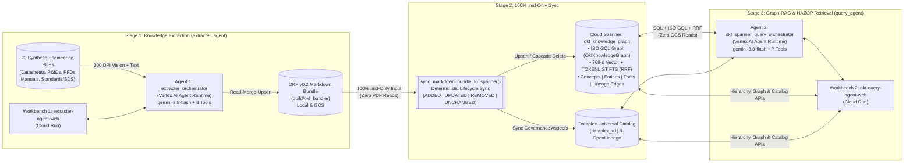

# Chemical Engineering OKF Multi-Agent Platform (`extracter_agent` & `query_agent`)

An end-to-end **Chemical Engineering Knowledge Extraction, Graph-RAG Retrieval, and Data Lineage Platform** built with the official **Google Agent Development Kit (`google-adk`)** and powered by **`gemini-3.8-flash`** (`GEMINI_LOCATION=global`).

### What Does This Platform Do?
In complex process plants, critical engineering data is scattered across hundreds of unstructured PDFs—**Process Data Sheets**, **P&IDs**, **PFDs**, **Operating Manuals**, and **Safety Data Sheets (SDS)**—often with competing revisions and cross-document discrepancies. This platform solves that in **three stages**:

1. **Extract & Reconcile (`Agent 1: extracter_agent`):** Reads raw engineering PDFs (using 300 DPI multimodal vision + native text parsing) and compiles them into a structured, cross-linked **Open Knowledge Format (OKF v0.2) Markdown (`.md`)** knowledge base—automatically superseding old revisions while flagging cross-document discrepancies with `⚠️ CONFLICT`.
2. **Deterministic Spanner & Catalog Sync (`sync_markdown_bundle_to_spanner`):** Synchronizes the compiled `.md` files (`ADDED`, `UPDATED`, `REMOVED`, `UNCHANGED`) directly into **Google Cloud Spanner** (Property Graph + 768-d Vector Search + Full-Text Search) and **Google Cloud Dataplex Universal Catalog** with **zero raw PDF reads and zero LLM calls**.
3. **Graph-RAG, Lineage & HAZOP Retrieval (`Agent 2: query_agent`):** Answers engineering parameter lookups, multi-hop P&ID equipment connectivity traversals (ISO GQL), PDF provenance & conflict audits, and 5-stage HAZOP safety assessments **100% from Cloud Spanner**.

---

## ⚡ Quick Links: All Agents & Live Web Workbenches

| Component | Role | ADK Agent Runtime (`agent_runtime`) | Live Cloud Run Web UI (`cloud_run`) | Package Docs |
| :--- | :--- | :--- | :--- | :--- |
| **Agent 1: OKF Extracter Agent** | Extracts raw PDFs (`reference/raw/`) into cross-linked OKF v0.2 `.md` files with Read-Merge-Upsert & `⚠️ CONFLICT` detection | **`extracter_orchestrator`**<br>`reasoningEngines/YOUR_EXTRACTER_ENGINE_ID`<br>Model: `gemini-3.8-flash` (8 Tools) | **`extracter-agent-web`**<br>3-Pane PDF + Markdown + Extraction Chat Workbench | [`extracter_agent/README.md`](./extracter_agent/README.md) |
| **Bridge: `.md`-to-Spanner Sync** | Deterministic 100% `.md`-only lifecycle sync (`ADDED`, `UPDATED`, `REMOVED`, `UNCHANGED`) into Cloud Spanner & Dataplex | Deterministic Python Engine (`sync_markdown_bundle_to_spanner`) | Triggered via CLI or **🔄 Sync Dataplex** button in Query Workbench | [`query_agent/spanner/repository.py`](./query_agent/spanner/repository.py) |
| **Agent 2: Spanner Graph-RAG Query Agent** | 100% Cloud Spanner retrieval: ISO GQL Graph traversal, 768-d Vector + FTS (RRF), 5-Stage HAZOP, and Dataplex Catalog | **`okf_spanner_query_orchestrator`**<br>`reasoningEngines/YOUR_QUERY_ENGINE_ID`<br>Model: `gemini-3.8-flash` (7 Tools) | **`okf-query-agent-web`**<br>3-Pane Equipment Tree + Latency Chat + Interactive Graph & Catalog UI | [`query_agent/README.md`](./query_agent/README.md) |

---

## 📑 Table of Contents
1. [High-Level Architecture & Data Flow](#-1-high-level-architecture--data-flow)
2. [Context of All Agents & How They Work Together](#-2-context-of-all-agents--how-they-work-together)
   - [Agent 1: OKF Extracter Agent (`extracter_agent`)](#21-agent-1-okf-extracter-agent-extracter_agent)
   - [Bridge: Consolidated 100% `.md`-Only Spanner Sync (`sync_markdown_bundle_to_spanner`)](#22-bridge-consolidated-100-md-only-spanner-sync-sync_markdown_bundle_to_spanner)
   - [Agent 2: OKF Spanner Graph-RAG Query Agent (`query_agent`)](#23-agent-2-okf-spanner-graph-rag-query-agent-query_agent)
3. [How to Use the Platform (Source Data Setup, Web UIs, Demo Walkthrough, Local Dev & CLI)](#-3-how-to-use-the-platform-web-uis-local-dev--cli)
   - [How to Put Source Data in Local (`reference/raw/`) & Google Cloud Storage (GCS)](#30-how-to-put-source-data-in-local-referenceraw--google-cloud-storage-gcs)
   - [Using the Cloud Run Web Workbenches](#31-using-the-cloud-run-web-workbenches)
   - [Running Both Workbenches Locally](#32-running-both-workbenches-locally)
   - [Running `.md`-to-Spanner Purge, Reload & Incremental Sync (CLI)](#33-running-md-to-spanner-purge-reload--incremental-sync-cli)
   - [End-to-End Walkthrough with Demo Data (Seabrook P&IDs, HAZOP/RAM & Synthetic Reference)](#34-end-to-end-walkthrough-with-demo-data-seabrook-pids-hazopram--synthetic-reference)
4. [How to Configure & Deploy (`deploy.sh`)](#-4-how-to-configure--deploy-deploysh)
5. [Testing & Live Evaluation Benchmarks](#-5-testing--live-evaluation-benchmarks)
6. [Repository Structure & Specification Links](#-6-repository-structure--specification-links)

---

## 🏗️ 1. High-Level Architecture & Data Flow



### Key Architectural Principles
- **Strict Separation of Write vs. Read Responsibilities:**
  - **`extracter_agent` (Write / Synthesis):** Handles slow, compute-intensive 300 DPI multimodal PDF reading and cross-document reconciliation into human-readable `.md` files.
  - **`sync_markdown_bundle_to_spanner` (Deterministic Projection):** Because every extracted parameter, stream connection, instrument loop, `⚠️ CONFLICT`, and source PDF citation (`doc_code`, `revision`, `gcs_uri`) is already recorded in the `.md` frontmatter and tables, syncing to Cloud Spanner requires **zero raw PDF access and zero LLM calls**.
  - **`query_agent` (Low-Latency Read / Graph-RAG):** Queries **100% Cloud Spanner and Dataplex** at runtime (zero GCS or PDF file reads during user queries).
- **Global Gemini Routing + Regional Data Residency:**
  - Both agents invoke **`gemini-3.8-flash`** via the Vertex AI global endpoint (`GEMINI_LOCATION=global`), while all data stores (Cloud Spanner, GCS, Dataplex Catalog), Agent Runtimes, and Cloud Run services reside in **`asia-southeast1`**.

---

## 🤖 2. Context of All Agents & How They Work Together

### 2.1 Agent 1: OKF Extracter Agent (`extracter_agent`)
- **What it is:** An autonomous ADK agent (`extracter_orchestrator`) that transforms raw engineering PDFs into structured **OKF v0.2 Markdown (`.md`)** concept files (`equipment/`, `instruments/`, `hazards/`, `units/`, `procedures/`, `troubleshooting/`, `hazop/`, `parameters/`, `sources/`).
- **Two Extraction Modes:**
  1. **Mode A — By-Equipment / Concept ID (`Entity-Centric`):** Ask for an equipment tag (e.g., `D-2304`, `V-2301`, `E-2307`) or domain concept (`sis-interlocks`, `cumene-hydroperoxide`). The agent discovers all relevant PDFs across `data_sheets/`, `pid/`, `pfd/`, `operating_manuals/`, and `standards/`, reconciles them, and writes the `.md` concept.
  2. **Mode B — By-PDF File-by-File (`Document-Centric`):** Feed raw PDFs one at a time. For each PDF, the agent incrementally creates or enriches (`Read-Merge-Upsert`) every equipment, instrument, or hazard concept found in that PDF without losing data from earlier PDFs.
- **How It Handles Revisions vs. Conflicts:**
  - **Newer Revision of the Same Document (`Rev Z0` $\rightarrow$ `Rev Z1`):** Updates the parameter value in-place (**no conflict warning**) and updates the source citation to `Rev Z1`.
  - **Disagreement Across Different Active Documents (e.g., Datasheet vs. P&ID):** Preserves **both values** side-by-side in the table and adds an explicit `⚠️ CONFLICT` callout citing both PDFs.
- **8 Registered ADK `FunctionTools` (`extracter_agent/tools/`):**

| Tool Name | Purpose |
| :--- | :--- |
| `find_raw_documents_tool` | Searches `reference/raw/` (local or GCS) by equipment tag, drawing number, or keyword. |
| `process_raw_pdf_tool` | Extracts native text + adaptive 300 DPI Gemini vision windows (`2` pages for vector CAD drawings, `4` pages for text/table PDFs). |
| `inspect_existing_okf_concept_tool` | Reads existing `.md` concepts or lists concepts citing a specific PDF before incremental merging. |
| `generate_equipment_okf_tool` | Synthesizes or merges (`merge_existing=True`) `equipment/<TAG>.md` with conflict detection and dynamic instrument linking. |
| `generate_okf_concept_tool` | Synthesizes or merges (`merge_markdown_bodies`) non-equipment `.md` files (`instruments/`, `hazards/`, `units/`, etc.). |
| `build_okf_indexes_and_validate_tool` | Builds category `index.md` files, the root Master Plant Catalog `index.md`, and `log.md`, and validates the bundle. |
| `validate_okf_bundle_tool` | Verifies YAML frontmatter, footnote citations, trust tiers, and zero broken internal links. |
| `export_bundle_to_gcs_tool` | Parallel (`16`-worker) MD5-verified upload of `.md` files to Google Cloud Storage. |

---

### 2.2 Bridge: Consolidated 100% `.md`-Only Spanner Sync (`sync_markdown_bundle_to_spanner`)
- **What it is:** A single deterministic function ([`sync_markdown_bundle_to_spanner`](./query_agent/spanner/repository.py)) that keeps Cloud Spanner (`okf_knowledge_graph`) and Dataplex Universal Catalog in exact sync with the `.md` bundle directory.
- **How It Handles `.md` File Changes (`ADDED`, `UPDATED`, `REMOVED`, `UNCHANGED`):**

| `.md` File State | How It Is Detected | What Happens in Cloud Spanner (`okf_knowledge_graph`) |
| :--- | :--- | :--- |
| **`ADDED`** | `concept_id` is not in Spanner `OkfConcepts` | Parses YAML frontmatter (`title`, `description`, `unit`, `sources`), H2 chunks, entities, table facts, `⚠️ CONFLICT` rows, process/instrument edges, and PDF lineage; generates 768-d `text-embedding-005` vectors; upserts into all 9 Spanner tables. |
| **`UPDATED`** | `concept_id` exists in Spanner with `new_md5 != existing_md5` | Atomically deletes stale child chunks, facts, and edges for that concept (`delete_concepts_cascade`), then re-parses, re-embeds, and upserts the updated `.md` file. |
| **`REMOVED`** | `.md` file was deleted from the bundle (`FULL_MIRROR` mode) | Atomically cascade-deletes the concept and all its edges, chunks, facts, entities, and orphaned source documents in reverse Property Graph dependency order. |
| **`UNCHANGED`** | `new_md5 == existing_md5` | **Skipped in `< 1ms`** (zero embedding API calls, zero Spanner writes). |

---

### 2.3 Agent 2: OKF Spanner Graph-RAG Query Agent (`query_agent`)
- **What it is:** An independent ADK agent (`okf_spanner_query_orchestrator`) that answers engineering, connectivity, provenance, conflict, and process safety questions **100% from Cloud Spanner (`okf_knowledge_graph`) and Dataplex Universal Catalog**.
- **Why Cloud Spanner (Graph + Vector + Full-Text in One Database):**
  - **Spanner Property Graph (`ISO GQL`):** Traverses multi-hop upstream/downstream process lines (`CONNECTS_TO`), instrument trip loops (`MONITORS_OR_TRIPS`), and claim-to-PDF lineage (`DERIVED_FROM`).
  - **Hybrid RRF Search (`768-d Vector` + `TOKENLIST FTS`):** Combines semantic understanding (`COSINE_DISTANCE` with `text-embedding-005`) and exact alphanumeric tag matching (`SEARCH` / `SEARCH_SUBSTRING`) via Reciprocal Rank Fusion ($k=60$).
- **7 Registered ADK `FunctionTools` (`query_agent/tools/spanner_rag_tools.py`):**

| Tool Name | When the Agent Uses It |
| :--- | :--- |
| `lookup_entity_and_parameters` | Exact equipment tag (`D-2304`), instrument tag (`TXSHH-1301`), or parameter table lookups in Spanner SQL. |
| `hybrid_search_okf_spanner` | Conceptual, operating procedure, troubleshooting, or chemical hazard search using Vector + FTS Reciprocal Rank Fusion. |
| `traverse_equipment_connectivity_graph` | Multi-hop (`1..4` hops) upstream/downstream process stream and SIS interlock traversal via Spanner Graph ISO GQL. |
| `trace_data_lineage_and_conflicts` | **Backward Provenance** (`Equipment/Parameter -> Source PDFs & ⚠️ CONFLICTS`) or **Forward Blast Radius** (`PDF Code -> All Impacted Concepts & Parameters`). |
| `execute_multistage_risk_and_hazop_query` | **5-Stage HAZOP & Risk Assessment Engine:** Synthesizes (1) Risk Matrix rules, (2) HAZOP scenarios, (3) Upstream causes via GQL, (4) Downstream consequences via GQL, and (5) SIS/PSV safeguards + conflict alerts. |
| `read_full_okf_concept_from_spanner` | Reads the complete `.md` document and YAML frontmatter directly from Spanner `OkfConcepts` (zero GCS reads). |
| `sync_or_inspect_knowledge_catalog` | Inspects or syncs live governance aspects in **Google Cloud Dataplex Universal Catalog (`dataplex_v1`)** and **OpenLineage**. |

---

## 🖥️ 3. How to Use the Platform (Web UIs, Local Dev & CLI)

### 3.0 How to Put Source Data in Local (`reference/raw/`) & Google Cloud Storage (GCS)

All raw engineering PDF documents ingested by **Agent 1 (`extracter_agent`)** and displayed in **Workbench 1 (`extracter-agent-web`)** are organized under **5 canonical category folders** inside [`reference/raw/`](./reference/raw/README.md):

| Canonical Subfolder | What PDFs to Put Here | Folder Guide |
| :--- | :--- | :--- |
| [`reference/raw/data_sheets/`](./reference/raw/data_sheets/README.md) | Process Data Sheets, Mechanical Vessel/Exchanger/Pump Data Sheets, Control Valve & Relief Valve (PSV) Sizing Packages | [`data_sheets/README.md`](./reference/raw/data_sheets/README.md) |
| [`reference/raw/pid/`](./reference/raw/pid/README.md) | Piping & Instrumentation Diagrams (P&IDs) — single-sheet or multi-sheet CAD/scanned drawing packages (e.g., `ML101620329-part-1.pdf` .. `part-8.pdf`) | [`pid/README.md`](./reference/raw/pid/README.md) |
| [`reference/raw/pfd/`](./reference/raw/pfd/README.md) | Process Flow Diagrams (PFDs), Heat & Material Balance (H&MB) tables, and Material Selection Diagrams | [`pfd/README.md`](./reference/raw/pfd/README.md) |
| [`reference/raw/operating_manuals/`](./reference/raw/operating_manuals/README.md) | Plant Operating Manuals, Equipment Inspection & Maintenance Manuals (`Inspection_Manual_for_Heat_Exchangers_1.pdf`), Startup/Shutdown SOPs | [`operating_manuals/README.md`](./reference/raw/operating_manuals/README.md) |
| [`reference/raw/standards/`](./reference/raw/standards/README.md) | Engineering Design Standards, HAZOP Guides (`HAZOP_Training_Guide.pdf`), Risk Assessment Matrices (`Risk_Assessment_Matrix.pdf`), SIS Interlock Registers, Safety Data Sheets (SDS) | [`standards/README.md`](./reference/raw/standards/README.md) |

#### Option A — Putting Source Data Locally (`reference/raw/<subfolder>/`)
1. **Copy your PDF files** into the matching category folder under `reference/raw/`:
   ```bash
   cp /path/to/your_datasheet.pdf        reference/raw/data_sheets/
   cp /path/to/your_pid_drawing.pdf      reference/raw/pid/
   cp /path/to/your_pfd.pdf              reference/raw/pfd/
   cp /path/to/your_operating_manual.pdf reference/raw/operating_manuals/
   cp /path/to/your_standard_or_sds.pdf  reference/raw/standards/
   ```
2. *(Optional)* **Generate the 20 synthetic chemical plant reference PDFs** across all 5 folders for local testing:
   ```bash
   PYTHONPATH=. .venv/bin/python scripts/generate_synthetic_reference.py
   ```
3. **Configure `.env` for local source discovery:**
   - `REFERENCE_RAW_DIR=reference/raw` (default) points `extracter_agent` and `extracter-agent-web` to your local `reference/raw/` folders.
   - Set `USE_GCS_STORAGE=false` in `.env` if you want `extracter_agent` to read strictly from your local filesystem (`reference/raw/`), or leave `USE_GCS_STORAGE=true` to merge GCS + local PDFs automatically.

#### Option B — Putting Source Data in Google Cloud Storage (`gs://$DESTINATION_GCS_BUCKET/$SOURCE_GCS_RAW_PREFIX/`)
When running on **Vertex AI Agent Runtime (`agent_runtime`)** and **Google Cloud Run (`cloud_run`)**, `extracter_agent` discovers and streams raw PDFs from `gs://${DESTINATION_GCS_BUCKET}/${SOURCE_GCS_RAW_PREFIX}/<subfolder>/<filename>.pdf` (where `SOURCE_GCS_RAW_PREFIX` defaults to `reference/raw`):

```bash
# Load bucket, project, and prefix variables from .env
source .env

# 1. Sync your entire local reference/raw/ directory tree (all 5 subfolders) to GCS:
gcloud storage rsync reference/raw \
  "gs://${DESTINATION_GCS_BUCKET}/${SOURCE_GCS_RAW_PREFIX:-reference/raw}" \
  --project="${GOOGLE_CLOUD_PROJECT}" \
  --recursive

# 2. Or upload individual PDFs directly to a specific GCS subfolder:
gcloud storage cp /path/to/your_datasheet.pdf \
  "gs://${DESTINATION_GCS_BUCKET}/${SOURCE_GCS_RAW_PREFIX:-reference/raw}/data_sheets/"

gcloud storage cp /path/to/your_pid_drawing.pdf \
  "gs://${DESTINATION_GCS_BUCKET}/${SOURCE_GCS_RAW_PREFIX:-reference/raw}/pid/"

gcloud storage cp /path/to/your_pfd.pdf \
  "gs://${DESTINATION_GCS_BUCKET}/${SOURCE_GCS_RAW_PREFIX:-reference/raw}/pfd/"

gcloud storage cp /path/to/your_manual.pdf \
  "gs://${DESTINATION_GCS_BUCKET}/${SOURCE_GCS_RAW_PREFIX:-reference/raw}/operating_manuals/"

gcloud storage cp /path/to/your_standard.pdf \
  "gs://${DESTINATION_GCS_BUCKET}/${SOURCE_GCS_RAW_PREFIX:-reference/raw}/standards/"

# 3. Or run deploy.sh --target infra (creates bucket if needed + rsyncs reference/raw/ to GCS):
./deploy.sh --target infra

# 4. Verify uploaded PDFs in GCS:
gcloud storage ls -r "gs://${DESTINATION_GCS_BUCKET}/${SOURCE_GCS_RAW_PREFIX:-reference/raw}/**.pdf"
```

---

### 3.1 Using the Cloud Run Web Workbenches

#### Workbench 1: Extraction Workbench (`extracter-agent-web`)
1. **Browse Raw PDFs & Extracted Markdown (Left Pane):** Filter between `All`, `Raw PDFs (20)`, `Extracted MD`, and `⚠️ Conflicts`.
2. **Compare Side-by-Side (Center Pane):** Click any `.md` concept (e.g., `equipment/D-2304`) to view its rendered tables, `⚠️ CONFLICT` callout banner, and interactive `[[wikilinks]]` right next to its cited Raw PDF datasheet or P&ID.
3. **Run Live Extraction or Ask Bundle Questions (Right Pane):**
   - Click the **`⚡`** button on any PDF or equipment item—or select a target from the dropdown—to run a live `extracter_orchestrator` extraction job with real-time step-by-step tool progress.
   - Or type a conversational question in the chat box (e.g., *"What files were updated in the last extraction?"*).

#### Workbench 2: Spanner Graph-RAG & Retrieval Workbench (`okf-query-agent-web` v2.2)
1. **Left Pane (`270px` — Live Spanner Plant Hierarchy & OKF Concepts):** Browse equipment grouped by **Process Unit (`Unit 2300`) $\rightarrow$ Equipment Class $\rightarrow$ Tag**, or switch tabs to `⚠️ Conflicts` or `OKF Concepts` (`hazop/`, `hazards/`, `procedures/`, `troubleshooting/`, `instruments/`, `sources/`, `units/`, `parameters/`).
2. **Middle Pane (`1fr` — Selection-Driven Live Graph & Active Knowledge Catalog):**
   - **Upper Half (`1. Live Spanner Graph Explorer`):** Interactive SVG Property Graph (`OkfKnowledgeGraph`) centered strictly on the selected Equipment or OKF Concept (`1..3` hops, `CONNECTS_TO`, `MONITORS_OR_TRIPS`, `DERIVED_FROM`). Click any node/edge to inspect or **double-click** to pivot.
   - **Lower Half (`2. Active Knowledge Catalog`):** Displays a 3-section engineering dossier for the active selection:
     1. **Governance & Approval Card:** `Trust Tier` (`✓ HUMAN-REVIEWED`), named `Approver` / `Author` / `Governing Authority` / `Effective Date` / `Document ID` (from `frontmatter.entity_metadata` and `verified`), `Extracted By & Model` (`extracter_agent/gemini-3.8-flash`), and `Bundle Version & MD5`.
     2. **Source PDF Provenance Table:** Every backing PDF with exact filename, document code, document type (`Process Data Sheet`, `P&ID Drawing`, `PFD`, `Operating Manual`, `Engineering Standard / HAZOP`), revision (`Rev Z1`, `Rev R1`), and role (`PRIMARY` vs `⚠️ CONFLICTING`).
     3. **Governing Parameters & Conflict Alerts** (for Equipment) or **Concept Summary & Clickable Linked Entities** (for OKF Concepts).
3. **Right Pane (`50vw` / 50% Screen Width — Dynamic Studies, Slim Telemetry & Multi-Turn ADK Chat):**
   - **Mode-Specific 4-Chip Pre-Built Studies:** Automatically constructs 4 tailored prompts based on whether an **Equipment item** (reflecting `<Tag>` + `<Process Unit>`) or an **OKF Concept** (tailored to `hazop`, `hazards`, `procedures`, `troubleshooting`, `instruments`, etc.) is selected.
   - **Slim 1-Line Auto-Collapsing Tool Telemetry Bar:** Tracks contiguous per-step and per-tool execution latency (`ms`) where $\sum \text{step\_ms} = \text{Total ms}$.
   - **Multi-Turn Session-Retaining Chat:** Retains conversation context across follow-up turns within the active `session_id` (with `+ New Session` reset).

---

### 3.2 Running Both Workbenches Locally

```bash
# 1. Create virtual environment & install dependencies
python3 -m venv .venv
.venv/bin/pip install -e ".[dev]"

# 2. Configure environment variables
cp .env.example .env
# Ensure gcloud Application Default Credentials are active:
gcloud auth application-default login

# 3. Extract the OKF v0.2 bundle from the 20 synthetic PDFs in reference/raw/
PYTHONPATH=. .venv/bin/python -m extracter_agent.cli --output-dir build/okf_bundle

# 4. Run Workbench 1 (Extracter Agent Web UI) on http://localhost:8080
PYTHONPATH=. .venv/bin/uvicorn extracter_agent.web_server:app --host 0.0.0.0 --port 8080 --reload

# 5. Run Workbench 2 (Spanner Query Agent Web UI) on http://localhost:8081
PYTHONPATH=. .venv/bin/uvicorn query_agent.web_server:app --host 0.0.0.0 --port 8081 --reload
```

---

### 3.3 Running `.md`-to-Spanner Purge, Reload & Incremental Sync (CLI)

Two CLI scripts under [`scripts/`](./scripts/) manage Cloud Spanner (`okf_knowledge_graph`) and Dataplex Universal Catalog (`dataplex_v1`) ingestion directly from any OKF v0.2 `.md` bundle (defaulting to `build/okf_bundle`):

```bash
# A. Full Clean Purge & Reload (Deletes all Spanner rows + Dataplex Catalog entries, then reloads bundle)
PYTHONPATH=. .venv/bin/python scripts/purge_and_reload_spanner.py \
  --bundle-dir build/okf_bundle \
  --bundle-version v1-acme-demo

# (Equivalent via ingest_okf_bundle_to_spanner.py with --purge)
PYTHONPATH=. .venv/bin/python scripts/ingest_okf_bundle_to_spanner.py \
  --purge \
  --bundle-dir build/okf_bundle \
  --bundle-version v1-acme-demo

# B. Incremental / Mirror Sync (Skips UNCHANGED .md files via MD5 hash; upserts ADDED/UPDATED; removes deleted)
PYTHONPATH=. .venv/bin/python scripts/ingest_okf_bundle_to_spanner.py \
  --no-purge \
  --bundle-dir build/okf_bundle

# C. Incrementally sync a single newly added or edited .md file
PYTHONPATH=. .venv/bin/python scripts/ingest_okf_bundle_to_spanner.py \
  --no-purge \
  --sync-mode INCREMENTAL \
  --bundle-dir build/okf_bundle/equipment/D-2304.md
```

**Supported CLI Flags (`scripts/purge_and_reload_spanner.py` & `scripts/ingest_okf_bundle_to_spanner.py`):**
- `--bundle-dir <PATH>`: Path to the OKF `.md` bundle directory or single `.md` file (default: `build/okf_bundle`).
- `--bundle-version <STR>`: Version tag recorded on ingested concepts (default: `v1-acme-demo`).
- `--purge` / `--no-purge`: Whether to purge all 9 Cloud Spanner tables (`purge_all_spanner_data()`) and Dataplex Catalog entries (`purge_catalog_entries()`) before reloading (`--purge` is default in `purge_and_reload_spanner.py`; `--no-purge` is default in `ingest_okf_bundle_to_spanner.py`).
- `--sync-mode {FULL_MIRROR,INCREMENTAL}`: `FULL_MIRROR` (default) removes concepts from Spanner that were deleted from the bundle; `INCREMENTAL` only adds/updates.
- `--force-reingest`: Force re-extraction and re-embedding even if `.md` MD5 hashes match.
- `--skip-embeddings`: Skip computing 768-d `text-embedding-005` vectors.
- `--skip-catalog`: Skip synchronizing Google Cloud Dataplex Universal Catalog & OpenLineage.

---

### 3.4 End-to-End Walkthrough with Demo Data (Seabrook P&IDs, HAZOP/RAM & Synthetic Reference)

The platform supports both **real multi-sheet P&ID & HAZOP/RAM PDF packages** in Google Cloud Storage and **deterministic synthetic reference PDFs** for offline/CI testing.

#### A. Available Demo Datasets

| Dataset | Source PDFs (`reference/raw/`) | Key Extracted Equipment & Domain Concepts | Live Spanner Graph Scale (`v8-seabrook`) |
| :--- | :--- | :--- | :--- |
| **1. Seabrook Station LR P&IDs + HAZOP/RAM Package (Live Cloud Demo)** | • `pid/ML101620329-part-1.pdf` (`5` sheets: `LR20483`, `LR20484`, `LR20446`, `LR20447`, `LR20448`)<br>• `pid/ML101620329-part-2.pdf` (`5` sheets: `LR20449`, `LR20450`, `LR20518`, `LR20519`, `LR20520`)<br>• `standards/hazop-training-guide.pdf`<br>• `standards/risk-assessment-matrix.pdf` | • **31 Equipment Concepts (`equipment/`):**<br>  - *Spent Fuel Pool (`SF`):* `P-12`, `F-33`, `DM-8`, `F-34`, `P-272`, `F-207`<br>  - *Safety Injection (`SI` / `CS`):* `SI-P-6A/B`, `CS-P-2A/B`, `SI-TK-9A..D`<br>  - *Residual Heat Removal (`RH` / `CBS`):* `RH-P-8A/B`, `RH-E-9A/B`, `CBS-TK-10A/B`<br>  - *Nuclear Sample System (`SS`):* `SS-E-12A/B`, `SS-E-13A/B`, `SS-E-106`, `SS-CP-166A`, `SS-CP-419`, `SS-P-392`, `SS-T-312`, `SS-TK-197`, `SS-TK-228A/B`<br>• **11 Governance & Source Concepts:** `hazop/guide-words-and-deviations`, `hazop/risk-assessment-matrix`, `procedures/*`, `standards/*`, `sources/*` | • **`10`** `RawSourceDocuments`<br>• **`42`** `OkfConcepts`<br>• **`314`** `OkfSectionChunks` (768-d vectors)<br>• **`443`** `EngineeringEntities`<br>• **`862`** `FactAssertions`<br>• **`560`** `ProcessConnections` (`CONNECTS_TO`)<br>• **`208`** `InstrumentControlEdges` (`MONITORS_OR_TRIPS`)<br>• **`981`** `FactLineageEdges` (`DERIVED_FROM`) |
| **2. Synthetic Chemical Plant Reference Dataset (Local / CI)** | Generated via `scripts/generate_synthetic_reference.py` (`20` PDFs across `data_sheets/`, `pid/`, `pfd/`, `operating_manuals/`, `standards/`) | Unit 2100/2200/2300 equipment (`D-2304`, `C-2301`, `R-2101`, `V-2301`, `E-2307`, `P-2301A/B`), SIS interlock registers, and Cumene/Phenol SDS hazards | Used by automated `pytest` unit/property suites and `evals/` benchmarks |

#### B. Step-by-Step Demo Workflow

**Step 1 — Extract Raw PDFs into Structured OKF `.md` Files (Workbench 1 or API)**
1. Open **`extracter-agent-web`** (or local `http://localhost:8080`).
2. In the **Left Pane**, filter by **`Raw PDFs`** and click the **`⚡`** extract button next to `pid/ML101620329-part-1.pdf` and `pid/ML101620329-part-2.pdf` (or trigger via API):
   ```bash
   curl -X POST "$EXTRACTER_WEB_URL/api/extract" \
     -H "Content-Type: application/json" \
     -d '{"target": "pid/ML101620329-part-1.pdf"}'
   ```
3. Each extracted `equipment/<TAG>.md` file is automatically synthesized (or incrementally merged via `Read-Merge-Upsert` when equipment like `RH-E-9A`, `RH-P-8A`, or `SI-P-6A` spans multiple P&ID sheets) with structured Spanner Graph connectivity in both YAML frontmatter (`entity_metadata.connections` & `entity_metadata.instruments`) and the 10-column `## Connections & Stream Summary` table (`Stream | Direction | From (Source) | To (Target) | Line Size | Inline Valves / Components | Temp | Pressure | Flow Rate | Description`).

**Step 2 — Sync Extracted `.md` Bundle from GCS & Load into Cloud Spanner (`okf_knowledge_graph`)**
Download the latest extracted `.md` bundle from GCS into `build/okf_bundle` and run `ingest_okf_bundle_to_spanner.py`:

```bash
# 1. Pull the latest extracted .md files from GCS into build/okf_bundle
PYTHONPATH=. .venv/bin/python -c "
import shutil
from pathlib import Path
from google.cloud import storage
from extracter_agent.config import get_config

cfg = get_config()
client = storage.Client(project=cfg.google_cloud_project)
bucket = client.bucket(cfg.destination_gcs_bucket)
out_dir = Path('build/okf_bundle')
if out_dir.exists():
    shutil.rmtree(out_dir)
out_dir.mkdir(parents=True, exist_ok=True)
prefix = cfg.destination_gcs_prefix.strip('/') + '/'
for blob in bucket.list_blobs(prefix=prefix):
    if not blob.name.endswith('/'):
        dest = out_dir / blob.name.removeprefix(prefix)
        dest.parent.mkdir(parents=True, exist_ok=True)
        blob.download_to_filename(str(dest))
"

# 2. Purge & reload Cloud Spanner (OkfKnowledgeGraph) + Dataplex Universal Catalog
PYTHONPATH=. .venv/bin/python scripts/ingest_okf_bundle_to_spanner.py \
  --bundle-dir build/okf_bundle \
  --bundle-version v8-seabrook \
  --purge
```

**Step 3 — Explore the Knowledge Graph & Run Engineering Queries in Workbench 2 (`okf-query-agent-web`)**
Open **`okf-query-agent-web`** (or local `http://localhost:8081`) and try these demo scenarios:
- **Scenario 1 — Spent Fuel Pool Purification Train (`P-12 -> F-33 -> DM-8 -> F-34`):**
  - Click **`F-33`** (*Fuel Pool Prefilter*) in the **Left Pane**.
  - Inspect the **Live Spanner Graph Explorer** (Middle Pane Upper) to trace the 4" inlet from `P-12` (via `1-SF-V20`), the 3"x4" outlet to Demineralizer `DM-8` (via `1-SF-V27`), the 4" bypass (`1-SF-V25`), and differential pressure switch `PDIS-2622` (`MONITORS_OR_TRIPS`).
- **Scenario 2 — Multi-Sheet RHR & Low Head Safety Injection Topology (`CBS-TK-10A -> RH-P-8A -> RH-E-9A -> SI-TK-9A/B`):**
  - Select **`RH-E-9A`** (*RHR Loop A Heat Exchanger*) to view merged connectivity across `PID-1-SI-LR20448` (`part-1.pdf`) and `PID-1-SI-LR20449` (`part-2.pdf`), including tube-side supply from `RH-P-8A`, 20" CCW Loop A shell cooling, thermal relief valve `RH-V13` (`Set @ 600 PSIG`), and 8" Low Head SI injection through `PENETRATION-X-11` to `SI-TK-9A` / `SI-TK-9B`.
- **Scenario 3 — 5-Stage HAZOP & Risk Assessment Study:**
  - Select any equipment item (e.g., `RH-E-9A`, `SI-TK-9A`, or `F-33`) and click the **`HAZOP // 5-STAGE`** chip in the **Right Pane** to execute `execute_multistage_risk_and_hazop_query`, combining the extracted `hazop/risk-assessment-matrix` and `hazop/guide-words-and-deviations` standards with live GQL upstream/downstream propagation paths and active safeguards.

---

## 🚀 4. How to Configure & Deploy (`deploy.sh`)

### 4.1 Unified `.env` Configuration
All settings for both agents and both Cloud Run services live in a single gitignored [`.env`](./.env) file (template in [`.env.example`](./.env.example)):

```ini
# 1. Core GCP & Gemini Model Configuration
GOOGLE_CLOUD_PROJECT=your-gcp-project-id
GOOGLE_CLOUD_LOCATION=asia-southeast1
GEMINI_LOCATION=global
GOOGLE_GENAI_USE_VERTEXAI=true
GEMINI_MODEL=gemini-3.8-flash
EMBEDDING_MODEL=text-embedding-005

# 2. Cloud Spanner & Dataplex Universal Catalog Configuration
SPANNER_INSTANCE_ID=okf-knowledge-spanner
SPANNER_DATABASE_ID=okf_knowledge_graph
DATAPLEX_ENTRY_GROUP_ID=okf-knowledge-assets
DATAPLEX_TAG_TEMPLATE_ID=okf-governance-template

# 3. Deployed Agent Runtimes & Cloud Run Services
NONPROD_AGENT_RUNTIME_ID=projects/YOUR_PROJECT_NUMBER/locations/asia-southeast1/reasoningEngines/YOUR_EXTRACTER_ENGINE_ID
NONPROD_QUERY_AGENT_RUNTIME_ID=projects/YOUR_PROJECT_NUMBER/locations/asia-southeast1/reasoningEngines/YOUR_QUERY_ENGINE_ID
CLOUD_RUN_WEB_SERVICE=extracter-agent-web
QUERY_WEB_SERVICE_NAME=okf-query-agent-web
```

### 4.2 Deploying with `./deploy.sh`
The unified [`deploy.sh`](./deploy.sh) script provisions GCS & Cloud Spanner (if not already present), deploys both ADK agents to the **Gemini Enterprise Agent Platform (`agent_runtime`)**, and deploys both 3-pane web workbenches to **Google Cloud Run (`cloud_run`)**:

```bash
# Deploy EVERYTHING (GCS + Spanner + Agent 1 + Agent 2 + Extracter Web UI + Query Web UI)
./deploy.sh --target all

# Or deploy individual components:
./deploy.sh --target agent_runtime   # Deploy Agent 1 (extracter_orchestrator) to Vertex AI Agent Engine
./deploy.sh --target query_agent     # Deploy Agent 2 (okf_spanner_query_orchestrator) to Vertex AI Agent Engine
./deploy.sh --target cloud_run       # Deploy Workbench 1 (extracter-agent-web) to Google Cloud Run
./deploy.sh --target query_web       # Deploy Workbench 2 (okf-query-agent-web) to Google Cloud Run
```

*(Declarative Terraform IaC for Cloud Run, Cloud Spanner `okf-knowledge-spanner`, Artifact Registry, and IAM is also maintained under [`terraform/`](./terraform/).)*

---

## 📊 5. Testing & Live Evaluation Benchmarks

### 5.1 Latest Verified Evaluation & Test Summary

| Benchmark Suite | Target | Cases / Tests | Pass Rate | Key Metrics | Report Link |
| :--- | :--- | :---: | :---: | :--- | :--- |
| **Agent 1 Live Eval (Mode A: By-Equipment)** | `extracter_orchestrator` | `25` | **`25 / 25` (`100.0%`)** | `1.000` Trajectory Precision \| `1.000` Groundedness \| `40` Domain & Source `.md` Concepts | [`PROGRESS_REPORT_20260929.md`](./specs/plan/PROGRESS_REPORT_20260929.md) |
| **Agent 1 Live Eval (Mode B: By-PDF)** | `extracter_orchestrator` | `20` | **`20 / 20` (`100.0%`)** | `1.000` Trajectory Precision \| `1.000` Groundedness across all 20 Synthetic Raw PDFs | [`PROGRESS_REPORT_20260922.md`](./specs/plan/PROGRESS_REPORT_20260922.md) |
| **Agent 2 Live Spanner & Dataplex Eval** | `okf_spanner_query_orchestrator` | `16` | **`16 / 16` (`100.0%`)** | `1.0000` Trajectory Precision \| `1.0000` Groundedness \| `1.0000` Conflict Accuracy | [`QUERY_AGENT_EVAL_REPORT.md`](./specs/plan/QUERY_AGENT_EVAL_REPORT.md) |
| **Unit & Property-Based Tests (`pytest` + `hypothesis`)** | `extracter_agent` + `query_agent` | `143` | **`143 / 143` (`100.0%`)** | `94` Deterministic Unit Tests + `49` Hypothesis Property Tests (`0` Ruff/Bandit issues) | [`specs/plan/README.md`](./specs/plan/README.md) |

### 5.2 Commands to Run Tests & Live Evaluations

```bash
# 1. Run all 143 Unit & Hypothesis Property-Based Tests across both agents and web servers
PYTHONPATH=. .venv/bin/pytest tests/ evals/test_eval_benchmarks.py -q

# 2. Run Ruff static linter & Bandit SAST security scan
.venv/bin/ruff check extracter_agent/ query_agent/ scripts/ tests/ evals/
.venv/bin/bandit -r extracter_agent/ query_agent/ -q

# 3. Run the Live Spanner Query Agent Evaluation against agent_runtime
PYTHONPATH=. .venv/bin/python -u evals/run_live_query_agent_eval.py \
  --use-agent-runtime --concurrency 4 \
  --output build/eval_reports/query_agent_live_eval.json

# 4. Run the Live Extracter Agent V5 Dual Evaluation (By-PDF + By-Equipment)
bash scripts/run_dual_evals_v5.sh
```

---

## 📁 6. Repository Structure & Specification Links

```text
├── README.md                        # Platform overview, architecture, usage & deployment guide
├── AGENTS.md                        # Agent Operating Manual & Governance Rules (Rules 1–14)
├── .env / .env.example              # Unified environment configuration (GCP, GCS, Spanner, Dataplex)
├── deploy.sh                        # One-command deployment (--target all|agent_runtime|query_agent|cloud_run|query_web)
├── Dockerfile                       # Cloud Run container for extracter-agent-web
├── Dockerfile.query_web             # Cloud Run container for okf-query-agent-web
├── scripts/                         # Operational, Synthetic PDF Generation & Evaluation Scripts
│   ├── generate_synthetic_reference.py # Deterministic generator for the 20 synthetic PDFs in reference/raw/
│   ├── purge_and_reload_spanner.py  # Clean purge + reload of Cloud Spanner & Dataplex Catalog from .md bundle
│   ├── ingest_okf_bundle_to_spanner.py # Full mirror or incremental .md-to-Spanner sync CLI
│   └── run_dual_evals_v5.sh         # Concurrent V5 live evaluation runner (By-PDF + By-Equipment)
├── extracter_agent/                 # Agent 1: Autonomous OKF Extracter Agent & Extraction Workbench UI
│   ├── README.md                    # Package guide for extracter_agent
│   ├── agent.py / agent/            # ADK Root Agent (extracter_orchestrator), Classifier & Guardrails
│   ├── pdf/processor.py             # Native PDF parser + adaptive 300 DPI Gemini vision windowing
│   ├── okf/                         # OKF v0.2 parser, Read-Merge-Upsert synthesizer, indexer & validator
│   ├── tools/                       # 8 ADK FunctionTools for PDF discovery, extraction & GCS sync
│   └── web_server.py / static/      # FastAPI server & 3-Pane Split PDF + Markdown Workbench UI
├── query_agent/                     # Agent 2: OKF Spanner Graph-RAG Query Agent & Retrieval Workbench UI
│   ├── README.md                    # Package guide for query_agent & Spanner sync
│   ├── agent.py / orchestrator.py   # ADK Root Agent (okf_spanner_query_orchestrator) & Guardrails
│   ├── spanner/
│   │   ├── schema.sql               # Cloud Spanner DDL (9 tables, FTS TOKENLIST, OkfKnowledgeGraph)
│   │   ├── lineage_extractor.py     # 100% .md-only parser, header-preserving chunker & lineage builder
│   │   ├── repository.py            # SpannerGraphRepository + sync_markdown_bundle_to_spanner() + purge
│   │   └── catalog_sync.py          # Dataplex Universal Catalog (dataplex_v1) & OpenLineage sync + purge
│   ├── tools/spanner_rag_tools.py   # 7 ADK FunctionTools for SQL, ISO GQL, RRF, 5-Stage HAZOP & Catalog
│   └── web_server.py / static/      # FastAPI server & 3-Pane Spanner Graph + Catalog Retrieval Workbench UI
├── specs/                           # Spec-Driven Development (SDD) Specifications & Living Plans
│   ├── README.md                    # Master specification registry
│   ├── baseline/system-overview.md  # Multi-agent system baseline & invariants
│   ├── features/
│   │   ├── SPEC-20260922-OKF-EXTRACTER-AGENT.md
│   │   ├── SPEC-20260929-OKF-SPANNER-GRAPH-RAG-AGENT.md
│   │   ├── SPEC-20260929-QUERY-AGENT-RETRIEVAL-WORKBENCH-UI.md
│   │   └── SPEC-20261001-REPOSITORY-SANITIZATION-AND-SYNTHETIC-DATASET.md
│   └── plan/
│       ├── README.md                # Living plan index & multi-agent status matrix
│       ├── PROGRESS_REPORT_20260929.md
│       ├── PROGRESS_REPORT_20260922.md
│       └── QUERY_AGENT_EVAL_REPORT.md
├── evals/ & tests/                  # Live Evaluation Suites & 143 Unit + Hypothesis PBT Tests
├── reference/raw/                   # STRICTLY IMMUTABLE Read-Only Source PDFs (Local & GCS Mirror)
│   ├── README.md                    # Source data layout & Local/GCS upload guide
│   ├── data_sheets/                 # Equipment, control valve & relief valve (PSV) data sheets (with README.md)
│   ├── pid/                         # Piping & Instrumentation Diagrams (P&IDs, with README.md)
│   ├── pfd/                         # Process Flow Diagrams (PFDs) & Heat/Material Balances (with README.md)
│   ├── operating_manuals/           # Plant operating & equipment inspection manuals (with README.md)
│   └── standards/                   # Engineering standards, HAZOP guides, Risk Matrix & SDS (with README.md)
└── terraform/                       # Declarative Terraform IaC for Cloud Run, Cloud Spanner & IAM
```

