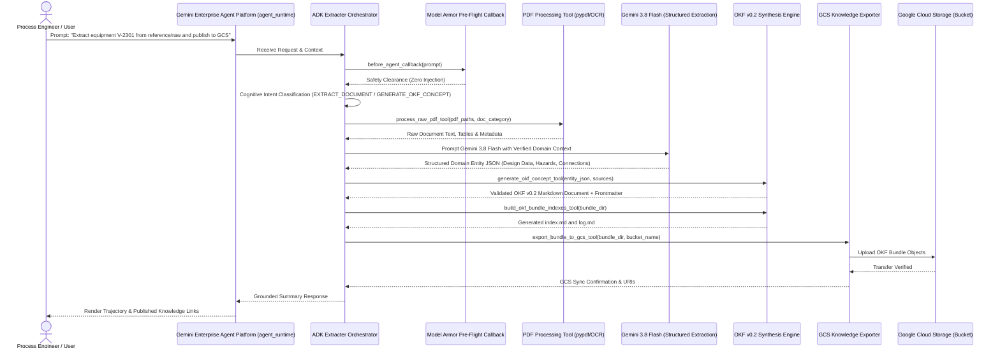

# Specification: Autonomous OKF Extracter Agent on Google ADK & Gemini Enterprise Agent Platform

**Document ID:** SPEC-20260922-OKF-EXTRACTER-AGENT  
**Status:** Approved  
**Date:** 2026-09-22  
**Target Project:** `your-gcp-project-id`  
**Git Repository:** `https://github.com/pantana-na/engineering-kg-and-extractor.git`  
**Target Runtime:** Gemini Enterprise Agent Platform (`agent_runtime`)  

---

## 1. Problem Statement & Objectives

### 1.1 Context & Motivation
Industrial engineering facilities (e.g. the Acme Petrochemical Demo Complex — Unit 2300 chemical plant) generate voluminous, heterogeneous technical documentation across process data sheets, Piping & Instrumentation Diagrams (P&IDs), Process Flow Diagrams (PFDs), operating manuals, and design standards. Historically, converting these raw engineering PDFs into structured knowledge required manual analysis by human process safety and chemical engineering experts.

To scale knowledge extraction, eliminate manual ingestion bottlenecks, and enable intelligent enterprise reasoning, we are developing the **Extracter Agent**. Built on the official **Google Agent Development Kit (`google-adk`)**, this autonomous agent runs on the **Gemini Enterprise Agent Platform (`agent_runtime`)**. It combines dedicated PDF document processing pipelines with **Gemini 3.8 Flash** model-driven extraction to generate structured knowledge conforming strictly to the **Open Knowledge Format (OKF v0.2)**, targeting **Google Cloud Storage (GCS)** as the authoritative destination.

### 1.2 Goals
1. **Official Google ADK Architecture:** Build an autonomous multi-agent reasoning system using `google-adk` (`Agent`, `FunctionTool`, `before_agent_callback`) packaged for Gemini Enterprise Agent Platform deployment (`agents-cli deploy --deployment-target agent_runtime`).
2. **Cognitive Model-Driven Reasoning:** Rely exclusively on model-driven reasoning via Gemini 3.8 Flash structured schemas and canonical intent topology; zero regex routing, keyword heuristics, or hardcoded fallback lists.
3. **Engineering PDF Extraction Pipeline:** Extract technical parameters, operating limits, equipment metallurgy, design specifications, P&ID instrumentation loops, HAZOP nodes, and process chemistry from complex PDFs in `reference/raw/`.
4. **OKF v0.2 Knowledge Construction:** Compile extracted domain data into fully compliant Open Knowledge Format bundles featuring YAML frontmatter (`type`, `title`, `description`, `sources` with credibility signals, `generated`, `verified`, `status`, `entity_metadata`) and structured Markdown bodies with per-claim footnote attribution (`[^source_id]`).
5. **GCS Knowledge Publishing:** Export and synchronize OKF knowledge bundles directly into target Google Cloud Storage buckets (`gs://<bucket>/<prefix>/...`) with atomic sync and content-type integrity.
6. **Progressive Disclosure & Navigation:** Automatically generate hierarchical directory indexes (`index.md`) and chronological update logs (`log.md`) matching OKF v0.2 specifications.
7. **Adherence to Repository Governance:** Strictly comply with SDD (Unit + Property-Based Tests at every step), DevSecOps (CodeMender SAST), unified `.env` configuration, and immutable reference boundaries.

### 1.3 Non-Goals
- Modifying or altering any contents within the read-only `reference/` directory (strictly immutable).
- Building bespoke proprietary frontend metadata formats; OKF v0.2 is the universal vendor-neutral standard.
- Hardcoded string extraction rules or heuristic regex scrapers.

---

## 2. System Architecture & Component Interaction

### 2.1 Runtime Boundary & Separation of Responsibilities

| Dimension | Autonomous AI Agents & Reasoning Engine | Web Frontend & API Streaming Proxies | Object Storage & Knowledge Repo |
| :--- | :--- | :--- | :--- |
| **Target Runtime** | **Gemini Enterprise Agent Platform (`agent_runtime`)** | **Google Cloud Run (`cloud_run`)** | **Google Cloud Storage (`storage.googleapis.com`)** |
| **Deployed Artifacts** | ADK Root Orchestrator (`ExtracterAgent`), extraction subagents, cognitive prompt topology, Model Armor security callback, and `FunctionTool` registries. | React/Vite web application, FastAPI streaming proxy, health probes (`/healthz`). | OKF knowledge bundles (`index.md`, `log.md`, `equipment/`, `hazards/`, `hazop/`, `instruments/`, `units/`). |
| **Deployment Mechanism** | `agents-cli deploy --deployment-target agent_runtime` | Google Cloud Build (`cloudbuild.yaml`) + Terraform via Infrastructure Manager | Automated ADK tool export or Cloud Build deployment |
| **Core Responsibilities** | Document ingestion, cognitive multimodal PDF extraction, OKF schema synthesis, GCS sync, live eval (`agents-cli eval`). | User interaction, authentication gateway (IAP/OAuth2), SSE streaming proxy to Agent Platform. | Durable storage, progressive disclosure serving, cross-system knowledge distribution. |
| **Governance Rule** | `_agents/rules/google_adk_and_agent_runtime.md` | `_agents/rules/devops_security_and_quality_standards.md` | `_agents/rules/spec_driven_development.md` |

### 2.2 Sequence Diagram: Cognitive Extraction & OKF Generation



### 2.3 Canonical Intent Topology (MECE)
Intent classification is strictly cognitive and model-driven using Gemini 3.8 Flash:
1. `EXTRACT_DOCUMENT`: Parse raw technical PDF documents (`reference/raw/`) and extract domain entities.
2. `GENERATE_OKF_CONCEPT`: Transform extracted domain entities into an individual OKF v0.2 concept document with frontmatter and body.
3. `BUILD_OKF_BUNDLE`: Process a collection of documents, generate concept categories (`equipment/`, `hazards/`, `hazop/`, `instruments/`, `parameters/`, `procedures/`, `units/`), and build progressive disclosure index files (`index.md`) and change logs (`log.md`).
4. `EXPORT_TO_GCS`: Upload and synchronize an OKF knowledge bundle directory to the designated GCS bucket.
5. `VALIDATE_OKF_BUNDLE`: Execute formal OKF v0.2 validation on a bundle (verifying frontmatter schemas, link integrity, and freshness).
6. `OTHERS`: Polite out-of-scope guidance explaining extraction and OKF synthesis capabilities.

### 2.4 Autonomous Orchestrator Instruction Contract & Trajectory Protocol
The root coordinator agent (`extracter_orchestrator`) prompt must provide explicit operational instructions establishing:
1. **Multi-Step Execution Trajectory:** Sequential flow from raw document discovery (`reference/raw/`), text/table extraction (`process_raw_pdf_tool`), OKF concept synthesis (`generate_equipment_okf_tool`), bundle progressive disclosure indexing & validation (`build_okf_indexes_and_validate_tool`), to GCS export (`export_bundle_to_gcs_tool`).
2. **Chemical Engineering Document Precedence Hierarchy:**
   - **Mechanical Dimensions & Design Ratings:** Process Data Sheets (especially As-Built Rev Z1) govern. Conflicting annotations on P&ID drawings must be documented with explicit Markdown conflict notes.
   - **Instrumentation & Control Loops:** P&IDs govern all transmitter tags, control loops, safety instrumented functions (SIS/ESD), voting logic (e.g. 2oo3), and pressure relief trains (PSVs).
   - **Operating Conditions & Streams:** Process Flow Diagrams (PFDs) govern stream numbers, temperatures, pressures, and flow rates.
   - **Process Safety Limits:** Engineering standards, operating manuals, and SDS govern safe operating windows and decomposition limits.
3. **Structured Entity Schemas:** Explicit parameter keys for `design_data`, `operating_conditions`, `connections`, `instruments`, `hazards`, and `source_files`.
4. **Strict Negative Constraints:** Immutable boundary protection for `reference/` (zero writes or deletions), strict grounding, and engineering unit fidelity.

### 2.4 Vertex AI Preemption Resilience & Retry Architecture (`gemini-3.8-flash`)
When executing sustained multi-turn trajectories against `gemini-3.8-flash` (`gemini-3.8-flash-rc`), Vertex AI may return transient `500 INTERNAL` (`DECODE_PREEMPTED` on `SHEDDABLE` QoS queues) or `503 UNAVAILABLE` mid-stream errors that gRPC `PredictStreamed` cannot retry automatically once partial stream chunks have been emitted:
1. **GenAI Client `HttpOptions` Retry Policy:** All `genai.Client()` instances in `extracter_agent/pdf/processor.py` and `extracter_agent/agent/classifier.py` must be initialized with `HttpOptions(retry_options=HttpRetryOptions(attempts=5, initial_delay=2.0, exp_base=2.0, http_status_codes=[429, 500, 502, 503, 504]))`.
2. **Turn-Level Exponential Backoff & Session Reset:** The evaluation and execution harness (`evals/run_live_vertex_eval.py`) wraps each ADK session turn in an exponential backoff retry loop (up to 4 attempts with jitter and cooldown), re-initializing a clean `InMemorySessionService` session whenever a transient server preemption (`500 INTERNAL`, `DECODE_PREEMPTED`, `503 UNAVAILABLE`, `429 RESOURCE_EXHAUSTED`) interrupts streaming.
3. **Checkpoint Resumability & Detached Execution:** Evaluation runs support `--resume` to skip already-passed cases and execute inside detached `tmux` / `setsid` sessions so batch evaluations continue uninterrupted across UI/client disconnects.

### 2.5 Multi-Unit Tag Sanitization, Cross-Sheet Conflict Callouts & Topology Extraction
1. **Multi-Vessel Tag Filename Sanitization (`sanitize_tag_filename`):**
   - Equipment and instrument tags containing slashes (e.g., `D-2204A/B/C`, `P-2301A/B`, `TI-23-0601 / TAH-23-0601`) must retain their exact display tag in the Markdown title and `entity_metadata.tag`, while sanitizing `/` and `\` out of the filesystem path (`equipment/D-2204ABC.md`, `equipment/P-2301AB.md`) to prevent `FileNotFoundError` subdirectory traversal errors.
2. **Resilient Domain Parameter Defaults:**
   - `EngineeringParameter`, `ConnectionStream`, and `InstrumentLoop` default `source` to `"Engineering Reference Document"` when omitted on secondary nozzles/streams to prevent Pydantic `ValidationError` aborts.
3. **Explicit Multi-Sheet & Cross-Document Conflict Callouts (`⚠️ CONFLICT`):**
   - When numerical ratings (such as internal design pressure, temperature, or nozzle sizing) differ across P&ID drawings, Process Data Sheet cover sheets vs. mechanical sketch sheets (e.g. Sheet 1 `0.5 kg/cm²g` vs. Sheet 4 `3.5 kg/cm²g` vs. P&ID `3.9 kg/cm²g`), the agent must explicitly document both values and emit a `⚠️ CONFLICT` callout note rather than silently dropping one value.
4. **Upstream/Downstream Gravity Drainage & SIS Trip Philosophy:**
   - The agent must explicitly extract upstream feeding vessels, downstream receiving vessels, and minimum static elevation head notes (e.g. `≥ 2500 mm`, `≥ 600 mm`, `≥ 5000 mm above quench nozzle`), as well as the process safety rationale for SIS/ESD valve trip actions (e.g. why `UXV-0601` closes on Concentration ESD `UC-2301`).

### 2.6 Cloud-Native GCS Raw Ingestion & Automatic Bundle Persistence
To ensure 100% cloud-native operation both during live Agent Runtime (`agent_runtime`) evaluations and remote Playground/API invocations:
1. **GCS Raw Document Discovery & Ingestion (`gs://your-gcp-project-id-okf-demo/reference/raw/`):**
   - `find_raw_documents_tool` queries Google Cloud Storage (`reference/raw/`) directly when `USE_GCS_STORAGE=true` (falling back to local `reference/raw/` only in offline unit test sandboxes).
   - `process_raw_pdf_tool` fetches the authoritative raw PDF blob from `gs://<bucket>/reference/raw/<subfolder>/<pdf_filename>` into an ephemeral cache (`/tmp/extracter_gcs_raw_cache/`) for multi-page text, table, and 300 DPI multimodal extraction.
2. **Automatic GCS Concept & Index Persistence (`gs://your-gcp-project-id-okf-demo/okf-bundles/acme-plant/`):**
   - Every call to `generate_equipment_okf_tool`, `generate_okf_concept_tool`, and `build_okf_indexes_and_validate_tool` automatically persists the generated `.md` concept, `index.md`, and `log.md` directly to `gs://your-gcp-project-id-okf-demo/okf-bundles/acme-plant/` in addition to the local staging directory (`build/okf_bundle/`).

---

## 3. Data Models & Type Contracts

All data structures are codified as strict Pydantic v2 models in `extracter_agent/models/`:

```python
from enum import Enum
from typing import Any, Optional
from pydantic import BaseModel, Field


class IntentCategory(str, Enum):
  EXTRACT_DOCUMENT = "EXTRACT_DOCUMENT"
  GENERATE_OKF_CONCEPT = "GENERATE_OKF_CONCEPT"
  BUILD_OKF_BUNDLE = "BUILD_OKF_BUNDLE"
  EXPORT_TO_GCS = "EXPORT_TO_GCS"
  VALIDATE_OKF_BUNDLE = "VALIDATE_OKF_BUNDLE"
  OTHERS = "OTHERS"


class IntentClassificationResult(BaseModel):
  intent: IntentCategory
  confidence: float = Field(ge=0.0, le=1.0)
  reasoning: str
  target_entities: list[str] = Field(default_factory=list)
  raw_sources: list[str] = Field(default_factory=list)


class OKFSource(BaseModel):
  id: str
  resource: str
  title: Optional[str] = None
  author: Optional[str] = None
  usage_count: Optional[int] = None
  last_modified: Optional[str] = None


class OKFActor(BaseModel):
  by: str
  at: str


class OKFConceptStatus(str, Enum):
  DRAFT = "draft"
  STABLE = "stable"
  DEPRECATED = "deprecated"


class OKFFullFrontmatter(BaseModel):
  type: str
  title: Optional[str] = None
  description: Optional[str] = None
  resource: Optional[str] = None
  tags: list[str] = Field(default_factory=list)
  sources: list[OKFSource] = Field(default_factory=list)
  generated: Optional[OKFActor] = None
  verified: list[OKFActor] = Field(default_factory=list)
  status: OKFConceptStatus = OKFConceptStatus.STABLE
  stale_after: Optional[str] = None
  entity_metadata: dict[str, Any] = Field(default_factory=dict)


class EquipmentDesignParameter(BaseModel):
  parameter: str
  value: str
  unit: Optional[str] = None
  source_citation: str


class InstrumentLoop(BaseModel):
  tag: str = Field(description="Instrument tag (e.g. TI-0404, FT-0401A, PSV-23-0401A)")
  service: str = Field(description="Process service or functional description")
  instrument_type: str = Field(description="Physical or functional instrument type (e.g. RTD, DP Transmitter, PSV)")
  location: Optional[str] = Field(default=None, description="Physical installation location or nozzle tap point")
  setpoint_or_range: Optional[str] = Field(default=None, description="Calibrated range or operational setpoint")
  interlock_or_alarm: Optional[str] = Field(default=None, description="Associated DCS alarm or SIS/ESD trip action")
  source: str = Field(description="Engineering drawing or datasheet citation")


class EquipmentExtractionPayload(BaseModel):
  tag: str
  name: str
  equipment_type: str
  unit: str
  description: str
  design_data: list[EquipmentDesignParameter] = Field(default_factory=list)
  operating_conditions: list[EquipmentDesignParameter] = Field(
      default_factory=list
  )
  instruments: list[InstrumentLoop] = Field(
      default_factory=list,
      description="P&ID instrumentation, transmitters, and control/safety loops associated with this equipment",
  )
  hazards: list[str] = Field(default_factory=list)
  connections: list[dict[str, str]] = Field(default_factory=list)
  source_files: list[str] = Field(default_factory=list)


class GCSUploadResult(BaseModel):
  bucket: str
  prefix: str
  files_uploaded: list[str]
  total_bytes: int
  gcs_root_uri: str
```

### 3.1 OKF v0.2 P&ID Relationship Architecture (Equipment-to-Instrument Cross-Linking)

In chemical engineering facilities, instrumentation is inextricably bound to equipment, piping loops, and process safety barriers. OKF v0.2 models these relationships using a 4-layer architecture:

1. **Structured Frontmatter (`entity_metadata.instruments`):**
   Equipment concept frontmatter contains an `instruments` array where each element contains:
   - `tag`: Normalized instrument tag (e.g. `TI-0404`, `FT-0401A/B/C`, `PSV-23-0401A`).
   - `service`: Functional description of the measurement/actuation.
   - `type`: Physical instrument or transmitter class (e.g. `RTD`, `DP Transmitter`, `Modulating PSV`).
   - `location`: Process nozzle, sump, or piping location.
   - `setpoint_or_range`: Calibrated instrument range or operational trip setpoint.
   - `interlock_or_alarm`: Associated alarm level (`FAL`, `TAHH`) or SIS/ESD trip action (`UC-2301 Trigger`).
   - `source`: Engineering drawing or process datasheet citation.

2. **Bidirectional Hypertext Graph Linking:**
   The Markdown body generates standard bundle-relative Markdown links:
   - From Equipment to Instrument: `[Tag](/instruments/{tag}.md)` or `[Tag](/instruments/{register}.md#{tag})`.
   - From Instrument Register to Equipment: `[Tag](/equipment/{tag}.md)`.

3. **Control Philosophy & SIS Topology:**
   Multi-element safety instrumented functions (e.g., 2oo3 voting on feed flow cutoff via `UXV-0401`, DIERS-sized overpressure relief via `PSV-23-0401A/B/C/D`) are detailed under `## Control Philosophy & Interlocks`.

4. **Engineering Footnote Provenance:**
   Every instrument row includes explicit footnote citations (e.g. `[^src-pid-0004]`) pointing to the authoritative P&ID drawing.

---

## 4. API Contracts & ADK FunctionTool Registries

### 4.1 Tool: `process_raw_pdf_tool`
- **Docstring:**
  ```text
  Extract raw textual content, structural tables, and engineering annotations from PDF documents in reference/raw/.
  When to use: Ingesting process data sheets, P&IDs, PFDs, or operating manuals for knowledge extraction.
  When NOT to use: Do not use for already extracted Markdown files or general conversational chat.
  ```
- **Arguments:**
  - `pdf_path` (str): Absolute or project-relative path to the PDF file.
  - `doc_category` (str): Category (`data_sheets`, `pid`, `pfd`, `operating_manuals`, `standards`).
- **Returns:**
  - `dict`: Formatted text pages, extracted tables, and document metadata.

### 4.2 Tool: `generate_okf_concept_tool`
- **Docstring:**
  ```text
  Construct a validated Open Knowledge Format (OKF v0.2) concept document with frontmatter and Markdown body.
  When to use: Generating compliant knowledge files for equipment, hazards, HAZOP, instruments, or units.
  When NOT to use: Do not use for modifying immutable reference/ files or writing raw unconverted notes.
  ```
- **Arguments:**
  - `concept_id` (str): Relative path without extension (e.g. `equipment/V-2301`).
  - `concept_type` (str): Descriptive OKF type (e.g. `Equipment Concept`).
  - `title` (str): Human-readable concept title.
  - `description` (str): Concise single-sentence summary.
  - `tags` (list[str]): Categorical tags.
  - `sources` (list[dict]): Provenance sources with id, resource, and author.
  - `body_markdown` (str): Structured Markdown body with footnotes.
  - `entity_metadata` (dict): Domain-specific properties.
- **Returns:**
  - `dict`: Full OKF Markdown document string, validation verdict, and output path.

### 4.3 Tool: `build_okf_bundle_indexes_tool`
- **Docstring:**
  ```text
  Generate progressive disclosure index.md files for every directory in the OKF bundle, plus log.md.
  When to use: Completing an OKF bundle prior to deployment or after adding/updating concept files.
  When NOT to use: Do not use on non-OKF directories.
  ```
- **Arguments:**
  - `bundle_dir` (str): Path to the root of the generated OKF bundle directory.
- **Returns:**
  - `dict`: List of generated index files, entry counts, and log path.

### 4.4 Tool: `export_bundle_to_gcs_tool`
- **Docstring:**
  ```text
  Upload and synchronize an entire OKF knowledge bundle directory to Google Cloud Storage (GCS).
  When to use: Publishing a completed, validated OKF bundle to the enterprise destination bucket.
  When NOT to use: Do not use if the bundle fails OKF validation or contains malformed frontmatter.
  ```
- **Arguments:**
  - `bundle_dir` (str): Path to the local bundle directory.
  - `gcs_bucket` (str): Target GCS bucket name.
  - `gcs_prefix` (str): Target prefix folder within the bucket.
- **Returns:**
  - `dict`: Upload confirmation, object URIs, total bytes, and timestamp.

### 4.5 Tool: `validate_okf_bundle_tool`
- **Docstring:**
  ```text
  Execute rigorous OKF v0.2 validation verifying frontmatter schemas, link integrity, and progressive indexes.
  When to use: Verifying quality and standards compliance of an OKF bundle before publishing.
  When NOT to use: Do not use on raw unstructured PDF files.
  ```
- **Arguments:**
  - `bundle_dir` (str): Path to the bundle directory to validate.
- **Returns:**
  - `dict`: Validity boolean, list of errors, warnings, and trust tier distribution.

---

## 5. UI/UX, Security, Guardrails & Non-Functional Requirements

1. **Pre-Flight Callback Guardrail (`before_agent_callback`):**
   - Intercept prompts before model execution.
   - Detect prompt injection, adversarial bypasses, or jailbreak attempts.
   - Immediately abort execution if flagged (`filterMatchState == "MATCH_FOUND"`), preventing unauthorized tool invocation.
2. **Deterministic Footnote Attribution:**
   - Every factual claim derived from a raw document must include a Markdown footnote `[^source-id]` matching a declared entry in `sources[]`.
3. **Environment & Secrets Isolation:**
   - No credentials, tokens, or private endpoints committed to source control.
   - Unified `.env` file structure (`NONPROD_*` and `PROD_*`) documented in `.env.example`.
4. **Reference Immutability:**
   - Runtime file output guards prevent write/delete operations targeting `reference/`.

---

## 6. DevOps, Security, Cloud & Agent Governance Checklist

| Rule | Area | Requirement / Architecture Specification |
| :--- | :--- | :--- |
| **Rule 1** | **SCM & Multi-Branch** | Single GitHub repo `https://github.com/pantana-na/engineering-kg-and-extractor.git`; Non-Prod (`main`) vs Prod (`prod`). |
| **Rule 2** | **Code Quality** | Strict type hinting, Ruff/Flake8 linting, Pyright/Mypy type safety, zero critical code smells. |
| **Rule 3** | **SAST & CodeMender** | Pre-build vulnerability scan, triage, and patching via CodeMender (`cm find`, `cm verify`, `cm fix`). Reports in `docs/`. |
| **Rule 4** | **Artifact Analysis** | Third-party dependency security scanning via Container Analysis / pip audit. |
| **Rule 5** | **Cloud Build** | Automated builds via `cloudbuild.yaml` targeting Artifact Registry in `your-gcp-project-id`. |
| **Rule 6** | **Cloud Run Observability**| Liveness probe `/healthz`, structured JSON logging, latency and error metrics. |
| **Rule 7** | **Post-Deploy Smoke Test** | Post-deployment integration tests validating GCS bucket connectivity and agent invocation. |
| **Rule 8** | **Unified `.env` Management**| Single unified `.env` file with base shared variables, `NONPROD_*` block, and `PROD_*` block. |
| **Rule 9** | **Terraform & Infra Manager** | Declarative IaC under `terraform/` managed via Google Cloud Infrastructure Manager. |
| **Rule 10**| **IAM & Ingress** | Zero `allUsers` bindings; Pattern 3 direct unauthenticated or Pattern 1 IAP gateway. |
| **Rule 11**| **Google ADK & Agent Runtime** | Official `google-adk`, deployed to Gemini Enterprise Agent Platform (`agent_runtime`) via `agents-cli deploy`. Strictly model-driven reasoning; zero regex/heuristics. |
| **Rule 12**| **Live Agent Evaluation** | Continuous live evaluation via `agents-cli eval` ($\ge 95\%$ tool precision, 1.000 groundedness). |
| **Rule 13**| **Root Cause Investigation** | Mandatory 4-step RCA protocol on failure; zero quick fixes, mockups, or regex patches. |

---

## 7. Step-by-Step Implementation Plan & Test Design

### Step 1: Environment Configuration & Core Data Models
- **Implementation:**
  - Create unified multi-environment configuration file `.env` and `.env.example` storing target GCP project (`your-gcp-project-id`), GitHub repo (`https://github.com/pantana-na/engineering-kg-and-extractor.git`), GCS bucket names, and Gemini model configs.
  - Implement Pydantic data models for OKF v0.2 (`OKFDocument`, `OKFFullFrontmatter`, `OKFSource`, `OKFActor`, `OKFConceptStatus`), chemical engineering entities (`EquipmentExtractionPayload`, `EquipmentDesignParameter`), and intent classification in `extracter_agent/models/`.
- **Unit Tests:**
  - Deterministic parsing tests for OKF frontmatter, required key validation (`type`), ISO 8601 timestamps, and serializing/deserializing payloads.
- **Property-Based Tests (PBT):**
  - Use `hypothesis` to test serialization/deserialization round-tripping of `OKFDocument` across arbitrary generated YAML frontmatter dictionaries and markdown strings.
  - Invariant: `OKFDocument.parse(doc.serialize()) == doc` must hold for all valid frontmatters.
- **Completion Criteria:** 100% unit and property test pass rate for data models and configuration loader.

### Step 2: PDF Document Processing Pipeline
- **Implementation:**
  - Implement `extracter_agent/pdf/processor.py` to extract text, tables, and document layout from chemical engineering PDFs in `reference/raw/` (`data_sheets/`, `pid/`, `pfd/`, `operating_manuals/`, `standards/`).
  - Implement caching and extraction chunking to handle multi-page engineering manuals and complex data sheets.
- **Unit Tests:**
  - Test PDF text extraction, table detection, page count metadata, and error handling for missing/corrupted files.
- **Property-Based Tests (PBT):**
  - Invariant testing with `hypothesis` verifying that extracted text chunks preserve character counts and never throw unhandled exceptions across malformed byte streams.
- **Completion Criteria:** Clean extraction verified on actual sample PDFs from `reference/raw/data_sheets/` with passing tests.

### Step 3: OKF v0.2 Knowledge Synthesis & Progressive Disclosure Engine
- **Implementation:**
  - Implement `extracter_agent/okf/synthesizer.py` to convert domain extraction payloads into conformant OKF v0.2 concept documents.
  - Implement `extracter_agent/okf/indexer.py` to generate progressive disclosure `index.md` files for directories and chronological `log.md`.
  - Implement `extracter_agent/okf/validator.py` to validate bundles against OKF v0.2 rules (§4, §5, §8, §11).
- **Unit Tests:**
  - Verify frontmatter formatting, footnote creation, progressive index generation, trust tier derivation, and validation error detection.
- **Property-Based Tests (PBT):**
  - Invariant testing verifying that `indexer.py` generates `index.md` files where 100% of listed concept links resolve to existing files within the bundle directory.
- **Completion Criteria:** OKF documents synthesized and validated against the specification with 100% test pass rate.

### Step 4: Google Cloud Storage (GCS) Knowledge Exporter
- **Implementation:**
  - Implement `extracter_agent/gcs/exporter.py` using `google-cloud-storage` to upload OKF bundles to GCS buckets with atomic synchronization, MD5 hashing, and proper MIME types (`text/markdown`, `text/yaml`).
- **Unit Tests:**
  - Test upload queueing, path-to-URI conversion, MIME type mapping, and dry-run synchronization.
- **Property-Based Tests (PBT):**
  - Invariant testing verifying that GCS object keys mapped from local bundle paths strictly preserve hierarchy and never contain illegal characters.
- **Completion Criteria:** Exporter unit and property tests passing.

### Step 5: ADK Agent Architecture, FunctionTools & Model-Driven Reasoning
- **Implementation:**
  - Implement strongly typed ADK `FunctionTool` callables wrapping PDF extraction, OKF synthesis, bundle indexing, GCS export, and validation in `extracter_agent/tools/`.
  - Implement cognitive model-driven intent classifier `extracter_agent/agent/classifier.py` using Gemini 3.8 Flash structured schemas.
  - Implement pre-flight Model Armor guardrail callback `before_agent_callback` in `extracter_agent/agent/guardrails.py`.
  - Implement root `ExtracterAgent` and ADK application container `extracter_agent/agent/orchestrator.py`.
  - Create `agents-cli-manifest.yaml` targeting `agent_runtime` on Gemini Enterprise Agent Platform.
- **Unit Tests:**
  - Test tool callable signatures, schema generation, Model Armor attack interception, and ADK agent initialization.
- **Property-Based Tests (PBT):**
  - Invariant testing verifying that intent classification strictly returns members of `IntentCategory` enum across arbitrary fuzzed user queries.
- **Completion Criteria:** Agent initialized with registered tools, guardrail callbacks, and passing tests.

### Step 6: End-to-End Extraction & Evaluation
- **Implementation:**
  - Run end-to-end extraction on `reference/raw` documents (e.g. `ACME-2300-PS-V2301...` data sheet and `ACME-2300-PID-23-0001...` P&ID) to generate OKF concepts in `build/okf_bundle/equipment/V-2301.md`.
  - Validate the generated OKF bundle using `validate_okf_bundle_tool`.
  - Create evaluation dataset `evals/datasets/extraction_eval.jsonl` testing tool selection precision ($\ge 95\%$) and groundedness.
- **Unit Tests & Evals:**
  - Run full test suite (`pytest tests/`).
  - Run `agents-cli` validation or test scripts.
- **Completion Criteria:** Full test suite passes; generated OKF bundle passes all validation checks.

### Step 7: Security Audit (CodeMender SAST) & Documentation
- **Implementation:**
  - Run CodeMender (`cm find`) to conduct pre-build SAST scanning.
  - Document findings and remediation in `docs/codemender-sast-report.md`.
  - Author living plan progress tracking report in `specs/plan/PROGRESS_REPORT_20260922.md`.
  - Synchronize `specs/README.md` and `README.md`.
- **Completion Criteria:** Zero High/Critical security vulnerabilities; complete documentation and execution tracking.

### Step 8: P&ID Equipment-Instrument Relationship Extraction & Cross-Linking Engine
- **Implementation:**
  - Codify `InstrumentLoop` model in `extracter_agent/models/domain.py` and attach `instruments: list[InstrumentLoop]` to `EquipmentEntity`.
  - Update `extracter_agent/okf/synthesizer.py` to inject `entity_metadata.instruments` in YAML frontmatter and render `## Instrumentation & Control Loops (P&ID)` table in Markdown body with bundle-relative links (`/instruments/{tag}.md`).
  - Update `extracter_agent/tools/okf_tools.py` signature and docstring contracts to accept `instruments` parameter.
- **Unit Tests:**
  - In `tests/test_okf_unit.py`: Verify that synthesizing an equipment concept with `InstrumentLoop` entities produces valid frontmatter arrays, correctly formatted Markdown tables, and footnote citations.
  - Test edge cases: equipment with zero instruments, instruments without optional locations/ranges.
- **Property-Based Tests (PBT):**
  - In `tests/test_okf_property.py`: Formulate invariant tests with `hypothesis` verifying that:
    1. For every synthesized instrument loop, the generated Markdown link strictly conforms to bundle-relative URI pattern `^\[[^\]]+\]\(/instruments/[^)]+\.md\)$`.
    2. Serializing and deserializing OKF frontmatter preserves all instrument tags and attributes without loss or truncation.
- **Completion Criteria:** 100% unit and property-based test pass rate; zero spec drift; clean schema fidelity.

### Step 9: Ground Truth Evaluation Suite
- **Implementation:**
  - Build automated dataset compiler `evals/builders/build_wiki_eval_dataset.py` that generates `evals/datasets/wiki_ground_truth_eval.jsonl`.
  - Each JSONL record encapsulates:
    - `eval_id`: Unique evaluation identifier (e.g. `eval-equipment-V-2301`).
    - `category`: Functional domain category.
    - `target_tag`: Canonical entity tag or concept name.
    - `source_files`: Authoritative raw PDF files in `reference/raw/` that ground this entity.
    - `user_prompt`: Natural language extraction query.
    - `expected_intent`: Canonical intent category (`GENERATE_OKF_CONCEPT` or `EXTRACT_DOCUMENT`).
    - `expected_tool_trajectory`: Required ADK tool execution sequence.
    - `ground_truth`: Structured expert-verified parameters, tables, instrumentation loops, and safeguards.
    - `verification_rules`: Strict assertions for parameters, links, and footnotes.
- **Unit & Property Tests:**
  - Verify that `wiki_ground_truth_eval.jsonl` contains pure extraction records.
  - Validate that 100% of JSONL records parse against strict Pydantic evaluation schemas with zero null or empty target tags.
- **Completion Criteria:** Complete dataset generated and verified by automated tests.

### Step 11: Document Discovery, Vector P&ID Multimodal Ingestion & Universal OKF Synthesis
- **Implementation:**
  - Implement `find_raw_documents_tool(query, subfolder)` enabling cognitive discovery of target engineering documents across `reference/raw/`.
  - Upgrade `process_raw_pdf_tool` and `pdf/processor.py` with vector drawing detection (`is_vector_drawing`) and Google GenAI multimodal Part conversion (`extract_pdf_multimodal_part`) to support AutoCAD vector drawings (P&IDs, PFDs) with 0 native text streams.
  - Implement universal concept synthesis tool `generate_okf_concept_tool` for hazards, instruments, procedures, and units.
  - Implement standalone bundle validation tool `validate_okf_bundle_tool`.
  - Register all 7 tools in ADK Root Orchestrator (`extracter_orchestrator`).
- **Unit & Property Tests:**
  - Unit tests for raw document searching, vector drawing detection, concept generation, and bundle validation.
  - Property-based tests verifying invariant search result integrity and valid frontmatter generation across arbitrary concept categories.
- **Completion Criteria:** All 7 tools registered and passing 100% unit and property tests.

### Step 12: Multimodal Visual Extraction for Vector Drawings & Scanned Schedules
- **Implementation:**
  - Implement `extract_pdf_multimodal_summary(file_path, prompt_hint)` in `extracter_agent/pdf/processor.py` using `google.genai.Client` and `types.Part.from_bytes` for automatic multimodal interpretation of vector CAD drawings (P&IDs, PFDs) and scanned raster equipment schedules.
  - Integrate multimodal extraction into `process_raw_pdf_tool` in `extracter_agent/tools/pdf_tools.py` whenever `is_vector_drawing` is True or pages lack digital font streams (`chars < 50`).
  - Enable seamless multi-source cross-document reconciliation (e.g. Process Data Sheet + P&ID drawing) in the ADK agent trajectory without failure on vector-only or scanned documents.
- **Unit & Property Tests:**
  - Deterministic tests verifying multimodal fallback triggers when text is empty or document is vector drawing.
  - Property tests verifying that multimodal text preserves equipment tag candidates and engineering units.
- **Completion Criteria:** Live multi-source evaluation successfully discovers, reads, reconciles, and synthesizes OKF v0.2 equipment concepts citing multiple raw documents.

### Step 14: Autonomous Domain Slug Derivation, Multimodal Caching, Link Sanitization & Parallel Evaluation
- **Implementation:**
  1. **Deterministic Domain Slug Taxonomy (`extracter_agent/models/domain.py` & `extracter_agent/tools/okf_tools.py`):**
     - Implement `derive_canonical_equipment_tag(tag, source_files)` that resolves equipment filenames from the authoritative `PS-<TAG>_` document code in `source_files` (e.g., `PS-E2307` $\rightarrow$ `E-2307`, `PS-P2302` $\rightarrow$ `P-2302`, `PS-E2302AB` $\rightarrow$ `E-2302AB`), falling back to `sanitize_tag_filename(tag)`.
     - Implement `derive_canonical_concept_id(concept_id, concept_type, title, sources, entity_metadata)` that autonomously derives canonical paths from raw metadata.
  2. **Instrument Link Sanitization & Zero-Fabrication Nozzle Rule (`extracter_agent/okf/synthesizer.py` & `extracter_agent/agent/orchestrator.py`):**
     - Sanitize all `/instruments/{safe_tag}.md` links using `sanitize_tag_filename` after stripping parenthetical nozzle remarks (`(Y02)`).
     - Render datasheet nozzle marks (`Nozzle Y02 (LT)`) as plain text when no P&ID loop tag exists.
  3. **Two-Tier Multimodal PDF Cache & Context Deduplication (`extracter_agent/pdf/processor.py` & `extracter_agent/tools/pdf_tools.py`):**
     - Persist `extract_pdf_multimodal_summary` output keyed by SHA-256 hash in `/tmp/extracter_multimodal_cache/` and `gs://.../cache/multimodal/`.
     - Attach `multimodal_text` at most once per PDF in `process_raw_pdf_tool` rather than duplicating across every empty page.
  4. **Master Plant Catalog Indexer & Parallel GCS Exporter (`extracter_agent/okf/indexer.py` & `extracter_agent/gcs/exporter.py`):**
     - Upgrade `generate_bundle_indexes` to compile a root `index.md` with unit breakdown, equipment design/safeguard matrix, chemical hazard runaway matrix, instrument/SIS register, and cross-document `⚠️ CONFLICT` register.
     - Upgrade `export_bundle_to_gcs` with `ThreadPoolExecutor(max_workers=16)` and unchanged-blob skipping.
  5. **Dataset Intent Alignment & Parallel Evaluation Runner (`evals/builders/build_wiki_eval_dataset.py` & `evals/run_live_vertex_eval.py`):**
     - Align `expected_intent` (`GENERATE_OKF_CONCEPT` for OKF v0.2 synthesis prompts, `BUILD_OKF_BUNDLE` for `index.md`/`log.md`) while keeping prompts 100% free of `concept_id` hints.
     - Add `--concurrency N` async worker pool and source-grounded concept matching to `run_live_vertex_eval.py`.
- **Unit & Property-Based Tests (PBT):**
  - Unit tests verifying `derive_canonical_equipment_tag`, `derive_canonical_concept_id`, multimodal cache hit/miss, context deduplication, and master `index.md` generation.
  - Property-Based Tests (`hypothesis`) verifying idempotence (`f(f(x)) == f(x)`), whitespace/parenthesis-free `/instruments/...` Markdown links across fuzzed strings, and $\le 1$ multimodal payload occurrence across arbitrary page arrays.
- **Completion Criteria:** 100% `pytest` pass rate, 0 Ruff/Bandit issues, repaired bundle synced to GCS, redeployed `agent_runtime`, and resumed parallel evaluation.

### Step 15: Complete Codebase De-Hardcoding, Corpus-Driven Cross-Linking & 100% Golden Parity
- **Implementation:**
  1. **Purge Static Dictionaries & Plant Tags from `extracter_agent/models/domain.py`:**
     - Delete static `instrument_map`, hardcoded tag tuples, hardcoded chemical suffix lists, and document number literals.
     - Implement general source-citation and bundle-catalog matching (`derive_canonical_equipment_tag` and `derive_canonical_concept_id` accepting `bundle_root: Path | None = None`) that resolves paths by matching shared `sources` PDF citations and normalized titles against existing bundle metadata or generic `<category>/<slug>` formatting.
     - Generalize all Pydantic `Field(description=...)` strings in `domain.py` so zero dataset tags are embedded in model schemas.
  2. **Corpus-Driven Bundle-Indexed Instrument Cross-Linking (`extracter_agent/okf/synthesizer.py` & `extracter_agent/okf/indexer.py`):**
     - Implement `resolve_bundle_instrument_link(inst_tag, instrument_type, service, bundle_root)` which dynamically inspects the actual `instruments/*.md` files present in `bundle_root` with **zero hardcoded ISA prefix `if/elif` chains**.
     - Remove hardcoded default bucket/prefix/model/timestamp literals from `synthesizer.py`, `okf_tools.py`, and `exporter.py`, resolving dynamically via `get_config()` and current UTC ISO-8601 timestamps.
     - Refactor `_build_master_root_index` in `extracter_agent/okf/indexer.py` to dynamically build the Master Knowledge Catalog from bundle frontmatter.
  3. **De-Hardcode `cli.py`, `orchestrator.py`, `processor.py`, `okf_tools.py`, `pdf_tools.py` & `guardrails.py`:**
     - Replace hardcoded equipment dictionaries in `extracter_agent/cli.py` (`run_batch_extraction`) with dynamic PDF discovery and extraction.
     - Generalize `ORCHESTRATOR_INSTRUCTIONS` (`orchestrator.py`), `extract_pdf_multimodal_summary` (`processor.py`), and all ADK `FunctionTool` docstrings (`okf_tools.py`, `pdf_tools.py`) so zero test-set numbers, filenames, or equipment tags are hardcoded in prompts or tool declarations.
     - Upgrade `check_prompt_security` (`guardrails.py`) with structured `SafetyEvaluationResult` schema validation.
- **Unit & Property-Based Tests (PBT):**
  - `test_zero_hardcoded_domain_maps_or_tags`: Source audit test verifying `domain.py`, `indexer.py`, `synthesizer.py`, `cli.py`, `orchestrator.py`, `processor.py`, `okf_tools.py`, and `pdf_tools.py` contain zero hardcoded plant dictionaries, ISA prefix `if/elif` chains, or dataset-specific entity tags.
  - `test_pbt_dynamic_instrument_link_never_broken`: `hypothesis` property test verifying that `resolve_bundle_instrument_link(..., bundle_root=...)` always resolves to an existing `.md` file in `bundle_root`.
- **Completion Criteria:** Zero hardcoded domain maps/tags across the entire codebase, `0` broken Markdown links, and 100% `pytest` pass rate.

### Step 16: In-Place Updated Document Resolution, Content-Hash Cache Hardening & Cloud Run ADK Web UI Deployment
- **Actions:**
  1. **GCS Raw PDF Download Cache Hardening (`extracter_agent/tools/pdf_tools.py`):**
     - Enhance `_list_gcs_raw_blobs(force_refresh: bool = False)` to capture `md5_hash` (`blob.md5_hash`) and `updated` (`str(blob.updated or "")`) metadata alongside `size_bytes`.
     - Enhance `_download_pdf_from_gcs` to verify both local file size and base64-encoded MD5 digest (`_compute_file_md5_b64`) against the GCS blob's `size_bytes` and `md5_hash`; automatically re-download when an in-place updated PDF is detected in GCS.
  2. **Subdirectory File `mtime_ns` Cache Invalidation (`extracter_agent/models/domain.py` & `extracter_agent/okf/synthesizer.py`):**
     - Include `(len(md_files), max((p.stat().st_mtime_ns for p in md_files), default=0))` in the cache keys for `_iter_bundle_catalog` (`domain.py`) and `resolve_bundle_instrument_link` (`synthesizer.py`) so in-place edits to existing `.md` files on POSIX filesystems immediately invalidate in-memory caches.
  3. **MD5 Digest Verification in Batch GCS Exporter (`extracter_agent/gcs/exporter.py`):**
     - Track `existing_meta: dict[str, tuple[int, str | None]]` (`(b.size or 0, getattr(b, "md5_hash", None))`) in `GCSExporter.export_bundle` and compare local base64 MD5 digests so same-byte-length in-place updates are always uploaded to GCS.
  4. **Cloud Run ADK Web UI Deployment & Unified `deploy.sh` Script (`deploy.sh`, `extracter_agent/requirements.txt`):**
     - Provide `extracter_agent/requirements.txt` for containerized Cloud Run / Agent Platform builds.
     - Author `deploy.sh` supporting `--target all|agent_runtime|cloud_run` to deploy the ADK Agent (`adk deploy agent_engine`) and the interactive Web UI to Google Cloud Run (`extracter-agent-web` in `asia-southeast1`).
  5. **Global Vertex AI Model Endpoint Routing (`GEMINI_LOCATION=global`) Across Agent & Cloud Run (`extracter_agent/config.py`, `extracter_agent/agent/orchestrator.py`, `extracter_agent/agent/classifier.py`, `extracter_agent/pdf/processor.py`, `deploy.sh`, `.env`):**
     - Add `gemini_location: str = Field(default_factory=lambda: os.getenv("GEMINI_LOCATION", "global"))` to `AppConfig` (`config.py`), decoupling the Vertex AI publisher model endpoint location (`locations/global/publishers/google/models/gemini-3.8-flash`) from regional GCP infrastructure (`GOOGLE_CLOUD_LOCATION=asia-southeast1` for Cloud Run and Agent Engine sessions).
- **Unit & Property-Based Tests (PBT):**
  - `test_gcs_pdf_cache_redownloads_on_md5_or_size_change`, `test_in_place_md_update_invalidates_catalog_and_instrument_caches`, `test_exporter_uploads_same_size_modified_content`, `test_pbt_md5_cache_invalidation_on_any_mutation`, `test_gemini_global_location_routing_in_vertex_mode`, `test_pbt_gemini_location_decoupled_from_infra_region`.
- **Completion Criteria:** All Step 16 unit and property-based tests passing, Web UI deployed and verified on Google Cloud Run (`extracter-agent-web`).

### Step 17: Incremental File-by-File Extraction, Read-Merge-Upsert Tooling & Document-Centric Evaluation Dataset
- **Actions:**
  1. **New Bundle Inspection Tool `inspect_existing_okf_concept_tool` (`extracter_agent/tools/okf_tools.py` & `extracter_agent/agent/orchestrator.py`):**
     - Implement `inspect_existing_okf_concept_tool(concept_id: str | None = None, source_filter: str | None = None, output_bundle_dir: str | None = None)` allowing the agent to inspect an existing OKF concept document or query all existing concepts in the bundle that cite a given raw source PDF.
  2. **Automatic Incremental Read-Merge-Upsert Engine (`extracter_agent/okf/synthesizer.py` & `extracter_agent/tools/okf_tools.py`):**
     - Implement `merge_equipment_entity_with_existing` and `merge_markdown_bodies` in `extracter_agent/okf/synthesizer.py` with **Revision-Aware Source Supersession (`_is_same_source_or_revision_update`)**.
  3. **Document-Centric (File-by-File) Workflow Protocol in `ORCHESTRATOR_INSTRUCTIONS` (`extracter_agent/agent/orchestrator.py`):**
     - Update `ORCHESTRATOR_INSTRUCTIONS` (with zero hardcoded tags or dataset examples) to explicitly guide the agent when prompted to process a raw PDF file.
  4. **Document-Centric Evaluation Dataset Builder & Runner Support (`evals/builders/build_file_by_file_eval_dataset.py`, `evals/datasets/raw_file_by_file_eval.jsonl`, `evals/run_live_vertex_eval.py`):**
     - Build `evals/builders/build_file_by_file_eval_dataset.py` to scan all raw PDF files in `reference/raw/` and emit evaluation records in `evals/datasets/raw_file_by_file_eval.jsonl`.
- **Unit & Property-Based Tests (PBT):**
  - `test_incremental_equipment_merge_and_conflict_detection`, `test_inspect_existing_okf_concept_tool`, `test_incremental_concept_markdown_table_and_section_merge`, `test_raw_file_by_file_eval_dataset_integrity`, `test_pbt_incremental_merge_monotonic_and_idempotent`, `test_pbt_same_document_revision_supersedes_without_conflict`, `test_pbt_merge_markdown_bodies_preserves_rows_and_idempotent`.
- **Completion Criteria:** All Step 17 unit and property tests passing.

### Step 18: Strict Entity-Identity & Symmetric Slug Guard in Canonical Concept Resolution (Option A - RCA Approved)
- **Actions:**
  1. **Equipment Base-ID Identity Guard (`extracter_agent/models/domain.py` — `derive_canonical_equipment_tag`):**
     - Implement `_extract_equipment_base_id(tag_str: str) -> str` to extract the canonical `<PREFIX>-<NUMBER>` base identifier.
     - Filter `ps_candidates` extracted from `source_files` so that only Process Data Sheets whose base equipment ID matches `_extract_equipment_base_id(safe)` are eligible to canonicalize the filename stem.
  2. **Core-Slug Normalization & Symmetric Specificity Scoring (`extracter_agent/models/domain.py` — `derive_canonical_concept_id`):**
     - Strip generic descriptor affixes to form `core_id` and incorporate symmetric slug Jaccard similarity, stem specificity bonus, and capped source bonus.
  3. **Entity Tag Verification Guard on Merge/Upsert (`extracter_agent/tools/okf_tools.py`):**
     - Verify that any existing `entity_metadata.tag` shares the same base equipment ID before merging or overwriting.
- **Unit & Property-Based Tests (PBT):**
  - `test_equipment_tag_resolution_never_collides_on_shared_sources`, `test_concept_id_specificity_prevents_prefix_and_shared_source_collision`, `test_pbt_equipment_tag_base_id_preservation_invariant`.
- **Completion Criteria:** All unit and property-based tests passing, zero concept collisions in `build/okf_bundle/`.

### Step 19: Corpus-Wide Fact Recall Upgrade — Boundary-Aware PDF Resolution, Universal Datasheet Vision, Page-Window Batching & Schema-Tolerant Table Merging (Option A)
- **Actions:**
  1. **Boundary-Aware Document Code & Token Resolution (`extracter_agent/tools/pdf_tools.py`):**
     - Implement `_match_pdf_candidate(pdf_filename: str, subfolder: str, candidates: list[dict[str, Any]]) -> dict[str, Any] | None` prioritizing exact filename match, exact leading document-code prefix match, regex alphanumeric boundary match, and multi-token inclusion match.
  2. **Universal `data_sheets` Multimodal Vision & Unconditional Injection (`extracter_agent/tools/pdf_tools.py`):**
     - Trigger `extract_pdf_multimodal_summary` for all `subfolder == "data_sheets"` (in addition to `is_vector` drawings and pages with `< 100` chars), bypassing border header boilerplate traps.
  3. **Expanded Default `max_pages` & Page-Window Batching for Multi-Sheet PDFs (`extracter_agent/pdf/processor.py` & `extracter_agent/tools/pdf_tools.py`):**
     - Increase default `max_pages` in `process_raw_pdf_tool` from `10` to `75` and upgrade `extract_pdf_multimodal_summary` with page-window batching.
  4. **Multi-Table & Schema-Tolerant Section Merging (`extracter_agent/okf/synthesizer.py`):**
     - Implement `_extract_all_table_spans(lines)` and upgrade `_merge_section_content` to align and merge tables with differing column counts and preserve secondary `### ` sub-tables.
- **Unit & Property-Based Tests (PBT):**
  - `test_pdf_resolution_boundary_and_shortened_citation`, `test_datasheet_with_border_boilerplate_triggers_and_injects_multimodal`, `test_multimodal_window_batching_for_multipage_pdf`, `test_merge_section_content_multi_table_and_mismatched_columns`, `test_pbt_pdf_candidate_exact_code_prefix_never_matches_alpha_suffix`, `test_pbt_merge_markdown_bodies_preserves_all_tables_across_column_variations`.
- **Completion Criteria:** 100% `pytest` pass rate.

### Step 20: V3 Unified General Multimodal Extraction, Prompt-Hashed Cache Key, 4-Page Windowing & Full-Column Synthesis
- **Actions (100% General, Zero Hardcoded Prefixes, Fluid Codes, or Folder Branches):**
  1. **Prompt-Hashed Multimodal Cache Key (`extracter_agent/pdf/processor.py`):**
     - Construct `base_prompt = _build_multimodal_prompt(prompt_hint=prompt_hint)` before computing the cache digest `pdf_sha = _compute_multimodal_cache_digest(pdf_bytes, base_prompt)`.
  2. **Unified Domain-Agnostic Multimodal Prompt & Uniform `window_size=4` (`extracter_agent/pdf/processor.py`):**
     - Implement `_build_multimodal_prompt(prompt_hint: str | None) -> str` using a single, general engineering prompt.
  3. **Universal Multimodal Trigger & Structural Density Page Scoring (`extracter_agent/tools/pdf_tools.py`):**
     - Remove the hardcoded `subfolder` / `page_count > 10` gate in `process_raw_pdf_tool` so all PDFs run multimodal vision when `enable_multimodal=True`.
- **Unit & Property-Based Tests (PBT):**
  - `test_multimodal_cache_key_includes_prompt_hash`, `test_unified_multimodal_prompt_and_4page_window_size`, `test_universal_multimodal_trigger_for_all_documents`, `test_pbt_prompt_hashed_cache_digest_collision_free_on_prompt_or_byte_mutation`.
- **Completion Criteria:** 100% unit and property test pass rate, zero hardcoded tags/prefixes/fluid codes (`test_zero_hardcoded_domain_maps_or_tags`).

### Step 21: V4 Sub-0.5% Miss-Rate Upgrade — Non-Destructive Incremental Merging, Chunked Register Upserts, Multi-Target PFD/SDS Synthesis, Both-Value Conflict Retention & Adaptive Vector Windowing (Zero Hardcoding)
- **Actions (1–5 Implemented with 100% General Logic & Zero Hardcoding):**
  1. **Strict Additive-Only Table & Prose Merge Guardrail in Incremental Upserts (`extracter_agent/okf/synthesizer.py`, `extracter_agent/tools/okf_tools.py`).**
  2. **Chunked Multi-Sheet Register Synthesis for Large Discipline Datasheets (`extracter_agent/tools/okf_tools.py`, `extracter_agent/agent/orchestrator.py`).**
  3. **Multi-Target Concept Upsert on PFD & SDS Documents (`extracter_agent/agent/orchestrator.py`).**
  4. **Both-Value Conflict & Design-Margin Retention (`extracter_agent/okf/synthesizer.py`, `extracter_agent/agent/orchestrator.py`).**
  5. **Adaptive `1–2` Page Windowing + Border Continuation Arrow Transcription on Vector CAD Drawings (`extracter_agent/pdf/processor.py`, `extracter_agent/tools/pdf_tools.py`).**
- **Unit & Property-Based Tests (PBT):**
  - `test_v4_additive_merge_preserves_equal_col_diff_headers_and_conflict_notes`, `test_v4_chunked_register_append_sections_and_adaptive_vector_windowing`, `test_pbt_v4_non_destructive_numeric_cell_preservation_across_upserts`.
- **Completion Criteria:** 100% unit and property test pass rate.

### Step 22: Custom 3-Pane Split Engineering Workbench UI on Cloud Run with Live GCS Auto-Refresh, Side-by-Side PDF + Markdown Viewer & Agent Extraction Chat
- **Problem Statement & User Requirements:**
  Replace the generic ADK developer console (`adk web` / `/dev-ui`) on Cloud Run with a purpose-built **3-Pane Split Engineering Workbench UI** featuring a Light/Dark theme toggle (defaulting to Clean Industrial Light) and backed by Google Cloud Storage (`gs://your-gcp-project-id-okf-demo/reference/raw/` and `gs://your-gcp-project-id-okf-demo/okf-bundles/acme-plant/`).
- **Unit & Property-Based Tests (PBT):**
  - `test_healthz_and_status_endpoints`, `test_unified_files_endpoint_and_auto_refresh_versioning`, `test_okf_concept_viewer_resolves_cited_pdfs_and_conflicts`, `test_raw_pdf_streaming_and_path_traversal_guard`, `test_chat_extract_endpoint_guardrail_and_targeted_extraction`, `test_workbench_3pane_ui_html_css_js_structure`, `test_pbt_sync_version_digest_monotonic_sensitivity`, `test_pbt_path_traversal_and_subfolder_validation`.

### Step 23: Asynchronous Background Extraction Jobs, Real-Time ADK Tool Progress Polling & Resilient Proxy Error Handling (Option A)
- **Unit & Property-Based Tests (`tests/test_web_server_and_ui.py`):**
  - `test_async_chat_extract_job_lifecycle_and_polling`, `test_async_chat_extract_unknown_job_returns_404`, `test_frontend_safe_fetch_json_and_live_job_polling_support`, `test_pbt_async_job_registry_state_invariants`.

### Step 24: Cognitive Intent-Driven General Conversational Chat vs. Targeted Extraction in the 3-Pane Workbench
- **Unit & Property-Based Tests (`tests/test_web_server_and_ui.py`):**
  - `test_general_chat_mode_skips_forced_pdf_wrapper_and_preserves_viewer`, `test_pbt_chat_mode_vs_targeted_extraction_viewer_preservation`.

### Step 25: Cold-Start (Fresh PDF-Only) & Partial-Bundle Project Compatibility with Zero Golden Wiki Dependency
- **Unit & Property-Based Tests (`tests/test_web_server_and_ui.py`, `tests/test_okf_unit.py`):**
  - `test_fresh_and_partial_project_without_golden_wiki`, `test_pbt_fresh_and_partial_bundle_status_and_files_invariants`.

### Step 28: Zero-Collision Canonical Concept Resolution, Multi-Unit Equipment Suffix Preservation & Concurrent I/O Safety (V5 — Option A)
- **Architectural & Behavioral Specifications (Option A):**
  1. **Boilerplate-Free & Identifier-Aware `derive_canonical_concept_id` (`extracter_agent/models/domain.py`):**
     - Strip boilerplate/project/unit/date/revision stopwords (`{"cdn", "unit", "section", "acme", "2300", "ps", "sds", "psi", "batch", "hazop", "leadership", "training", "instruments", "instrument", "valves", "valve", "procedure", "procedures", "normal", "2026", "2015", "06", "14", "16", "r1", "r2", "r3", "z0", "z1", "rev", "as", "built", "process", "data", "sheet", "sheets", "table", "checklist", "readiness", "chapter", "guide", "standard", "study", "matrix"}`) from `slug_tokens` and `item_stem_tokens` before computing token overlap.
     - Enforce a **Distinct Identifier & Discipline Guard**: extract normalized document/chapter/CAS/sequence numbers (ignoring revision suffixes `-r\d+`, `-z\d+`, unit `23`/`2300`, and batch dates `2026-06-14`/`16`). If both the requested slug and candidate catalog stem contain identifier tokens and those sets differ (e.g., `0003` vs `0004`, `ch1` vs `ch2`, `98-82-8` vs `98-86-2`, `a6-2-2` vs `a6-2-3`), or if they have disjoint non-boilerplate domain tokens (`slug_jaccard < 0.65`), strictly forbid merging (`continue`).
  2. **Multi-Unit Equipment Suffix Preservation in `derive_canonical_equipment_tag` (`extracter_agent/models/domain.py`):**
     - Only prefer a `ps_candidates` tag over `safe` when `len(ps_tag) >= len(safe)`.
  3. **Canonical Path Alignment, Dummy Probe Guard & Thread-Safe Bundle I/O (`extracter_agent/tools/okf_tools.py`, `extracter_agent/okf/indexer.py`):**
     - Resolve `clean_id` in `inspect_existing_okf_concept_tool` via `derive_canonical_concept_id` and guard file read-merge-write operations with `_BUNDLE_IO_LOCK = threading.RLock()`.
- **Unit & Property-Based Tests (`tests/test_okf_unit.py`, `tests/test_okf_property.py`):**
  - `test_zero_collision_canonical_concept_resolution_v5`, `test_multi_unit_equipment_tag_suffix_preservation_v5`, `test_dummy_probe_guard_and_inspect_canonical_alignment_v5`, `test_pbt_distinct_identifier_concepts_never_collide`.

### Step 29: High-Resolution 300-DPI P&ID PNG Rasterization, Single-Page Vector Windowing & Verbatim Symbol Tag Grounding (Option A — RCA Approved)
- **Root Cause Addressed:**
  Sending multi-page landscape E-size P&ID `application/pdf` byte streams at default media resolution caused internal downsampling (~1000 px width across a 44-inch sheet), blurring 6-pt equipment/valve callouts inside symbols and causing visual tag hallucination and inconsistent General Note prefix synthesis.
- **Architectural & Behavioral Specifications (Option A):**
  1. **300-DPI PNG Page Rasterization (`_render_pdf_pages_to_png_parts` in `extracter_agent/pdf/processor.py`):**
     - For vector/raster-only PDF windows (0 native text characters across pages), rasterize each page at **300 DPI (`image/png`)** via `pdftoppm -png -r 300` into `types.Part.from_bytes(data=png_bytes, mime_type="image/png")`, falling back cleanly to `application/pdf` if `pdftoppm` is unavailable.
     - Configure `types.GenerateContentConfig` with `media_resolution=types.MediaResolution.MEDIA_RESOLUTION_HIGH` (when supported by the SDK).
  2. **Single-Page Vector Drawing Windowing in `process_raw_pdf_tool` (`extracter_agent/tools/pdf_tools.py`):**
     - Set `mm_kwargs["window_size"] = 1` when `is_vector` is `True` in `process_raw_pdf_tool` so each large-format P&ID/PFD sheet receives an isolated 300-DPI vision call.
  3. **Cache Digest Version Bump (`PROMPT_V5_300DPI` in `extracter_agent/pdf/processor.py`):**
     - Bump `_compute_multimodal_cache_digest` salt to `b"\x00PROMPT_V5_300DPI\x00"` and cache directory/prefix to `extracter_multimodal_cache_v5` / `cache/multimodal_v5/` to invalidate all stale low-resolution cached transcriptions.
  4. **Verbatim Printed Symbol Tag Grounding (`_build_multimodal_prompt` & `ORCHESTRATOR_INSTRUCTIONS`):**
     - Mandate transcribing the exact verbatim characters printed inside or beside each equipment symbol, valve, and instrument bubble without guessing or extrapolating sequential tag numbers.
     - When a drawing General Note defines a default system prefix, require recording both the verbatim printed symbol tag and the General-Note system prefix explicitly rather than fabricating a hybrid tag.
- **Unit & Property-Based Tests (`tests/test_pdf_unit.py`, `tests/test_pdf_property.py`):**
  - `test_vector_pdf_300dpi_png_rasterization_and_single_page_windowing`, `test_verbatim_tag_prompt_and_v5_300dpi_cache_invalidation`, `test_pbt_render_pdf_pages_to_png_parts_fallback_and_digest_invariants`.

### Step 30: Multi-Scale 2×2 Overlapping Quadrant Tiling + Leader-Line & Pipe-Tracing Topology Grounding (`multimodal_v6` — Option A)
- **Root Cause Addressed:**
  Even when an E-size P&ID sheet is rendered at 300 DPI (`~5000 × 3300` px) with `MEDIA_RESOLUTION_HIGH`, passing only a single full-sheet image per page causes the vision encoder's single-image patch grid to downscale 6-pt font digits (`TI 608` vs `TI 600`, `FE 610` vs `FE 611`, `V81`–`V88` vs `V70`–`V77`) and 1-pixel instrument leader lines (`TE 2564`/`2565` touching `RH-P-8A` below an adjacent `RH 12"` pipe).
- **Architectural & Behavioral Specifications (Option A):**
  1. **Multi-Scale 2×2 Overlapping Quadrant Tiling (`_encode_raw_crop_as_png` & `_build_multiscale_png_parts_from_raw` in `extracter_agent/pdf/processor.py`):**
     - For landscape high-resolution engineering drawings (`w > h` and `w >= 1600`), emit **5 PNG `Part` objects per page**:
       1. Full-sheet overview (`[0..w, 0..h]`) for global layout, title block, and cross-sheet routing.
       2. Top-Left quadrant (`55% × 55%`: `[0..0.55w, 0..0.55h]`).
       3. Top-Right quadrant (`55% × 55%`: `[0.45w..w, 0..0.55h]`).
       4. Bottom-Left quadrant (`55% × 55%`: `[0..0.55w, 0.45h..h]`).
       5. Bottom-Right quadrant (`55% × 55%`: `[0.45w..w, 0.45h..h]`).
     - Implemented in pure Python (`struct` + `zlib`) across both embedded FlateDecode XObject extraction (`_extract_flate_xobjects_as_png_parts`, prioritized first for lossless native 300-DPI palette/gray/RGB images) and `pdftoppm -r 300` PPM rasterization, requiring zero external image libraries.
  2. **Leader-Line Attachment, Step-by-Step Pipe Tracing & Smart Prefix Deduplication (`_build_multimodal_prompt` & `ORCHESTRATOR_INSTRUCTIONS`):**
     - Instruct the vision model and orchestrator to trace each instrument bubble's physical leader line or impulse tap to the exact pipe or equipment body it touches (never associating by 2D proximity alone).
     - Trace equipment-to-equipment and off-page piping paths step-by-step across grid coordinates, preserving train-specific vent/drain valve manifolds and drain headers (e.g., `RH-V81`–`V88` to `DR 154` on `RH-E-9A` vs. `RH-V73`–`V77` to `DR 155` on `RH-E-9B`).
     - Never double-prefix tags that already carry an explicit system prefix (`SI-`, `RH-`, `CBS-`, `CS-`, `RC-`, `CC-`, `SF-`).
     - Record both the graphic bubble tag (`FE 610` / `FIS 610` / `FCV 610`) and any differing General Note reference (`611`) when a drawing discrepancy exists.
  3. **Cache Digest Version Bump (`PROMPT_V6_300DPI_QUAD` / `multimodal_v6`):**
     - Bump `_compute_multimodal_cache_digest` salt to `b"\x00PROMPT_V6_300DPI_QUAD\x00"` and cache directory/prefix to `extracter_multimodal_cache_v6` / `cache/multimodal_v6/`.
- **Unit & Property-Based Tests (`tests/test_pdf_unit.py`, `tests/test_pdf_property.py`):**
  - Verify 5-part multi-scale PNG generation (`1 full + 4 overlapping quadrants`) on landscape high-res drawings, 1-part generation on portrait pages, leader-line/pipe-tracing prompt directives, and `v6` cache digest isolation.

### Step 31: Multi-Scale 3×2 Center-Bridge Overlapping Tiling & 5 P&ID Topological/Symbol Rules (`multimodal_v7`)
- **Root Cause Addressed:**
  A 500–600 DPI visual audit across all 5 pages of `ML101620329-part-1.pdf` revealed that:
  1. Splitting wide landscape P&IDs (`~1.6:1` aspect ratio) into a `2×2` quadrant grid cuts directly down the vertical center (`x = 45%–55%`) where central equipment (`F-33`, `DM-8`, `SF-P-272`, `X-25/X-26/X-27`) and cross-sheet horizontal transitions sit, causing long bottom/perimeter return headers (`F-34` $\rightarrow$ `V33` $\rightarrow$ `V34` $\rightarrow$ `V205`) to be detached from their true origin and falsely attributed to bypassed equipment (`1-SF-P-12`).
  2. Without explicit nozzle line-size (`4"`/`3"` reducer vs. `3/4"` top vent), arrowhead/check-valve flow direction, and relief-valve + open-drain (`SET @ ... PSIG` $\rightarrow$ `DR *`) vs. restriction orifice (`RO-*`) rules, the model swapped `3/4"` vents with `4"` process nozzles on `F-33`/`F-34`, reversed flow on `SF-F-287`/`SF-P-272`, and merged `DR 153`/`152` + `2235 PSIG` into fake orifices `RO-153`/`RO-152`.
- **Architectural & Behavioral Specifications:**
  1. **7-Part Multi-Scale 3×2 Center-Bridge Tiling (`_build_multiscale_png_parts_from_raw` in `extracter_agent/pdf/processor.py`):**
     - Emit **7 lossless PNG `Part` objects per non-blank landscape drawing page**:
       - Image 1: Full-Sheet Overview (`0–100% X, 0–100% Y`) for end-to-end cross-sheet line tracing across all columns `12..1`.
       - Image 2: Top-Left (`0–45% X, 0–55% Y`)
       - Image 3: Top-Center Bridge (`28–72% X, 0–55% Y` — 17% horizontal overlap on both sides so center equipment and horizontal transitions are never split)
       - Image 4: Top-Right (`55–100% X, 0–55% Y`)
       - Image 5: Bottom-Left (`0–45% X, 45–100% Y`)
       - Image 6: Bottom-Center Bridge (`28–72% X, 45–100% Y`)
       - Image 7: Bottom-Right (`55–100% X, 45–100% Y`)
  2. **5 General P&ID Topological & Symbol Rules (`_build_multimodal_prompt` & `ORCHESTRATOR_INSTRUCTIONS`):**
     - Cross-sheet line continuity & zero false proximity attachment on passing perimeter/tunnel headers.
     - Nozzle line-size verification (`4"`/`3"` reducer cones vs. `3/4"`/`1/2"` vents/instrument taps) and bypass tee tracing.
     - True flow direction determination via inline arrowheads, check valve orientation, and discharge pressure gauge placement.
     - Relief valve (`SET @ <pressure> PSIG` discharging to open drain `DR <num>`) vs. inline Restriction Orifice (`RO-<num>`) distinction.
     - Verbatim status modifier transcription (`NON-FUNCTIONAL`, `SPARE`) and internal sub-tag completeness (`EP-*`, `S-*`).
  3. **Cache Digest Version Bump (`PROMPT_V7_300DPI_3X2` / `multimodal_v7`):**
     - Bump `_compute_multimodal_cache_digest` salt to `b"\x00PROMPT_V7_300DPI_3X2\x00"` and cache directory/prefix to `extracter_multimodal_cache_v7` / `cache/multimodal_v7/`.

### Step 32: Spanner-Graph-Ready Equipment Connectivity Schema (`ConnectionStream`, `entity_metadata.connections`) & Unique Nozzle-Branch Valve Rule (`multimodal_v8`)
- **Root Cause Addressed:**
  Previously, `ConnectionStream` only captured `(stream_id, temperature, pressure, flow_rate, description, source)` and was omitted from `entity_metadata` YAML frontmatter, burying upstream/downstream equipment tags (`source_tag`, `target_tag`), edge direction (`direction`), line diameter (`line_size`), and ordered inline components (`inline_components`) inside free-text prose descriptions. In addition, without a strict unique-valve-per-nozzle-branch constraint, a vessel's inlet valve or bottom drain valve could be reused on its top vent or main process outlet.
- **Architectural & Behavioral Specifications:**
  1. **Spanner-Graph-Ready `ConnectionStream` Model (`extracter_agent/models/domain.py`):**
     - Extend `ConnectionStream` with `direction` (`INLET | OUTLET | BYPASS | VENT | DRAIN | RELIEF | RECIRC | UTILITY`), `source_tag`, `target_tag`, `line_size`, and `inline_components: list[str]` (with `@field_validator("inline_components", mode="before")` normalizing comma/arrow-delimited strings and lists).
  2. **Structured YAML Frontmatter (`entity_metadata.connections`) & 10-Column Markdown Table (`extracter_agent/okf/synthesizer.py`):**
     - Serialize `entity_metadata.connections` in every Equipment Concept YAML frontmatter and render a 10-column `## Connections & Stream Summary` table (`Stream | Direction | From (Source) | To (Target) | Line Size | Inline Valves / Components | Temp | Pressure | Flow Rate | Description`), with full backward-compatible parsing and non-destructive field merging in `merge_equipment_entity_with_existing`.
  3. **Unique Valve Per Nozzle Branch & Circular Bubble Digit Disambiguation (`_build_multimodal_prompt` & `ORCHESTRATOR_INSTRUCTIONS`, `multimodal_v8`):**
     - Enforce that each distinct nozzle branch on a vessel (Main Inlet, Main Outlet, Full-Flow Bypass, Top-Head Vent, Bottom-Head Drain) has its own unique valve tag (never reusing an inlet valve as a top vent valve or a bottom drain valve as a main outlet valve), and disambiguate `8` vs `6` in circular instrument bubbles (`PROMPT_V8_SPANNER_GRAPH_3X2`, `cache/multimodal_v8/`).

---

## 8. Plan Progress Tracking & Living Spec Synchronization
- All milestones, verification metrics, and test results will be continuously recorded under `specs/plan/`.
- If any data model or interface evolves during implementation, this specification will be updated synchronously to prevent spec drift.


