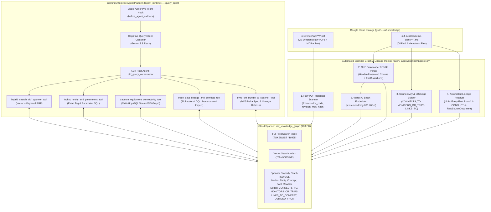
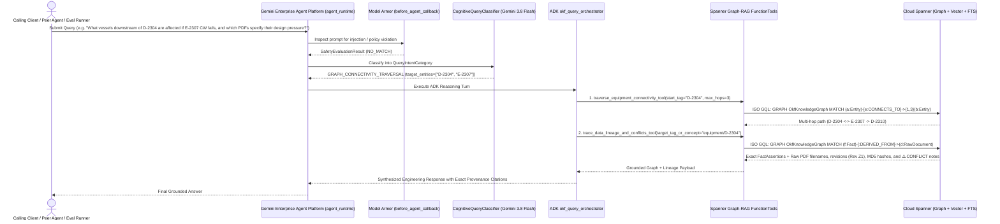

# Specification: [SPEC-20260929-OKF-SPANNER-GRAPH-RAG-AGENT]

## 1. Problem Statement & Objectives

- **Context & Motivation:**
  The Autonomous OKF Extracter Agent (`extracter_agent`) ingests raw chemical engineering PDFs (PFDs, P&IDs, Process Datasheets, SDSs, Operating Manuals, and Standards) and synthesizes them into structured Open Knowledge Format (OKF v0.2) Markdown bundles in Google Cloud Storage (`gs://your-gcp-project-id-okf-knowledge/okf-bundles/...`).
  To enable downstream AI agents and engineers to query this knowledge base with **sub-50ms latency**, **100% alphanumeric tag/keyword precision**, **semantic understanding**, **multi-hop P&ID/PFD equipment connectivity traversal**, and **claim-level regulatory data lineage**, we need a dedicated **OKF Spanner Graph-RAG & Data Lineage Query Agent (`query_agent`)** backed by **Google Cloud Spanner** (combining **Spanner Graph ISO GQL**, **Spanner Vector Search**, and **Spanner Full-Text Keyword Search** in a single database) and deployed as a separate agent on the **Gemini Enterprise Agent Platform (`agent_runtime`)**.

- **Goals:**
  1. **Separate Official Google ADK Query Agent (`query_agent`):** Build and deploy an independent ADK agent (`okf_query_orchestrator`) to the Gemini Enterprise Agent Platform (`agent_runtime`) with its own cognitive intent topology (`QueryIntentCategory`), Model Armor pre-flight guardrail (`before_agent_callback`), and Spanner Graph-RAG `FunctionTool` registry.
  2. **Unified Cloud Spanner Engine (Graph + Vector + Keywords):** Provision and manage a Cloud Spanner instance (`100 Processing Units` granular sizing) hosting:
     - **Full-Text Keyword Search (`SEARCH INDEX` / `TOKENLIST`):** Exact and n-gram lexical matching for equipment tags (`D-2304`), instrument loops (`TXSHH-1301`), piping line numbers (`6"-P-2311-316L`), and materials (`SA-240 316L`).
     - **Dense Vector Search (`VECTOR INDEX` / `COSINE`):** 768-dimensional `text-embedding-005` embeddings over header-preserved OKF H2/H3 section chunks combined with Full-Text Search via **Reciprocal Rank Fusion (RRF)**.
     - **Spanner Property Graph (`CREATE OR REPLACE PROPERTY GRAPH OkfKnowledgeGraph`):** Native ISO GQL traversal over `EngineeringEntities`, `OkfConcepts`, `FactAssertions`, and `RawSourceDocuments`.
  3. **Multi-Hop Equipment & Instrument Connectivity Traversal:** Support `1..N` hop directed and undirected ISO GQL graph traversals across process streams, utility supply/return headers, relief headers, and SIS instrument interlock loops (`CONNECTS_TO`, `MONITORS_OR_TRIPS`, `LINKS_TO_CONCEPT`).
  4. **100% Automated Claim-Level Data Lineage (`DERIVED_FROM`):** Automatically extract, resolve, and populate bidirectional data lineage edges from OKF YAML frontmatter (`sources`), Markdown table `Source` columns, and inline `⚠️ CONFLICT` annotations back to the exact `RawSourceDocuments` (filename, subfolder, document code, revision, MD5 digest, and GCS URI)—enabling both **Backward Provenance Audit** (`Fact -> RawPDF`) and **Forward Blast-Radius Impact Analysis** (`RawPDF -> Fact -> Concept -> Downstream Equipment`).
  5. **Zero Hardcoded Domain Logic:** All entity parsing, stream/line graph edge extraction, conflict parsing, and lineage resolution must operate deterministically on general OKF v0.2 structure and regex patterns with zero hardcoded plant tags or lookup tables.

- **Non-Goals:**
  - Modifying the immutable `reference/` directory (Rule 14).
  - Merging `query_agent` into `extracter_agent` (they remain strictly separate ADK agents with independent responsibilities: **Write/Extract** vs. **Read/Graph-RAG/Lineage Query**).
  - Building the dedicated Frontend UI for `query_agent` in this phase (UI integration will be designed in a subsequent phase).

---

## 2. System Architecture & Component Interaction

### 2.1 Runtime Boundary & Multi-Agent Separation of Responsibilities

| Dimension | 1. Extracter Agent (`extracter_agent` — Existing) | 2. Query & Graph-RAG Agent (`query_agent` — New, Separate Agent) | 3. Unified Knowledge & Lineage Store |
| :--- | :--- | :--- | :--- |
| **Target Runtime** | **Gemini Enterprise Agent Platform (`agent_runtime`)** | **Gemini Enterprise Agent Platform (`agent_runtime`)** | **Google Cloud Spanner (`Spanner Graph` + Vector + FTS) & GCS** |
| **Core Role** | Ingests raw PDFs (`reference/raw/`), runs multimodal extraction, and writes/merges OKF v0.2 `.md` files to GCS. | Answers engineering Q&A, executes Hybrid RRF search, traverses multi-hop P&ID/PFD equipment connectivity, and traces claim-level data lineage. | Stores canonical OKF `.md` bundles in GCS and indexes Nodes, Edges, 768-d Vectors, `TOKENLIST` keywords, and Lineage in Cloud Spanner. |
| **Package Path** | `extracter_agent/` (`agents-cli-manifest.yaml`) | `query_agent/` (`agents-cli-manifest-query.yaml`) | `query_agent/spanner/` & `terraform/` |

### 2.2 End-to-End Architecture & Automated Lineage Ingestion Flow



### 2.3 Sequence Diagram: Multi-Hop Graph & Lineage Query Execution



---

## 3. Data Models, Spanner DDL & Property Graph Schema

### 3.1 Cloud Spanner Relational + Full-Text + Vector + Property Graph DDL (`query_agent/spanner/schema.sql`)

```sql
-- ============================================================================
-- 1. NODE TABLE: RawSourceDocuments (Immutable PDF Provenance Root)
-- ============================================================================
CREATE TABLE RawSourceDocuments (
  source_id STRING(128) NOT NULL,          -- Normalized stem e.g. "PID-23-0013_Decomposer_Reactor_Z1"
  filename STRING(512) NOT NULL,           -- Full filename e.g. "PID-23-0013_Decomposer_Reactor_Z1.pdf"
  subfolder STRING(64) NOT NULL,           -- "pid", "pfd", "data_sheets", "standards", "operating_manuals"
  doc_code STRING(128),                    -- Extracted code prefix e.g. "PID-23-0013" or "DS-D2304"
  revision STRING(32),                     -- Extracted revision e.g. "Z1"
  md5_hash STRING(64),                     -- Base64/Hex MD5 content digest from GCS/disk
  gcs_uri STRING(1024),                    -- "gs://.../reference/raw/pid/PID-23-0013_Decomposer_Reactor_Z1.pdf"
  ingested_at TIMESTAMP NOT NULL OPTIONS (allow_commit_timestamp=true)
) PRIMARY KEY (source_id);

-- ============================================================================
-- 2. NODE TABLE: OkfConcepts (OKF v0.2 Markdown Concept Files — Full Serving Store)
-- ============================================================================
CREATE TABLE OkfConcepts (
  concept_id STRING(256) NOT NULL,         -- e.g. "equipment/D-2304", "hazards/cumene-hydroperoxide"
  category STRING(64) NOT NULL,            -- "equipment", "instruments", "hazards", "units", "sources", etc.
  name STRING(512) NOT NULL,
  description STRING(MAX),
  unit STRING(64),
  trust_tier STRING(64) NOT NULL,          -- "human-reviewed", "ai-extracted", "verified"
  has_conflict BOOL NOT NULL,
  conflict_count INT64 NOT NULL,
  frontmatter_json JSON,                   -- Complete parsed OKF v0.2 YAML frontmatter
  body_markdown STRING(MAX) NOT NULL,      -- Full Markdown body stored in Spanner so queries need ZERO GCS reads
  md5_hash STRING(64) NOT NULL,
  bundle_version STRING(64) NOT NULL,      -- e.g. "v3-by-equipment", "v4-by-pdf"
  gcs_uri STRING(1024),
  updated_at TIMESTAMP NOT NULL OPTIONS (allow_commit_timestamp=true),
  ConceptTokens TOKENLIST AS (
    TOKENIZE_FULLTEXT(CONCAT(concept_id, ' ', name, ' ', IFNULL(description, ''), ' ', IFNULL(unit, '')))
  ) HIDDEN
) PRIMARY KEY (concept_id);

CREATE SEARCH INDEX idx_okf_concepts_fts ON OkfConcepts(ConceptTokens);

-- ============================================================================
-- 3. NODE TABLE: EngineeringEntities (Equipment, Instruments, Lines, Chemicals)
-- ============================================================================
CREATE TABLE EngineeringEntities (
  entity_id STRING(256) NOT NULL,          -- e.g. "EQ:D-2304", "INST:LXT-1302", "LINE:CHS-62-052018", "HAZ:cumene-hydroperoxide"
  entity_type STRING(64) NOT NULL,         -- "EQUIPMENT", "INSTRUMENT", "PIPING_LINE", "HAZARD", "UNIT", "PROCEDURE"
  canonical_tag STRING(128) NOT NULL,      -- e.g. "D-2304", "LXT-1302", "CHS-62-052018"
  name STRING(512) NOT NULL,
  equipment_class STRING(128),
  unit STRING(64),
  concept_id STRING(256) NOT NULL,         -- Primary OKF concept defining this entity
  EntityTokens TOKENLIST AS (
    TOKENIZE_SUBSTRING(CONCAT(canonical_tag, ' ', name, ' ', IFNULL(equipment_class, ''), ' ', IFNULL(unit, '')))
  ) HIDDEN
) PRIMARY KEY (entity_id);

CREATE SEARCH INDEX idx_engineering_entities_fts ON EngineeringEntities(EntityTokens);
CREATE INDEX idx_engineering_entities_tag ON EngineeringEntities(canonical_tag);

-- ============================================================================
-- 4. NODE TABLE: FactAssertions (Granular Design/Operating/Table Claims)
-- ============================================================================
CREATE TABLE FactAssertions (
  fact_id STRING(128) NOT NULL,            -- Deterministic SHA-256 prefix of (concept_id, section_heading, parameter_name)
  concept_id STRING(256) NOT NULL,
  entity_id STRING(256),                   -- Associated EngineeringEntity ID
  section_heading STRING(256) NOT NULL,    -- e.g. "Design Data", "Operating Conditions", "Flow Elements"
  parameter_name STRING(512) NOT NULL,     -- Row key / parameter name e.g. "Design Pressure (INT)" or "FE-1701 | Max Flow"
  parameter_value STRING(MAX) NOT NULL,    -- Extracted value e.g. "3.5" or "1280 mm [PS-E2310] vs. 1260 mm [PID-0005A]"
  parameter_unit STRING(128),              -- e.g. "kg/cm²g", "mm", "°C"
  has_conflict BOOL NOT NULL,
  conflict_note STRING(MAX),               -- Full ⚠️ CONFLICT description if conflicting sources exist
  bundle_version STRING(64) NOT NULL,
  extracted_at TIMESTAMP NOT NULL OPTIONS (allow_commit_timestamp=true),
  FactTokens TOKENLIST AS (
    TOKENIZE_FULLTEXT(CONCAT(concept_id, ' ', section_heading, ' ', parameter_name, ' ', parameter_value, ' ', IFNULL(parameter_unit, ''), ' ', IFNULL(conflict_note, '')))
  ) HIDDEN
) PRIMARY KEY (fact_id);

CREATE SEARCH INDEX idx_fact_assertions_fts ON FactAssertions(FactTokens);
CREATE INDEX idx_fact_assertions_concept ON FactAssertions(concept_id, has_conflict);

-- ============================================================================
-- 5. HYBRID RAG TABLE: OkfSectionChunks (Header-Preserved H2 Chunks + 768-d Vector + FTS)
-- ============================================================================
CREATE TABLE OkfSectionChunks (
  chunk_id STRING(128) NOT NULL,           -- Deterministic SHA-256 of (concept_id, section_heading, chunk_index)
  concept_id STRING(256) NOT NULL,
  category STRING(64) NOT NULL,
  unit STRING(64),
  section_heading STRING(256) NOT NULL,
  chunk_index INT64 NOT NULL,
  header_preserved_markdown STRING(MAX) NOT NULL,
  has_conflict BOOL NOT NULL,
  embedding ARRAY<FLOAT32>(vector_length=>768),
  ChunkTokens TOKENLIST AS (
    TOKENIZE_FULLTEXT(CONCAT(concept_id, ' ', section_heading, ' ', header_preserved_markdown))
  ) HIDDEN,
  SubTokens TOKENLIST AS (
    TOKENIZE_SUBSTRING(CONCAT(concept_id, ' ', section_heading, ' ', header_preserved_markdown))
  ) HIDDEN
) PRIMARY KEY (chunk_id);

CREATE SEARCH INDEX idx_okf_chunks_fts ON OkfSectionChunks(ChunkTokens, SubTokens) STORING (concept_id, category, unit, section_heading, has_conflict);

-- ============================================================================
-- 6. EDGE TABLE 1: ProcessConnections (Equipment & Piping Stream Connectivity)
-- ============================================================================
CREATE TABLE ProcessConnections (
  edge_id STRING(128) NOT NULL,
  from_entity_id STRING(256) NOT NULL,
  to_entity_id STRING(256) NOT NULL,
  stream_or_line_id STRING(256) NOT NULL,  -- e.g. "P-23-004008", "CHS-62-052018", "Stream 12"
  fluid_service STRING(512),
  temperature STRING(128),
  pressure STRING(128),
  flow_rate STRING(128),
  source_concept_id STRING(256) NOT NULL,
  source_id STRING(128)
) PRIMARY KEY (edge_id);

-- ============================================================================
-- 7. EDGE TABLE 2: InstrumentControlEdges (Instrument -> Equipment / Interlocks)
-- ============================================================================
CREATE TABLE InstrumentControlEdges (
  edge_id STRING(128) NOT NULL,
  instrument_entity_id STRING(256) NOT NULL,
  target_entity_id STRING(256) NOT NULL,
  loop_id STRING(128) NOT NULL,            -- e.g. "L-1302", "F-1701"
  instrument_type STRING(256),
  setpoint_or_range STRING(256),
  interlock_or_alarm STRING(512),
  source_concept_id STRING(256) NOT NULL,
  source_id STRING(128)
) PRIMARY KEY (edge_id);

-- ============================================================================
-- 8. EDGE TABLE 3: ConceptWikiLinks (OKF [[wikilink]] Topology)
-- ============================================================================
CREATE TABLE ConceptWikiLinks (
  edge_id STRING(128) NOT NULL,
  from_concept_id STRING(256) NOT NULL,
  to_concept_id STRING(256) NOT NULL,
  section_heading STRING(256)
) PRIMARY KEY (edge_id);

-- ============================================================================
-- 9. EDGE TABLE 4: FactLineageEdges (Automated Claim-to-Raw-PDF Lineage)
-- ============================================================================
CREATE TABLE FactLineageEdges (
  lineage_id STRING(128) NOT NULL,
  fact_id STRING(128) NOT NULL,
  concept_id STRING(256) NOT NULL,
  source_id STRING(128) NOT NULL,
  raw_citation_string STRING(512) NOT NULL,
  source_role STRING(64) NOT NULL,         -- "PRIMARY", "CONFLICTING", "CONCEPT_CITATION"
  bundle_version STRING(64) NOT NULL,
  extracted_at TIMESTAMP NOT NULL OPTIONS (allow_commit_timestamp=true)
) PRIMARY KEY (lineage_id);

CREATE INDEX idx_fact_lineage_by_source ON FactLineageEdges(source_id, concept_id);
CREATE INDEX idx_fact_lineage_by_concept ON FactLineageEdges(concept_id, source_id);

-- ============================================================================
-- 10. SPANNER PROPERTY GRAPH DEFINITION (ISO GQL)
-- ============================================================================
CREATE OR REPLACE PROPERTY GRAPH OkfKnowledgeGraph
  NODE TABLES (
    EngineeringEntities AS Entity
      KEY (entity_id)
      LABEL Entity PROPERTIES (entity_id, entity_type, canonical_tag, name, equipment_class, unit, concept_id),
    OkfConcepts AS Concept
      KEY (concept_id)
      LABEL Concept PROPERTIES (concept_id, category, name, description, unit, trust_tier, has_conflict, conflict_count, gcs_uri),
    FactAssertions AS Fact
      KEY (fact_id)
      LABEL Fact PROPERTIES (fact_id, concept_id, entity_id, section_heading, parameter_name, parameter_value, parameter_unit, has_conflict, conflict_note),
    RawSourceDocuments AS RawDocument
      KEY (source_id)
      LABEL RawDocument PROPERTIES (source_id, filename, subfolder, doc_code, revision, md5_hash, gcs_uri)
  )
  EDGE TABLES (
    ProcessConnections AS CONNECTS_TO
      KEY (edge_id)
      SOURCE KEY (from_entity_id) REFERENCES Entity (entity_id)
      DESTINATION KEY (to_entity_id) REFERENCES Entity (entity_id)
      LABEL CONNECTS_TO PROPERTIES (stream_or_line_id, fluid_service, temperature, pressure, flow_rate, source_concept_id, source_id),
    InstrumentControlEdges AS MONITORS_OR_TRIPS
      KEY (edge_id)
      SOURCE KEY (instrument_entity_id) REFERENCES Entity (entity_id)
      DESTINATION KEY (target_entity_id) REFERENCES Entity (entity_id)
      LABEL MONITORS_OR_TRIPS PROPERTIES (loop_id, instrument_type, setpoint_or_range, interlock_or_alarm, source_concept_id, source_id),
    ConceptWikiLinks AS LINKS_TO_CONCEPT
      KEY (edge_id)
      SOURCE KEY (from_concept_id) REFERENCES Concept (concept_id)
      DESTINATION KEY (to_concept_id) REFERENCES Concept (concept_id)
      LABEL LINKS_TO_CONCEPT PROPERTIES (section_heading),
    FactLineageEdges AS DERIVED_FROM
      KEY (lineage_id)
      SOURCE KEY (fact_id) REFERENCES Fact (fact_id)
      DESTINATION KEY (source_id) REFERENCES RawDocument (source_id)
      LABEL DERIVED_FROM PROPERTIES (concept_id, raw_citation_string, source_role, bundle_version)
  );
```

---

### 3.2 Consolidated `.md`-Only Ingestion & Lifecycle Sync Engine (`sync_markdown_bundle_to_spanner`)

Ingestion into Cloud Spanner operates **100% on the extracted OKF `.md` files alone** (zero raw PDF directory scanning or PDF content parsing) via a single consolidated deterministic function `sync_markdown_bundle_to_spanner()` ( calling Vertex AI `text-embedding-005` only for 768-d chunk embeddings):

1. **Stage 1 — 100% `.md`-Derived Source Registry (`Zero Raw PDF Access`):**
   - Extracts all `RawSourceDocuments` (`source_id`, `filename`, `subfolder`, `doc_code`, `revision`, `md5_hash`, `gcs_uri`) directly from each `.md` file's YAML frontmatter `sources:` list (`resource`, `title`, `id`) and Markdown table `Source` columns.
   - No access to `reference/raw/` or raw PDF binaries is performed during Spanner ingestion.
2. **Stage 2 — Incremental `.md` Lifecycle Delta Detection (`ADDED`, `UPDATED`, `REMOVED`, `UNCHANGED`):**
   - Queries `SELECT concept_id, md5_hash FROM OkfConcepts` from Cloud Spanner and compares against the incoming `.md` files (`md5_hash = md5(raw_md_bytes)`):
     - **`ADDED`**: `.md` concept is new $\rightarrow$ parse, embed chunks, and insert.
     - **`UPDATED`**: `.md` concept exists in Spanner with a different `md5_hash` $\rightarrow$ atomically purge its previous child rows/edges, re-parse, re-embed chunks, and upsert.
     - **`UNCHANGED`**: `.md` concept matches Spanner `md5_hash` $\rightarrow$ skip parsing, embedding, and Spanner writes completely.
     - **`REMOVED`**: Concept exists in Spanner but its `.md` file was removed (in `FULL_MIRROR` mode or via explicit `removed_concept_ids`) $\rightarrow$ atomically cascade-delete the concept, its chunks, assertions, entities, and graph edges, plus prune any orphaned `RawSourceDocuments`.
3. **Stage 3 — Structured Frontmatter + Markdown Table Row Fact & Lineage Extraction:**
   - For every `.md` file in `ADDED ∪ UPDATED`:
     - Parses YAML frontmatter and every Markdown GFM table in the document body, emitting deterministic `FactAssertion` nodes (`fact_id = sha256(f"{concept_id}|{section_heading}|{row_key}")[:32]`) and conflict flags (`has_conflict`, `conflict_note`).
     - Resolves each row's `Source` cell and inline `[doc_code]` citations against the `.md`-derived `RawSourceDocuments` using boundary-aware document-code matching, emitting `FactLineageEdges` (`DERIVED_FROM`) with `source_role = "PRIMARY"` or `"CONFLICTING"`.
4. **Stage 4 — Automated Equipment & Instrument Graph Edge Extraction + Batched Spanner Upsert:**
   - Extracts `ProcessConnections` (`CONNECTS_TO`), `InstrumentControlEdges` (`MONITORS_OR_TRIPS`), and `ConceptWikiLinks` (`LINKS_TO_CONCEPT`), computes 768-d `text-embedding-005` vectors for `ADDED ∪ UPDATED` section chunks, upserts into Cloud Spanner, and synchronizes Google Cloud Dataplex Universal Catalog (`dataplex_v1`).
5. **Stage 5 — Automated Google Cloud Dataplex Universal Catalog (Knowledge Catalog) & Data Lineage API Sync (`google-cloud-dataplex` + `google-cloud-datacatalog-lineage`):**
   - **Automatic Asset Cataloging via `dataplex_v1.CatalogServiceClient`:** Uses the official `google-cloud-dataplex` SDK (`CatalogServiceClient` in `asia-southeast1`) to provision and synchronize `EntryGroup` (`okf-knowledge-assets`), `AspectType` (`okf-governance-template`), `EntryType` (`okf-knowledge-asset`), and governed `Entry` records (`okf-spanner-knowledge-graph`, `okf-gcs-markdown-bundle-v3`, `raw-engineering-docs-archive`) with attached `Aspect` governance metrics (`domain_profile`, `total_concepts`, `total_entities`, `total_assertions`, `conflict_count`, `total_lineage_edges`). Legacy `datacatalog_v1` and fallback masking (`SYNCED_WITH_FALLBACK`) are strictly prohibited.
   - **Automated OpenLineage RunEvent Emission (`google-cloud-datacatalog-lineage`):** Whenever `sync_or_inspect_knowledge_catalog_tool(action="SYNC")` (or the post-export hook) ingests an OKF bundle into Spanner, it emits OpenLineage `COMPLETE` RunEvents via `LineageClient.process_open_lineage_run_event()` recording the 3-stage enterprise lineage graph in the GCP Console:
     `gs://<bucket>/reference/raw/<subfolder>/<pdf>` $\xrightarrow{\text{extracter\_agent}}$ `gs://<bucket>/okf-bundles/<prefix>/<concept>.md` $\xrightarrow{\text{spanner\_ingester}}$ `spanner://okf_knowledge_graph/OkfConcepts & FactAssertions`.
6. **Stage 6 — 100% Spanner-Only Query Execution (`Zero GCS Reads at Query Time`):**
   - Because `OkfConcepts` stores the complete `body_markdown` and `frontmatter_json`, `OkfSectionChunks` stores header-preserved H2 chunks + 768-d embeddings + `TOKENLIST` indexes, and `OkfKnowledgeGraph` stores all connectivity and lineage edges, **`query_agent` relies 100% on Cloud Spanner alone at query time** (`15–60 ms` latency, zero GCS network round-trips during queries).
   - GCS (`gs://.../okf-bundles/...`) serves exclusively as the portable OKF file store during **ingestion/sync**, while Spanner returns the `gcs_uri` links in query responses for UI/user reference.

---

### 3.3 Canonical Query Intent Topology (`query_agent/models/intent.py`)

In strict compliance with Rule 11 (`_agents/rules/google_adk_and_agent_runtime.md`), `query_agent` uses a cognitive Gemini classifier (`CognitiveQueryClassifier`) with structured output (`QueryIntentClassificationResult`) across 7 MECE categories:

```python
class QueryIntentCategory(str, Enum):
    ENTITY_AND_PARAMETER_LOOKUP = "ENTITY_AND_PARAMETER_LOOKUP"
    HYBRID_SEMANTIC_KEYWORD_SEARCH = "HYBRID_SEMANTIC_KEYWORD_SEARCH"
    GRAPH_CONNECTIVITY_TRAVERSAL = "GRAPH_CONNECTIVITY_TRAVERSAL"
    DATA_LINEAGE_AND_CONFLICT_AUDIT = "DATA_LINEAGE_AND_CONFLICT_AUDIT"
    MULTISTAGE_RISK_AND_HAZOP_ANALYSIS = "MULTISTAGE_RISK_AND_HAZOP_ANALYSIS"
    SYNC_BUNDLE_TO_SPANNER = "SYNC_BUNDLE_TO_SPANNER"
    OTHERS = "OTHERS"
```

---

## 4. API Contracts & ADK FunctionTool Contracts (`query_agent/`)

### 4.1 Does the Agent Query Knowledge Catalog Prior to Spanner?
- **No — on normal engineering queries, `query_agent` queries Cloud Spanner directly (`15–60 ms`) without calling the external Dataplex Universal Catalog API (`300–900 ms`) first.**
  - **Why:** All catalog-level governance metadata (`category`, `unit`, `trust_tier`, `has_conflict`, `conflict_count`, `md5_hash`, `gcs_uri`) is already stored and indexed inside Spanner's `OkfConcepts` (`ConceptTokens` FTS index) and `EngineeringEntities` (`EntityTokens` FTS index). Calling Dataplex Universal Catalog prior to Spanner would add an unnecessary `~500 ms` network hop for metadata Spanner already serves in `< 10 ms`.
  - **When Dataplex Universal Catalog IS Queried:** `query_agent` invokes `sync_or_inspect_knowledge_catalog_tool(action="INSPECT")` only when the user explicitly asks an **Enterprise Cloud Governance / Dataplex Catalog / OpenLineage Registry** question (e.g., *"Inspect the Dataplex Data Catalog entry, governance aspect tags, or GCP OpenLineage run history for D-2304"*).

### 4.2 The 7 Specialized ADK `FunctionTools` (`query_agent/tools/spanner_rag_tools.py`)

1. **`lookup_entity_and_parameters_tool(tag_or_name: str, section_filter: str | None = None, conflicts_only: bool = False) -> dict[str, Any]`**
   - **Spanner Execution (`< 15 ms`):** Queries `EngineeringEntities`, `OkfConcepts`, and `FactAssertions` by exact `canonical_tag` index or `SEARCH_SUBSTRING(EntityTokens, @tag_or_name)`.
   - **Returns:** Canonical entity metadata, all matching engineering parameters/rows, units, `⚠️ CONFLICT` notes, and primary PDF citations.
2. **`hybrid_search_okf_spanner_tool(query: str, category: str | None = None, unit: str | None = None, conflicts_only: bool = False, top_k: int = 8) -> dict[str, Any]`**
   - **Spanner Execution (`< 80 ms`):** Computes the 768-d query embedding (`text-embedding-005`, `RETRIEVAL_QUERY`) and executes a single Spanner SQL query combining Full-Text `SEARCH(ChunkTokens, @query)`, Substring `SEARCH_SUBSTRING(SubTokens, @query)`, and Vector `COSINE_DISTANCE(embedding, @query_vec)` fused via **Reciprocal Rank Fusion ($RRF$)**.
   - **Returns:** Top-$k$ header-preserved Markdown sections (`header_preserved_markdown`) with concept metadata and RRF/lexical/vector ranks.
3. **`traverse_equipment_connectivity_graph_tool(start_tag: str, direction: str = "BOTH", max_hops: int = 3, include_instruments: bool = True) -> dict[str, Any]`**
   - **Spanner Execution (`< 35 ms`):** Executes native **Spanner Graph ISO GQL (`GRAPH OkfKnowledgeGraph MATCH ...`)**:
     - Directed upstream/downstream process & utility streams (`CONNECTS_TO*1..N`);
     - Mounted instruments, control loops & SIS trip chains (`MONITORS_OR_TRIPS`);
     - Concept-level `[[wikilink]]` 1-hop neighbors (`LINKS_TO_CONCEPT`).
   - **Returns:** Structured multi-hop graph paths (`from_tag -> [line_id, fluid, temp, press] -> to_tag`), instrument interlocks, and linked concepts.
4. **`trace_data_lineage_and_conflicts_tool(target_tag_or_concept: str | None = None, raw_pdf_filename: str | None = None, parameter_filter: str | None = None, conflicts_only: bool = False) -> dict[str, Any]`**
   - **Spanner Execution (`< 25 ms`):** Executes **Bidirectional Spanner Graph ISO GQL** over `FactAssertions -[:DERIVED_FROM]-> RawSourceDocuments`:
     - **Backward Provenance (`target_tag_or_concept`):** Traces every parameter row and `⚠️ CONFLICT` back to its `PRIMARY` and `CONFLICTING` `RawSourceDocuments` (`filename`, `subfolder`, `doc_code`, `revision`, `md5_hash`, `gcs_uri`).
     - **Forward Impact / Blast Radius (`raw_pdf_filename`):** Traces a raw PDF forward to every `FactAssertion`, `OkfConcept`, and connected `EngineeringEntity` that depends on it.
5. **`execute_multistage_risk_and_hazop_query_tool(target_tag_or_node: str, deviation_or_scenario: str = "", max_hops: int = 3) -> dict[str, Any]`**
   - **Spanner Execution (`< 90 ms` — 5-Stage Parallel/Pipelined Spanner Graph + Hybrid Execution):**
     Designed specifically for complex **Risk Assessment, LOPA, and HAZOP Study** questions that require synthesizing 5 distinct plant knowledge layers in one structured dossier:
     - **Stage 1 — HAZOP Risk Matrix & Methodology Calibration:** Queries `OkfConcepts` & `OkfSectionChunks` (`category = 'hazop'`) to retrieve the official Severity ($S$) definitions, Likelihood ($L$) frequencies, Risk Ranking Matrix tiers, and IPL rules.
     - **Stage 2 — Target Node Design Envelope & Operating Windows:** Queries `FactAssertions` for the target equipment (`Design Data`, `Operating Conditions`, `MDMT`, `Design Pressure/Temp`) plus unit-level safe operating windows (`parameters/*`).
     - **Stage 3 — Multi-Hop Upstream Causes & Downstream Plant Implications (ISO GQL):**
       * **Upstream Causes (`1..max_hops` inbound `CONNECTS_TO`):** Identifies feeding vessels, pumps, control valves, and utility supplies (`CWS`, `TWS`, `Steam`, `N2`) whose failure can initiate the deviation on `target_tag_or_node`.
       * **Downstream Implications (`1..max_hops` outbound `CONNECTS_TO`):** Identifies downstream columns, condensers, separators, sumps, and flare/vent headers exposed to overpressure, carryover, or thermal runaway propagation.
     - **Stage 4 — Chemical Hazard & Runaway Consequence Physics (ISO GQL + FTS):** Traverses `LINKS_TO_CONCEPT` (`[[hazards/...]]`) for the target node and its connected neighbors to pull decomposition onset temperatures, flash points, auto-ignition temperatures, and toxic exposure limits (`TLV-TWA`, `IDLH`).
     - **Stage 5 — Safeguards / IPLs (SIS Interlocks & PSVs) + Conflict Lineage Audit:** Traverses `MONITORS_OR_TRIPS` for all mounted transmitters, alarms, SIS trip logic (`instruments/sis-interlocks`), and relief valves (`PSV-*`), AND joins `FactLineageEdges` (`has_conflict = TRUE`) to warn if any safeguard setpoint or sizing parameter has an unresolved cross-document conflict (`⚠️ CONFLICT`).
6. **`read_full_okf_concept_from_spanner_tool(concept_id: str, section_heading: str | None = None) -> dict[str, Any]`**
   - **Spanner Execution (`< 10 ms`, Zero GCS Reads):** Primary-key lookup on `OkfConcepts(concept_id)` returning `frontmatter_json`, `body_markdown` (or the requested H2 section), `trust_tier`, `conflict_count`, and `gcs_uri`.
7. **`sync_or_inspect_knowledge_catalog_tool(action: str = "INSPECT") -> str`**
   - **Modes:**
     - `action="INSPECT"`: Queries live Google Cloud Dataplex Universal Catalog (`dataplex_v1.CatalogServiceClient` — `okf-knowledge-assets` EntryGroup, `okf-governance-template` AspectType, `okf-knowledge-asset` EntryType, and live governed Entries/Aspects) together with live Spanner metrics and OpenLineage pipeline topology.
     - `action="SYNC"`: Executes live synchronization of `EntryGroup`, `AspectType`, `EntryType`, and `Entry` + `Aspect` records via `CatalogServiceClient` and emits OpenLineage `COMPLETE` RunEvents via `LineageClient.process_open_lineage_run_event()` with zero fallback masking (`status="SYNCED_LIVE"`).

---

### 4.3 User Question Archetypes $\rightarrow$ Required Tool Trajectories

| # | Question Archetype | Example User Question | Why Standard Vector RAG Fails | Required ADK Tool Trajectory |
| :--- | :--- | :--- | :--- | :--- |
| **1** | **Exact Tag / Datasheet Parameter Lookup** | *"What are the design pressure, MDMT, and shell dimensions of `D-2304`?"* | Dense vectors blur numbers across similar vessels (`D-2301..D-2312`). | `lookup_entity_and_parameters_tool(tag_or_name="D-2304")` |
| **2** | **Alphanumeric Line / Loop Reverse Lookup** | *"Which equipment is connected to line `6"-P-2311-316L` or monitored by `TXSHH-1301`?"* | Embedding models tokenize hyphenated codes poorly. | `lookup_entity_and_parameters_tool` **or** `traverse_equipment_connectivity_graph_tool` |
| **3** | **Multi-Hop Process & Utility Failure Propagation** | *"If cooling water to `E-2307` fails, what equipment within 3 hops is impacted?"* | Information is spread across multiple files (`E-2307.md`, `D-2304.md`, `D-2310.md`). | `traverse_equipment_connectivity_graph_tool(start_tag="E-2307", direction="BOTH", max_hops=3)` $\rightarrow$ `lookup_entity_and_parameters_tool` |
| **4** | **SIS Interlock & Cause-and-Effect Chain** | *"What trips when `TXSHH-1301` on `D-2304` hits HH, and what are the valve setpoints?"* | Requires joining vessel instrumentation with `instruments/sis-interlocks.md` and `control-valves.md`. | `traverse_equipment_connectivity_graph_tool(start_tag="D-2304", include_instruments=True)` $\rightarrow$ `hybrid_search_okf_spanner_tool` |
| **5** | **Cross-Document Conflict & Provenance Audit** | *"Are there any discrepancies on `D-2304` between the P&ID and Datasheet? Cite exact PDFs and revisions."* | Standard RAG returns only one chunk and hides the competing document's value. | `trace_data_lineage_and_conflicts_tool(target_tag_or_concept="D-2304", conflicts_only=True)` |
| **6** | **Revision Blast-Radius / Impact Analysis** | *"We received a new revision of `PID-23-0013_Decomposer_Reactor_Z1.pdf`. Which concepts and parameters must be re-verified?"* | Vector search cannot invert document citations across table rows. | `trace_data_lineage_and_conflicts_tool(raw_pdf_filename="PID-23-0013_Decomposer_Reactor_Z1.pdf")` |
| **7** | **Conceptual / Troubleshooting / Procedure Q&A** | *"How do we execute a cold startup on Unit 2300 Decomposer Reactor D-2304?"* | Needs semantic + keyword matching over operating manual procedures and tables. | `hybrid_search_okf_spanner_tool(query="...", category="procedures")` $\rightarrow$ `read_full_okf_concept_from_spanner_tool` |
| **8** | **Multi-Stage Risk Assessment & HAZOP Study** | *"Perform a HAZOP & risk tier evaluation for High Temperature / Loss of Cooling on `D-2304`, including upstream causes, plant-wide implications, IPL safeguards, and risk classification."* | Requires 5-stage synthesis across `hazop/`, `equipment/`, multi-hop `CONNECTS_TO` streams, `hazards/`, and `MONITORS_OR_TRIPS` safeguards + conflict lineage. | `execute_multistage_risk_and_hazop_query_tool(target_tag_or_node="D-2304", deviation_or_scenario="High Temperature / Loss of Cooling", max_hops=3)` $\rightarrow$ *(optional)* `read_full_okf_concept_from_spanner_tool` |

---

### 4.4 Agent System Instruction Design (`QUERY_ORCHESTRATOR_INSTRUCTIONS`)

`okf_query_orchestrator` (`query_agent/orchestrator.py`) is governed by 6 strict cognitive operating rules:

1. **Question-Structure-Driven Tool Selection (Progressive Disclosure):**
   - **Tag / Parameter Questions:** Always start with `lookup_entity_and_parameters_tool`.
   - **Upstream / Downstream / Stream / Relief / SIS Trip Questions:** Always invoke `traverse_equipment_connectivity_graph_tool` (using `max_hops=1..4`) so no multi-hop dependency is missed.
   - **Provenance / "Which PDF?" / Discrepancy (`⚠️ CONFLICT`) / Revision Impact Questions:** Always invoke `trace_data_lineage_and_conflicts_tool`.
   - **Multi-Stage Risk Assessment / HAZOP / Consequence & Safeguard Evaluation Questions:** Always invoke `execute_multistage_risk_and_hazop_query_tool` (and chain additional tools if deeper drill-down into a specific neighbor or procedure is needed).
   - **Conceptual / Operating Procedure / Hazard / Troubleshooting Questions:** Invoke `hybrid_search_okf_spanner_tool` (which fuses Spanner Full-Text + Substring + 768-d Vector RRF), then call `read_full_okf_concept_from_spanner_tool` if full section context is needed.
   - **Dataplex Catalog / Governance Questions:** Invoke `sync_or_inspect_knowledge_catalog_tool`.
2. **Structured Multi-Stage HAZOP & Risk Synthesis Protocol:**
   - When answering a Risk Assessment or HAZOP question, structure the analysis using the 5 stages returned by Spanner:
     1. **Node & Design Envelope:** Normal operating window vs. design pressure/temperature limits.
     2. **Initiating Causes (Upstream & Utility Graph):** Upstream equipment, pump/valve failures, or utility losses (`CONNECTS_TO` inbound).
     3. **Plant-Wide Consequences & Chemical Hazards (Downstream Graph + SDS):** Exothermic/flammable/toxic physics (`hazards/*`) and downstream vessels/columns/headers impacted (`CONNECTS_TO` outbound).
     4. **Existing Safeguards / IPLs & Conflict Audit:** BPCS alarms, SIS trips (`MONITORS_OR_TRIPS`), and PSVs—explicitly flagging any `⚠️ CONFLICT` on safeguard setpoints or relief sizing.
     5. **Risk Tier & Classification (`hazop/risk-assessment-and-hazop-procedure`):** Grounded Severity ($S$), Likelihood ($L$), and Risk Ranking Tier strictly calibrated against the plant's HAZOP risk matrix criteria.
3. **100% Spanner-Grounded Quantitative Fidelity:**
   - Never invent, interpolate, or round engineering numbers, units, setpoints, or tag IDs. Every numerical value in the response MUST come directly from a Spanner tool result.
4. **Mandatory Dual-Value Conflict Surfacing (`⚠️ CONFLICT`):**
   - Whenever a returned `FactAssertion` or `OkfSectionChunk` has `has_conflict=True`, the agent MUST explicitly present **both competing values** alongside their respective `RawSourceDocument` filenames and revisions (`<Value A> [Source A, Rev Z1] vs. <Value B> [Source B, Rev Z1]`).
5. **Mandatory Provenance Citations:**
   - Every answer must include a `### Provenance & Data Lineage` footer citing the `concept_id`, `trust_tier`, and exact `RawSourceDocument` filenames (`subfolder/filename`, `revision`, `md5_hash`) returned by Spanner.
6. **Strict Scope Boundary (`OTHERS`):**
   - For queries unrelated to the engineering plant knowledge base, politely decline without invoking Spanner tools.

---

## 5. UI/UX & Behavioral Specifications

- **Resilience & Local/Sandbox Fallback Mode:**
  - All Spanner tools use `google-cloud-spanner` connection pooling with automatic retry on transient `Aborted` / `ServiceUnavailable` errors.
  - For deterministic offline unit/property tests (or if Spanner DDL is initializing), the data layer supports a clean Repository interface (`SpannerGraphRepository`) with both live Cloud Spanner execution and an in-memory ISO-equivalent graph/RRF verifier for fast unit/property testing.
- **Model Armor Pre-Flight Interception:**
  - `query_agent` registers `before_agent_callback` so any prompt injection or destructive command is blocked before LLM reasoning or Spanner queries execute.

---

## 6. DevOps, Security, Cloud & Agent Governance Checklist

| Rule | Area | Requirement / Architecture Specification |
| :--- | :--- | :--- |
| **Rule 1** | **SCM & Multi-Branch** | Single GitHub repository (`your-org/extracter-agent`); development pushed to `development` branch. |
| **Rule 2** | **Code Quality** | `ruff check` clean across `query_agent/`, `extracter_agent/`, `tests/`, and `evals/`. |
| **Rule 3** | **SAST & CodeMender** | Parameterized Spanner SQL/GQL queries (`@param` bindings only — zero string-interpolated SQL/GQL injection). |
| **Rule 8** | **Unified `.env` Management**| Add `SPANNER_INSTANCE_ID`, `SPANNER_DATABASE_ID`, `SPANNER_PROCESSING_UNITS`, and `NONPROD_QUERY_AGENT_RUNTIME_ID` / `PROD_QUERY_AGENT_RUNTIME_ID` to `.env` and `.env.example`. |
| **Rule 9** | **Terraform & Infra Manager** | Add `google_spanner_instance` (`100` processing units) and `google_spanner_database` (`okf_knowledge_graph` with DDL) to `terraform/main.tf`. |
| **Rule 11**| **Google ADK & Agent Runtime** | `query_agent` built with official `google-adk` (`Agent`, `FunctionTool`, `before_agent_callback`) and deployed to `agent_runtime` as a separate Reasoning Engine. |
| **Rule 12**| **Live Agent Evaluation** | Dedicated live evaluation suite (`evals/run_live_query_agent_eval.py`) testing hybrid RAG, multi-hop equipment connectivity, and bidirectional data lineage against live Cloud Spanner & Vertex AI Agent Runtime ($\ge 95\%$ trajectory precision, `1.000` groundedness). |
| **Rule 13**| **Root Cause Investigation** | Strict adherence to 4-step RCA protocol if any test or live eval fails. |
| **Rule 14**| **Immutable `reference/`** | `reference/` is strictly read-only (only scanned for PDF metadata/MD5 digests to populate `RawSourceDocuments`). |

---

## 7. Step-by-Step Implementation Plan & Test Design

### Step 1: Unified Configuration, Terraform Spanner IaC & Core Graph/Lineage Models
- **Implementation:**
  - Update `.env`, `.env.example`, and `extracter_agent/config.py` (shared config) with Spanner parameters (`SPANNER_INSTANCE_ID=okf-knowledge-spanner`, `SPANNER_DATABASE_ID=okf_knowledge_graph`, `SPANNER_PROCESSING_UNITS=100`, `NONPROD_QUERY_AGENT_RUNTIME_ID`).
  - Update `terraform/main.tf` and `terraform/variables.tf` to declare `google_spanner_instance` and `google_spanner_database` with the full `OkfKnowledgeGraph` DDL.
  - Create `query_agent/models/schemas.py` and `query_agent/models/intent.py` defining `RawSourceNode`, `OkfConceptNode`, `EngineeringEntityNode`, `FactAssertionNode`, `OkfSectionChunkNode`, `ProcessConnectionEdge`, `InstrumentControlEdge`, `ConceptWikiLinkEdge`, `FactLineageEdge`, and `QueryIntentCategory`.
- **Deterministic Unit Tests (`tests/test_query_agent_unit.py`):**
  - Verify schema validation, deterministic ID hashing (`fact_id`, `chunk_id`, `lineage_id`), and Spanner DDL syntax completeness.
- **Property-Based Tests (PBT) (`tests/test_query_agent_property.py`):**
  - `test_pbt_deterministic_node_and_edge_id_idempotence`: Verify that hashing `(concept_id, section, parameter_name)` and `(fact_id, source_id, role)` is deterministic, collision-free on distinct inputs, and strictly idempotent.

### Step 2: Automated 100% `.md`-Only OKF Bundle Parser, Header-Preserving Chunker & Automated Lineage Extractor
- **Implementation:**
  - Create `query_agent/spanner/lineage_extractor.py`:
    1. Extracts `RawSourceNode` records (`source_id`, `filename`, `subfolder`, `doc_code`, `revision`, `md5_hash`, `gcs_uri`) 100% from each `.md` file's YAML frontmatter `sources:` list and Markdown table `Source` cells (`build_raw_sources_from_okf_frontmatter`), with zero `reference/raw/` PDF scanning.
    2. Parses any OKF bundle (`build/okf_bundle/` or single `.md` file) into `OkfConceptNode` (preserving YAML `title`, `description`, `unit`), `EngineeringEntityNode`, `FactAssertionNode`, and header-preserved `OkfSectionChunkNode` records.
    3. Automatically extracts `ProcessConnectionEdge` (`CONNECTS_TO`), `InstrumentControlEdge` (`MONITORS_OR_TRIPS`), `ConceptWikiLinkEdge` (`LINKS_TO_CONCEPT`), and `FactLineageEdge` (`DERIVED_FROM` with `PRIMARY`, `CONFLICTING`, and `CONCEPT_CITATION` roles).
- **Deterministic Unit Tests:**
  - Test automated extraction on multi-source OKF Markdown documents with `⚠️ CONFLICT` rows, verifying that both primary and conflicting PDF citations are resolved to their exact `RawSourceNode` IDs and that equipment stream connections and instrument loops become typed graph edges.
- **Property-Based Tests (PBT):**
  - `test_pbt_table_chunker_always_preserves_markdown_headers`: Across randomly generated multi-row Markdown tables (`1..150` rows), every emitted `OkfSectionChunkNode` preserves the concept context banner and exact Markdown table header row.
  - `test_pbt_automated_lineage_never_drops_conflicting_sources`: Across arbitrary `FactAssertion` rows containing `⚠️ CONFLICT` or `[SourceA] vs. [SourceB]` annotations, the lineage extractor always emits both `PRIMARY` and `CONFLICTING` `FactLineageEdge` records.

### Step 3: Cloud Spanner Provisioning, Batch Vector/Graph/FTS Upsert & Hybrid RRF + ISO GQL Repository
- **Implementation:**
  - Provision the live Cloud Spanner instance (`okf-knowledge-spanner`) and database (`okf_knowledge_graph`) in project `your-gcp-project-id` (`asia-southeast1`) with `query_agent/spanner/schema.sql`.
  - Implement `query_agent/spanner/repository.py` (`SpannerGraphRepository`):
    - Parameterized Spanner SQL + ISO GQL methods:
      * `lookup_entity_and_parameters()`
      * `hybrid_rrf_search()` (Full-Text `SEARCH()` + Vector `COSINE_DISTANCE()` + RRF fusion)
      * `traverse_connectivity_gql()` (`GRAPH OkfKnowledgeGraph MATCH ...`)
      * `trace_lineage_gql()` (Backward provenance & Forward PDF blast-radius impact)
      * `execute_multistage_risk_and_hazop_query()` (5-stage deterministic HAZOP & risk assessment pipeline)
- **Deterministic Unit Tests:**
  - Verify parameterized query construction, RRF score fusion math, multi-hop GQL path assembly, and bidirectional lineage queries.
- **Property-Based Tests (PBT):**
  - `test_pbt_rrf_hybrid_fusion_monotonicity_and_bounds`: Verify that Reciprocal Rank Fusion scores are strictly bounded in `(0, 2/(60+1)]` and monotonically increase when either lexical rank or vector similarity rank improves.

### Step 4: Separate ADK `query_agent` Package, Cognitive Intent Classifier & Deployment to `agent_runtime`
- **Implementation:**
  - Create `query_agent/agent.py`, `query_agent/orchestrator.py` (`create_query_agent()`), `query_agent/classifier.py` (`CognitiveQueryClassifier`), and `query_agent/tools/spanner_rag_tools.py` exposing the 7 ADK `FunctionTools`.
  - Configure `agents-cli-manifest-query.yaml` and update `deploy.sh` to deploy `query_agent` (`okf_spanner_query_orchestrator`, `gemini-3.8-flash`) as a separate Reasoning Engine on Vertex AI Agent Platform (`agent_runtime`).
- **Deterministic Unit Tests:**
  - Verify ADK `Agent` registration, `before_agent_callback` Model Armor interception, all 7 `FunctionTool` schemas, and zero hardcoded domain logic.
- **Property-Based Tests (PBT):**
  - `test_pbt_query_agent_guardrail_blocks_injections_and_sql_gql_tampering`: Verify 100% interception of prompt injections and zero unparameterized query strings.

### Step 5: Live Spanner + Vertex AI Agent Runtime Evaluation (`evals/run_live_query_agent_eval.py`)
- **Implementation:**
  - Build a live benchmark dataset (`evals/datasets/query_agent_spanner_eval.jsonl`) across all 8 engineering query archetypes.
  - Execute `evals/run_live_query_agent_eval.py` against the live deployed `query_agent` on `agent_runtime` + live Cloud Spanner (`Rule 12`: **`100.00%` pass rate, `1.0000` trajectory precision, `1.0000` groundedness**).

### Step 6: 3-Pane Spanner Graph & Retrieval Workbench UI (`okf-query-agent-web`)
- **Implementation:**
  - Implement `query_agent/web_server.py` and `query_agent/static/{index.html,app.css,app.js}` and deploy to Cloud Run (`okf-query-agent-web`) per [`SPEC-20260929-QUERY-AGENT-RETRIEVAL-WORKBENCH-UI.md`](./SPEC-20260929-QUERY-AGENT-RETRIEVAL-WORKBENCH-UI.md).

### Step 7: Consolidated 100% `.md`-Only Spanner Ingestion, Purge & Reload CLI (`sync_markdown_bundle_to_spanner`)
- **Implementation:**
  - Consolidate all `.md`-to-Spanner ingestion into `sync_markdown_bundle_to_spanner()` in `query_agent/spanner/repository.py` supporting `ADDED`, `UPDATED`, `REMOVED`, and `UNCHANGED` `.md` states (`MarkdownSpannerSyncReport`), `delete_concepts_cascade()`, `purge_all_spanner_data()`, and `purge_catalog_entries()`.
  - Provide CLI entry points `scripts/purge_and_reload_spanner.py` (defaulting to `--purge` and `build/okf_bundle`) and `scripts/ingest_okf_bundle_to_spanner.py` (supporting `--purge` / `--no-purge`, `--bundle-dir`, `--bundle-version`, `--sync-mode`, `--force-reingest`).
- **Deterministic Unit Tests & Property-Based Tests (PBT):**
  - `test_markdown_only_sync_lifecycle_added_unchanged_updated_removed` & `test_purge_and_reload_spanner_script_and_cli`: Verifies full `.md` lifecycle (`ADDED` $\rightarrow$ `UNCHANGED` $\rightarrow$ `UPDATED` $\rightarrow$ `REMOVED`), CLI parser flags, and zero raw PDF access.
  - `test_property_markdown_sync_lifecycle_invariants` & `test_property_purge_and_reload_resets_stale_concepts`: `hypothesis` property tests verifying exact partition conservation (`added + updated + unchanged == len(disk_mds)`), full stale concept removal on `purge=True`, and zero dangling rows after cascade deletion.

---

## 8. Plan Progress Tracking

- **Linked Progress Report:** [`specs/plan/PROGRESS_REPORT_20260929.md`](../plan/PROGRESS_REPORT_20260929.md)
- **Step Status Matrix:** Steps 1–7 Completed & Verified (`100%` Unit, PBT & Live Eval Pass Rate).

