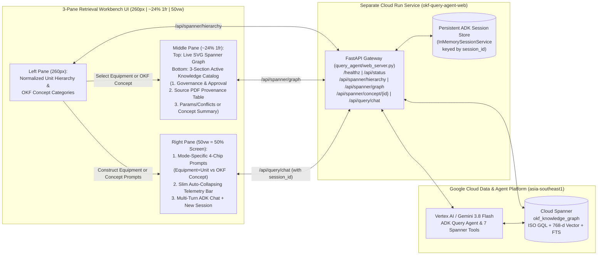

# Specification Document (SDD): OKF Spanner Graph-RAG & Knowledge Catalog Retrieval Workbench UI

- **Spec ID:** `SPEC-20260929-QUERY-AGENT-RETRIEVAL-WORKBENCH-UI`
- **Version:** `2.2` (2026-10-01 — Cache-Busted Static Assets, Async Selection Race Guard & Batched Hop-2 GQL, `entity_metadata` Approval/Provenance Extraction, and Strict 50vw CSS Grid Containment)
- **Status:** Approved & Implemented (`v2.2`)
- **Target Runtime:** Separate Google Cloud Run Service (`okf-query-agent-web`) + Vertex AI Agent Platform (`agent_runtime`)
- **Related Specs:** [`SPEC-20260929-OKF-SPANNER-GRAPH-RAG-AGENT.md`](./SPEC-20260929-OKF-SPANNER-GRAPH-RAG-AGENT.md), [`PROGRESS_REPORT_20260929.md`](../plan/PROGRESS_REPORT_20260929.md)

---

## 1. Problem Statement & Objectives

### 1.1 Context
The **OKF Spanner Graph-RAG & Data Lineage Query Agent (`query_agent`)** is deployed on Vertex AI Agent Platform (`agent_runtime`) backed by live Google Cloud Spanner (`okf-knowledge-spanner/okf_knowledge_graph`) and Google Cloud Dataplex Universal Catalog (`dataplex_v1`). The **3-Pane Retrieval & Graph Exploration Workbench UI** (`okf-query-agent-web`) provides engineers and auditors with interactive equipment hierarchy browsing, live Spanner Property Graph visualization, active equipment/concept knowledge catalog inspection, and multi-turn conversational ADK reasoning.

### 1.2 v2.1 / v2.2 Enhancements & Root Cause Remediations
1. **Reliable Active Knowledge Catalog & Graph Switching on Both Equipment and OKF Concept Selection (`v2.1` + `v2.2` Race-Condition Fix):**
   - **Root Cause Fixed (`v2.1`):** Explicitly pass `kind` (`"equipment"` vs `"concept"`), `concept_id` (e.g. `equipment/D-2304` or `hazop/risk-assessment-and-hazop-procedure`), `canonical_tag`, `unit`, `category`, and `title` on every Left-Pane tree item.
   - **Root Cause Fixed (`v2.2`):**
     - Reset both `state.graphData = null` and `state.conceptDetail = null` inside `setFocusTag()` so `renderCatalogPanel()` never falls back to stale `D-2304` parameters while a new selection is loading.
     - Guard `loadSpannerGraph()` with a monotonically increasing `state.selectionRequestSeq` counter and `AbortController` so slower in-flight responses from prior selections are cancelled/ignored and can never overwrite the current selection.
     - Eliminate the duplicate parallel `/api/spanner/concept/{id}` fetch during selection switches because `/api/spanner/graph` already returns `selected_entity_detail.catalog_dossier`, and batch Hop-2 GQL traversal in `traverse_connectivity_gql` using `UNNEST(@frontier_tags)` instead of 12 sequential queries (reducing switch latency from ~12s to <1s).
     - Fix exact tag boundary matching in `read_full_concept` and `lookup_entity_and_parameters` so `C-2301` is not shadowed by `UC-2301`.
2. **Structured 3-Section Active Knowledge Catalog & Rich `entity_metadata` Provenance (`#subpane-catalog`, `v2.1` + `v2.2`):**
   - Replace raw parameter-snippet lineage rows with 3 high-value engineering provenance & governance sections derived from Spanner `OkfConcepts.frontmatter_json` (including nested `frontmatter.entity_metadata` and `frontmatter.document_metadata`), `RawSourceDocuments`, and `FactLineageEdges`:
     1. **Governance & Approval Card:** Displays `Trust Tier` (`human-reviewed` vs `ai-extracted`), `Lifecycle Status` (`stable`), named `Approver` / `Author` / `Governing Authority` / `Effective Date` / `Document ID` from `frontmatter.entity_metadata` (alongside `verified` records), `Extracted By` (`extracter_agent/gemini-3.8-flash` + extraction timestamp), `Bundle Version` (`v1-acme-demo`), and `MD5 Checksum`.
     2. **Source PDF Provenance Table:** Lists every authoritative PDF document that the selected Equipment or OKF Concept was extracted from (from `frontmatter.sources`, `frontmatter.entity_metadata`, `FactLineageEdges`, `FactAssertions`, and markdown body citations), including **Exact PDF Filename**, **Document Code**, **Document Type**, **Revision / Version**, and **Source Role** (`PRIMARY` vs `CONFLICTING`).
     3. **Mode-Specific Engineering Details:**
        - **Equipment Selection:** Cross-Document Conflict Alerts + Governing Design & Operating Parameters Table.
        - **OKF Concept Selection:** Concept Summary & Markdown Excerpt + Clickable Linked Equipment / Wiki-Link Pills (`wiki_links`).
3. **Reduce Middle Pane Width so Right Chat Pane Consumes ~50% of Screen (`260px | minmax(300px, 1fr) | 50vw`, `v2.1` + `v2.2` CSS Grid Containment):**
   - Set `.wb-grid` column proportions to `260px minmax(300px, 1fr) 50vw` and enforce `min-width: 0` on `.wb-pane`, `.wb-pane-middle`, `.wb-pane-chat`, and `flex: 1; min-width: 0;` on `.prebuilt-chips-scroll`, plus `flex-wrap: wrap` on `.graph-legend-bar` so horizontal children never prevent the Middle Pane from shrinking.
4. **Mode-Specific 4-Chip Dynamic Pre-Built Prompts (Equipment + Unit vs. OKF Concept Category):**
   - Construct 4 tailored pre-built prompts based on whether the user selects an **Equipment item** (`kind === "equipment"`, reflecting Equipment Tag + Process Unit) or an **OKF Concept** (`kind === "concept"`, tailored to the OKF Concept's category: `hazop`, `hazards`, `procedures`, `troubleshooting`, `instruments`, `parameters`, `units`, `sources`, `root`).
5. **Static Asset Cache-Busting & No-Cache HTTP Headers (`v2.2`):**
   - Append `?v=2.2` query strings to `/static/app.css?v=2.2` and `/static/app.js?v=2.2` in `query_agent/static/index.html`, and serve `Cache-Control: no-cache, no-store, must-revalidate` headers on `/` and `/static/*` in `query_agent/web_server.py`.

---

## 2. System Architecture & Component Interaction



### 2.1 Confirmed Design Decisions (`v2.1` / `v2.2` User Sign-Off)

| Dimension | Confirmed Design Choice | Rationale |
| :--- | :--- | :--- |
| **1. Column Proportions** | `260px` Left (Units/Concepts) \| `minmax(300px, 1fr)` (~24%) Middle (Graph + Catalog) \| `50vw` Right (Chat = 50% of screen width) with `min-width: 0` containment | Gives the multi-turn conversational chat and markdown tables half the screen while keeping the Graph & Catalog side-by-side. |
| **2. Active Knowledge Catalog & Lineage Sections** | **3 Structured Sections:** (1) **Governance & Approval Card** (`Trust Tier`, `Approver / Author / Authority / Effective Date / Verified By`, `Extracted By + Model`, `Bundle Version & MD5`), (2) **Source PDF Provenance Table** (`PDF Filename`, `Doc Type`, `Revision`, `Role`), and (3) **Governing Parameters & Conflict Alerts** (for Equipment) or **Concept Summary & Linked Entities** (for OKF Concepts) | Replaces repetitive parameter claim snippets with actionable document provenance (which PDF, which revision, who approved/verified, and what conflicts exist). |
| **3. Selection-Aware Pre-Built Prompts** | **Mode-Specific 4-Chip Prompt Bar:** Distinct 4-prompt templates for **Equipment + Unit selection** vs. **OKF Concept category selection** (`hazop`, `hazards`, `procedures`, `troubleshooting`, `instruments`, `parameters`, `units`, `sources`) | Ensures pre-built prompts reflect the exact Equipment + Unit or OKF Concept selected in the Left Pane. |

---

## 3. Data Models & Type Contracts

### 3.1 Normalized `catalog_dossier` Payload
Both `GET /api/spanner/graph` (inside `selected_entity_detail.catalog_dossier`) and `GET /api/spanner/concept/{concept_id:path}` (inside `catalog_dossier`) return a deterministic provenance & governance structure built by `build_catalog_dossier(concept_doc, lineage_traces, parameters)`:

```python
class SourceDocumentProvenance(BaseModel):
    """Normalized source PDF provenance row for the Active Knowledge Catalog."""

    doc_code: str
    filename: str
    doc_type: str  # Process Data Sheet | P&ID Drawing | Process Flow Diagram (PFD) | Operating Manual | Engineering Standard / HAZOP
    revision: str  # e.g., "Z1", "R1", "0"
    source_role: str  # "PRIMARY" | "CONFLICTING" | "REFERENCED"
    resource_path: str
    md5_hash: str = ""


class GovernanceMetadata(BaseModel):
    """Normalized governance, approval, and extraction lineage for an OKF Concept or Equipment."""

    concept_id: str
    title: str
    concept_type: str
    category: str
    unit: str
    status: str  # e.g., "stable"
    trust_tier: str  # e.g., "human-reviewed" | "ai-extracted"
    approved_by: list[str]  # Includes named approver/author from entity_metadata + verified records
    approved_at: str  # Effective date or ISO-8601 verification timestamp
    approver: str = ""
    author: str = ""
    governing_authority: str = ""
    document_id: str = ""
    effective_date: str = ""
    extracted_by: str  # e.g., "extracter_agent/gemini-3.8-flash"
    extracted_at: str  # ISO-8601 timestamp
    bundle_version: str
    content_md5: str
    bundle_gcs_uri: str
```

### 3.2 Concept-Centered Graph Support in `get_interactive_graph`
When `GET /api/spanner/graph?center_tag={concept_id}` is called for a non-equipment OKF Concept (e.g., `hazop/risk-assessment-and-hazop-procedure`, `procedures/unit-2300-operating-manual`):
1. `read_full_concept(center_tag)` retrieves the `OkfConcepts` record, `frontmatter`, and `wiki_links`.
2. The center node is created with `type: "CONCEPT"`, `label: concept_id`, `subtitle: title`.
3. Every `wiki_links` target (`to_concept_id`) is added as a neighbor node (`EQUIPMENT` if `equipment/*`, else `CONCEPT`) connected via a `CONNECTS_TO` edge.
4. Every source PDF in `frontmatter.sources`, `frontmatter.entity_metadata`, or markdown citations is added as a `RAW_PDF` node connected via a `DERIVED_FROM` edge (`Rev Z1`, `Rev R1`, etc.).
5. `selected_entity_detail` includes the complete `catalog_dossier` (`governance`, `source_documents`, `wiki_links`, `description`, and `body_excerpt`).

### 3.3 Unit Hierarchy Normalization (`_infer_unit_from_tag`)
In `query_agent/spanner/repository.py`, `_assemble_hierarchy_payload` normalizes fragmented unit strings into canonical process unit buckets (`Unit 2100 (Cumene & Alkylation)`, `Unit 2200 (Oxidation Section)`, `Unit 2300 (CDN Section)`). Each item in `units` explicitly carries `"item_kind": "equipment"`, and each item in `knowledge_categories` explicitly carries `"item_kind": "concept"` and `"category": cat_k`.

---

## 4. API Contracts & External Integrations

- `GET /healthz`: Returns HTTP 200 JSON liveness payload (`status`, `service`, `spanner_database`).
- `GET /api/status`: Returns Spanner instance/database status, live entity/concept/conflict counts, and Dataplex catalog status.
- `GET /api/spanner/hierarchy`: Returns normalized Process Unit hierarchy (`units`), `conflict_items`, and `knowledge_categories`.
- `GET /api/spanner/graph`: Returns interactive Property Graph nodes, edges, and `selected_entity_detail.catalog_dossier` for `center_tag` and `hops` (`1..3`).
- `GET /api/spanner/concept/{concept_id:path}`: Returns full Markdown concept and `catalog_dossier` from Cloud Spanner.
- `POST /api/query/chat` & `GET /api/query/jobs/{job_id}`: Submits and polls asynchronous multi-turn ADK queries with contiguous per-step tool latency telemetry.

---

## 5. UI/UX & Behavioral Specifications

### 5.1 3-Pane Grid Layout (`260px | minmax(300px, 1fr) | 50vw`)
- **Left Pane (`260px`, `#pane-hierarchy`):** Normalized Process Units (`Unit 2100`, `Unit 2200`, `Unit 2300`), `⚠️ Conflicts` filter, and `OKF Concepts` categories (`hazards`, `hazop`, `instruments`, `parameters`, `procedures`, `root`, `sources`, `troubleshooting`, `units`).
- **Middle Pane (`minmax(300px, 1fr)`, `#pane-middle`, `min-width: 0`):**
  - **Upper Half (50%, `#subpane-graph`):** Live Spanner Graph Explorer centered on the selected Equipment or OKF Concept.
  - **Lower Half (50%, `#subpane-catalog`):** 3-Section Active Knowledge Catalog & Provenance Inspector.
- **Right Pane (`50vw`, `#pane-chat`, `min-width: 0`):** Consumes 50% of the viewport width. Contains the Mode-Specific 4-Chip Pre-Built Study Bar, Slim 1-Line Live Telemetry Bar, and Multi-Turn ADK Chat Stream.

### 5.2 Active Knowledge Catalog (`#subpane-catalog`) — 3-Section Layout
Whenever an Equipment item or OKF Concept is selected in the Left Pane (or a node is clicked in the Graph):
1. **Section 1 — Governance & Approval Card (`.catalog-governance-card`):**
   - Displays `Trust Tier` badge (`✓ HUMAN-REVIEWED` in emerald or `AI-EXTRACTED` in cyan) and `Status` badge (`STABLE`).
   - Grid showing:
     - **Approved / Verified By:** Named `approver` / `author` / `governing_authority` from `entity_metadata` (e.g., `Dr. Elena Vance (VP Engineering & Process Safety)`) and `verified` records + effective/approval date.
     - **Extracted By:** e.g. `extracter_agent / gemini-3.8-flash` (`2026-10-01`)
     - **Process Unit & Document / Category:** e.g. `Unit 2300 (CDN Section)` • `Doc ID: STD-PHA-001`
     - **Bundle Version & MD5:** e.g. `v1-acme-demo` • `MD5: 2cdb81c27d59...`
2. **Section 2 — Source PDF Provenance Table (`.catalog-pdf-table`):**
   - Shows exact source PDFs (`source_documents`) with columns:
     - **PDF Document & Code**
     - **Doc Type** (`Process Data Sheet`, `P&ID Drawing`, `PFD`, `Operating Manual`, `Engineering Standard / HAZOP`)
     - **Version / Rev** (`Rev Z1`, `Rev R1`)
     - **Role** (`PRIMARY` or `⚠️ CONFLICTING`)
3. **Section 3 — Mode-Specific Engineering Details:**
   - **If Equipment (`kind === "equipment"`):** Cross-Document Conflict Alerts + Governing Design & Operating Parameters.
   - **If OKF Concept (`kind === "concept"`):** Concept Overview & Markdown Summary + Clickable Linked Equipment & Concept Wiki-Links (`wiki_links`).

---

## 6. DevOps, Security, Cloud & Agent Governance Checklist

| Rule | Standard | Enforcement in `okf-query-agent-web` |
| :--- | :--- | :--- |
| **Rule 2 & 3** | **Code Quality & SAST** | Zero `ruff` or `bandit` findings across `query_agent/web_server.py`. |
| **Rule 6** | **Cloud Run `/healthz`** | Dedicated `/healthz` endpoint verified post-deployment. |
| **Rule 8** | **Unified `.env`** | Configured via `QUERY_WEB_SERVICE_NAME` and `SPANNER_*` variables in `.env`. |
| **Rule 10** | **IAM & Ingress** | Pattern 3 (`--no-invoker-iam-check`, zero `allUsers`). |

---

## 7. Step-by-Step Implementation Plan & Test Design

### Step 1: Backend Provenance Dossier, `entity_metadata` Extraction, Exact Tag Matching & Batched Hop-2 GQL (`query_agent/spanner/repository.py` & `query_agent/web_server.py`)
- **Implementation:**
  - Enrich `build_catalog_dossier()` in `query_agent/spanner/repository.py` to extract nested `frontmatter.entity_metadata` / `frontmatter.document_metadata` (`approver`, `author`, `document_id`, `effective_date`, `governing_authority`, `guideline_custodian`, `revision`) and scan `frontmatter` + `body_markdown` for referenced PDF documents/standards so non-equipment OKF concepts always display rich approval and source document provenance.
  - Fix `read_full_concept` and `lookup_entity_and_parameters` SQL/in-memory ranking so exact tag or `/tag` suffix matches take strict precedence over partial substring (`STRPOS`) matches (preventing `C-2301` from matching `UC-2301`), and skip `lookup_entity_and_parameters` / `traverse_connectivity_gql` when `is_non_eq_concept` is `True`.
  - Batch the Hop-2 GQL query in `traverse_connectivity_gql` using `UNNEST(@frontier_tags)` instead of up to 12 sequential loop queries, and add a 30s TTL cache for `get_interactive_graph` in `web_server.py`.
  - Add `Cache-Control: no-cache, no-store, must-revalidate` headers to `/` and `/static/*` responses in `query_agent/web_server.py`.
- **Deterministic Unit Tests:**
  - `tests/test_query_web_server_unit.py`: Verify `/healthz`, `/api/status`, `/api/spanner/hierarchy`, `/api/spanner/graph`, and `build_catalog_dossier`.
- **Property-Based Tests (PBT):**
  - `tests/test_query_web_server_property.py`: Verify with `hypothesis` that step latency breakdowns sum to `total_latency_ms` and subgraph filters preserve node/edge invariants.

### Step 2: Frontend Cache-Busting, Selection Race-Condition Guard & Strict 50vw CSS Containment (`query_agent/static/index.html`, `query_agent/static/app.css`, `query_agent/static/app.js`)
- **Implementation:**
  - Append `?v=2.2` to `/static/app.css?v=2.2` and `/static/app.js?v=2.2` in `query_agent/static/index.html`.
  - Add `min-width: 0` to `.wb-pane`, `.wb-pane-middle`, `.wb-pane-chat`, and `flex: 1; min-width: 0;` to `.prebuilt-chips-scroll`, plus `flex-wrap: wrap` to `.graph-legend-bar` in `query_agent/static/app.css`.
  - In `query_agent/static/app.js`:
    - Reset both `state.graphData = null` and `state.conceptDetail = null` in `setFocusTag()`.
    - Add `state.selectionRequestSeq` + `AbortController` (`state.graphAbortController`) in `loadSpannerGraph()` so out-of-order responses from previous selections are aborted/ignored.
    - Rely on the single `/api/spanner/graph` call (which already includes `selected_entity_detail.catalog_dossier`) instead of firing a duplicate parallel `/api/spanner/concept` request on every click.
- **Deterministic Unit Tests & Property-Based Tests (PBT):**
  - Verify `Cache-Control: no-cache` headers on `/` and `/static/app.js`, `?v=2.2` asset links in `index.html`, `entity_metadata` extraction (`approver`, `author`, `document_id`, `effective_date`) in `build_catalog_dossier`, exact tag boundary resolution (`C-2301` vs `UC-2301`), and `AbortController` / `selectionRequestSeq` race protection in `app.js`.

---

## 8. Plan Progress Tracking

- **Linked Progress Report:** [`specs/plan/PROGRESS_REPORT_20260929.md`](../plan/PROGRESS_REPORT_20260929.md)
- **Step Status:** Steps 1–2 Completed & Verified (`100%` Unit & PBT Pass Rate).
