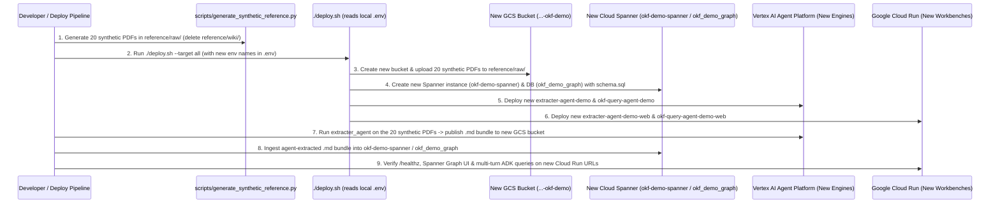

# Specification: Repository Sanitization, Synthetic Raw PDF Dataset & Fresh Environment Deployment Verification

**Document ID:** `SPEC-20261001-REPOSITORY-SANITIZATION-AND-SYNTHETIC-DATASET`  
**Status:** Approved & In Execution (Steps 1–3 Completed)  
**Date:** `2026-10-01`  
**Target Runtime:** Dual-Runtime (`agent_runtime` on Gemini Enterprise Agent Platform + `cloud_run` on Google Cloud Run)  

---

## 1. Problem Statement & Objectives

### 1.1 Context & Motivation
The repository previously contained confidential industrial customer documentation in `reference/raw/` (136 engineering PDFs) and `reference/wiki/` (134 extracted Markdown files), along with derived evaluation reports (`evals/reports/*`), a static demo bundle (`extracter_agent/static/data.js`), and hardcoded customer/licensor/GCP project identifiers across configuration files, scripts, and specifications.

To safely share this repository with others while proving that a brand-new user can deploy the entire stack from scratch:
1. We completely delete `reference/wiki/` (zero pre-baked `.md` files), `extracter_agent/static/data.js`, and `evals/reports/*`, and replace `reference/raw/` with **20 synthetic multi-page engineering PDFs** (`Acme Petrochemical Demo Complex — Unit 2300`) covering **all engineering document types and subtypes** present in the original corpus (Standards including Risk Assessment & HAZOP Procedure, Engineering Design Standard, and Chemical SDS; P&IDs including Equipment/Drawing Lists, SIS Cause & Effect Matrix, Vector CAD P&ID, Process P&ID, and Flare Header P&ID; PFDs with Heat & Material Balances; Operating Manuals; and Process Data Sheets for Columns, Reactors, Heat Exchangers, Pumps, Vacuum Systems, Control Valves, Pressure Relief Valves, and Field Instruments).
2. We leave all existing cloud resources (`okf-knowledge-spanner`, `extracter-agent-web`, `okf-query-agent-web`, and existing Reasoning Engines) **100% untouched**.
3. We test-deploy a **brand-new isolated environment** inside the target GCP project (`your-gcp-project-id`) via local `.env` and `./deploy.sh`:
   - **New GCS Bucket:** `your-gcp-project-id-okf-demo` (`DESTINATION_GCS_PREFIX=okf-bundles/acme-plant`)
   - **New Cloud Spanner Instance & Database:** `okf-demo-spanner` / `okf_demo_graph` (`100 PU`, initialized with `query_agent/spanner/schema.sql`)
   - **New Agent Platform Reasoning Engines (`agent_runtime`):** `extracter-agent-demo` and `okf-query-agent-demo`
   - **New Cloud Run Web Workbenches (`cloud_run`):** `extracter-agent-demo-web` and `okf-query-agent-demo-web`
4. After deploying the new environment, we use the newly deployed **`extracter_agent`** to extract the OKF v0.2 `.md` bundle from the 20 synthetic PDFs into the new GCS bucket, and then seed the new **Cloud Spanner (`okf-demo-spanner / okf_demo_graph`)** from those agent-extracted `.md` files.

### 1.2 Goals
1. **Complete Confidential Data Removal:**
   - Remove all 136 confidential PDFs in `reference/raw/` and completely remove `reference/wiki/` (134 files).
   - Delete `extracter_agent/static/data.js` (2.6 MB static dump) and all historical evaluation outputs in `evals/reports/*`.
   - Scrub all customer, plant, contractor, licensor, proprietary drawing codes, and named personnel identifiers across `evals/`, `scripts/`, `specs/`, `docs/`, `tests/`, and `README.md`.
2. **20 Comprehensive Synthetic Raw PDFs Only (`reference/raw/`) — Zero Pre-Baked `.md` Files:**
   - Provide `scripts/generate_synthetic_reference.py` to deterministically generate **20 synthetic multi-page engineering PDFs** across all 5 canonical subfolders (`data_sheets/`, `pid/`, `pfd/`, `standards/`, `operating_manuals/`) covering every engineering document subtype, including a vector-only P&ID (`is_vector_drawing=True`) and intentional cross-document parameter discrepancies (`11.0` vs `12.2 kg/cm²g` on `D-2304` to trigger `⚠️ CONFLICT`).
3. **Configuration Sanitization & Turnkey `./deploy.sh` Provisioning (Rule 8):**
   - Replace hardcoded GCP Project IDs, Reasoning Engine IDs, project numbers, and Cloud Run URLs in tracked files (`.env.example`, `extracter_agent/config.py`, `query_agent/config.py`, `terraform/variables.tf`, `agents-cli-manifest*.yaml`, `cloudbuild.yaml`, `deploy.sh`, `extracter_agent/static/index.html`) with clean generic placeholders (`your-gcp-project-id`).
   - Enhance `./deploy.sh` so deploying to a fresh environment automatically ensures the target GCS bucket, raw PDF uploads, and Cloud Spanner instance/database (`schema.sql`) exist before deploying the agents and Cloud Run services.
4. **Fresh Isolated Environment Deployment $\rightarrow$ Live Agent Extraction $\rightarrow$ New Spanner Seeding:**
   - Configure local `.env` (gitignored) with the new isolated resource names (`okf-demo-spanner`, `okf_demo_graph`, `extracter-agent-demo-web`, `okf-query-agent-demo-web`, `your-gcp-project-id-okf-demo`).
   - Deploy both new ADK agents (`agent_runtime`) and both new Cloud Run web workbenches (`cloud_run`).
   - Run `extracter_agent` against the 20 synthetic PDFs to extract and publish the OKF v0.2 `.md` bundle to the new GCS bucket.
   - Seed the new Cloud Spanner database (`okf-demo-spanner / okf_demo_graph`) from the newly extracted `.md` bundle and verify both new Cloud Run workbenches and live ADK agents.

### 1.3 Non-Goals
- Modifying, purging, or overwriting any existing Cloud Spanner instance (`okf-knowledge-spanner`), existing GCS bucket (`your-gcp-project-id-okf-knowledge`), or existing Cloud Run / Agent Engine deployments.
- Storing pre-baked `.md` files in `reference/wiki/`.
- Committing `.env` or any real customer/GCP credentials to Git.

---

## 2. System Architecture & Component Interaction

### 2.1 Dual-Runtime Architecture & Fresh Environment Topology

| Dimension | Conversational AI Agents (`agent_runtime`) | Web Workbenches & API Gateways (`cloud_run`) | New Isolated Data & Storage Tier |
| :--- | :--- | :--- | :--- |
| **Target Runtime** | **Gemini Enterprise Agent Platform (`agent_runtime`)** | **Google Cloud Run (`cloud_run`)** | **GCS + Cloud Spanner (`asia-southeast1`)** |
| **New Environment Artifacts** | 1. `extracter-agent-demo`<br>2. `okf-query-agent-demo` | 1. `extracter-agent-demo-web`<br>2. `okf-query-agent-demo-web` | 1. Bucket: `...-okf-demo`<br>2. Spanner: `okf-demo-spanner / okf_demo_graph` |
| **Data Flow** | 20 synthetic PDFs in `reference/raw/` & GCS $\rightarrow$ `extracter-agent-demo` $\rightarrow$ OKF `.md` bundle | Streams from new GCS bucket & new Cloud Spanner instance via ADC | OKF `.md` bundle $\xrightarrow{\text{ingest\_okf\_bundle\_to\_spanner.py}}$ `okf-demo-spanner / okf_demo_graph` |
| **IAM & Ingress** | Vertex AI Reasoning Engine IAM | Pattern 3: `invoker_iam_disabled = true`, `INGRESS_TRAFFIC_ALL` (zero `allUsers`) | Secret/Env isolation per Rule 8 & Rule 10 |

### 2.2 Sequence Diagram: Fresh Environment Provisioning, Agent Extraction & Spanner Seeding



---

## 3. Data Models & Type Contracts

### 3.1 Synthetic Raw PDF Manifest Contract (`scripts/generate_synthetic_reference.py`)
The synthetic reference dataset models **Acme Petrochemical Demo Complex — Unit 2300 (Decomposition & Recovery Section)** with zero real-world customer or licensor data and **zero `reference/wiki/` files**:

```python
from dataclasses import dataclass


@dataclass(frozen=True)
class SyntheticPdfSpec:
    subfolder: str          # "data_sheets" | "pid" | "pfd" | "standards" | "operating_manuals"
    filename: str           # e.g. "DS-V2301_Preflash_Column_Z1.pdf"
    doc_code: str           # e.g. "DS-V2301"
    title: str              # e.g. "V-2301 Preflash Column Process Data Sheet"
    revision: str           # e.g. "Z1"
    is_vector_only: bool    # True for PID-23-0004 (tests 0-char vector CAD detection)
    pages_content: list[str]
```

The **20 synthetic engineering PDFs** in `reference/raw/` covering all engineering document types and subtypes are:

| # | Subfolder | Filename | Engineering Doc Subtype & Key Technical Content |
| :--- | :--- | :--- | :--- |
| 1 | `data_sheets` | `DS-V2301_Preflash_Column_Z1.pdf` | **Column / Vessel Process Data Sheet** (9 pages): Preflash Column `V-2301` (`SA-516 Gr.70`, `FV / 3.5 kg/cm²g`, `165 °C`, ID `2100 mm x 14500 mm`). |
| 2 | `data_sheets` | `DS-D2304_Decomposer_Reactor_Z1.pdf` | **Reactor / Drum Process Data Sheet** (4 pages): Decomposer Reactor `D-2304` (`SA-240 316L`, Internal Design Pressure `11.0 kg/cm²g` at `250 °C` — contrasts with P&ID `12.2 kg/cm²g` to trigger `⚠️ CONFLICT`). |
| 3 | `data_sheets` | `DS-E2307_Reactor_Cooler_Z1.pdf` | **Shell & Tube Heat Exchanger Data Sheet** (4 pages): Reactor Circulation Cooler `E-2307` (`TEMA BEM`, Duty `4.85 Gcal/hr`, Heat Transfer Area `312 m²`, Shell `11.0 kg/cm²g`, Tube `7.0 kg/cm²g`). |
| 4 | `data_sheets` | `DS-P2301_Preflash_Bottoms_Pump_Z1.pdf` | **Centrifugal Pump Process Data Sheet** (3 pages): Preflash Column Bottoms Pump `P-2301A/B` (API 610 OH2, Rated Flow `68.5 m³/h`, Differential Head `85 m`, Seal Plan 53B, `316SS`). |
| 5 | `data_sheets` | `DS-X2301_Flash_Column_Vacuum_System_Z1.pdf` | **Vacuum Ejector Package Process Data Sheet** (3 pages): Two-Stage Steam Jet Ejector & Liquid Ring Vacuum Package `X-2301` (Suction Pressure `35 mmHgA`, MP Steam Driver). |
| 6 | `data_sheets` | `DS-PS-0010_Control_Valve_Process_Datasheet_Z1.pdf` | **Control Valve Process Data Sheet** (3 pages): Control valves `LV-1301` (`D-2304` Level Control), `TV-1302` (`E-2307` Cooling Water Control), and `PV-0401` (`V-2301` Vacuum Control). |
| 7 | `data_sheets` | `DS-PS-0018_Pressure_Relief_Valve_Datasheet_Z1.pdf` | **Pressure Relief Valve (PSV) Process Data Sheet** (3 pages): Relief valves `PSV-2304A/B` (Set Pressure `11.0 kg/cm²g`, Orifice `4J6`, Relieving Case: Blocked Outlet / Exothermic Runaway) and `PSV-2301` (Set Pressure `3.5 kg/cm²g`). |
| 8 | `data_sheets` | `DS-PS-0031_Instrument_Process_Datasheet_Z1.pdf` | **Flow, Pressure, Level & Temp Instrument Data Sheet** (4 pages): Guided-Wave Radar `LT-1301`, SIL-2 Voting Thermocouples `TXSHH-1301A/B/C` (`115.0 °C` trip), Coriolis Mass Flow `FT-0401`, and Pressure Transmitter `PT-1301`. |
| 9 | `pid` | `PID-23-0000_Equipment_and_Drawing_List_Z1.pdf` | **P&ID Master Drawing Index, Legend & Equipment List** (3 pages): Unit 2300 Master Equipment Register (`V-2301`, `D-2304`, `E-2307`, `P-2301A/B`, `P-2304A/B`, `X-2301`, `D-2310`, `D-2320`) and Piping Line Class Index. |
| 10 | `pid` | `PID-23-0002_Cause_and_Effect_Matrix_Z1.pdf` | **SIS Cause & Effect Interlock Matrix** (3 pages): Safety Interlocks `I-2301` (`V-2301` High Level / Vacuum Loss Trip) and `I-2304` (`D-2304` High-High Temp `TXSHH-1301 >= 115 °C` 2oo3 voting $\rightarrow$ trips Acid Feed `XV-1305` and opens Emergency Quench `XV-1309`). |
| 11 | `pid` | `PID-23-0004_Preflash_Column_Z1.pdf` | **Vector-Only CAD P&ID Drawing** (1 page): Preflash Column `V-2301` rendered purely with vector paths/lines and zero embedded text characters so `is_vector_drawing() == True`. |
| 12 | `pid` | `PID-23-0013_Decomposer_Reactor_Z1.pdf` | **Process P&ID — Decomposer Reactor & Circulation** (3 pages): P&ID for `D-2304`, `E-2307`, `P-2304A/B`, `LT-1301`, `TXSHH-1301`, `PSV-2304A/B` with conflicting design pressure annotation (`12.2 kg/cm²g` at `250 °C`). |
| 13 | `pid` | `PID-23-0022_Pressure_Relief_Header_Z1.pdf` | **Process P&ID — Pressure Relief & Flare Header** (2 pages): Closed Relief Header collecting discharges from `PSV-2301` and `PSV-2304A/B` into Acid Aromatics Knock-Out Drum `D-2320`. |
| 14 | `pfd` | `PFD-23-0001_Concentration_and_Preflash_Section_Z1.pdf` | **Process Flow Diagram — Concentration Section** (2 pages): PFD and Heat & Material Balance for `V-2301`, `P-2301A/B`, and `X-2301` (Streams `S210`, `S220`, `S229`). |
| 15 | `pfd` | `PFD-23-0005_Decomposer_and_Neutralization_Section_Z1.pdf` | **Process Flow Diagram — Decomposer & Neutralization** (2 pages): PFD and Heat & Material Balance for `D-2304`, `E-2307`, and Neutralization Drum `D-2310` (Streams `S229`, `S379`, `S380`, `S384`, `S387`). |
| 16 | `standards` | `STD-PHA-001_Risk_Assessment_and_HAZOP_Procedure_R1.pdf` | **Corporate Risk & HAZOP Study Procedure Standard** (5 pages): Process Hazard Analysis (PHA) standard, 5x5 Risk Ranking Matrix (Severity 1–5 vs. Likelihood A–E), HAZOP Guidewords & Deviations, LOPA/SIL Target Assignment, and Facilitator Workflow. |
| 17 | `standards` | `STD-ENG-014_Pressure_Relief_and_Flare_System_Design_R1.pdf` | **Engineering Design Standard — Overpressure & PSV Sizing** (4 pages): Corporate standard for API 520/521 relief sizing, accumulation limits (`10%` single PSV, `16%` multiple PSVs, `21%` fire), and two-phase runaway venting. |
| 18 | `standards` | `SDS_80-15-9_cumene-hydroperoxide.pdf` | **Safety Data Sheet (SDS) — Cumene Hydroperoxide (CHP)** (4 pages): Organic Peroxide Type F hazard profile, Self-Accelerating Decomposition Temperature (`SADT = 75 °C`), exothermic runaway kinetics (`1580 kJ/kg`), and Emergency Quench protocol. |
| 19 | `standards` | `SDS_108-95-2_phenol.pdf` | **Safety Data Sheet (SDS) — Phenol & Acetone** (3 pages): Acute dermal/inhalation toxicity, TWA `5 ppm`, PEG-300 decontamination protocol, and corrosion allowances. |
| 20 | `operating_manuals` | `OM-2300_Operating_Manual_Z1.pdf` | **Plant Operating Manual — Unit 2300** (5 pages): Standard Operating Conditions (`V-2301` at `92 °C`, `D-2304` at `82 °C / 1.8 kg/cm²g`), Normal Startup & Shutdown Procedures, Cause-and-Effect Trip Response (`I-2301`, `I-2304`), and Emergency Quench Activation. |

---

## 4. API Contracts & External Integrations

All existing FastAPI endpoints and ADK `FunctionTool` signatures in `extracter_agent` and `query_agent` remain 100% backward-compatible:
- `extracter_agent/web_server.py`:
  - `GET /healthz`, `GET /api/status`, `GET /api/files`, `GET /api/raw-pdf/{subfolder}/{filename:path}`, `GET /api/okf/{concept_id:path}`, `POST /api/chat/extract`, `GET /api/chat/jobs/{job_id}`.
- `query_agent/web_server.py`:
  - `GET /healthz`, `GET /api/status`, `GET /api/spanner/hierarchy`, `GET /api/spanner/graph`, `GET /api/spanner/concept/{concept_id:path}`, `POST /api/query/chat`, `GET /api/query/jobs/{job_id}`.

---

## 5. UI/UX & Behavioral Specifications

1. **Sanitized Default UI Banners (`extracter_agent/static/index.html` & `query_agent/static/index.html`):**
   - `extracter_agent/static/index.html` replaces the hardcoded project bucket subtitle and `"136 Raw PDFs"` welcome text with dynamic counters hydrated from `/api/status` (`gs://your-gcp-project-id-okf-knowledge` when unconfigured).
   - Delete `extracter_agent/static/data.js` so zero static confidential data is served under `/static/`.
2. **Workbench End-to-End Flow on New Cloud Run Services:**
   - `extracter-agent-demo-web` displays the 20 synthetic Raw PDFs across all 5 categories (`data_sheets`, `pid`, `pfd`, `standards`, `operating_manuals`) from `gs://...-okf-demo/reference/raw/` and all OKF `.md` concepts extracted by `extracter_agent`.
   - `okf-query-agent-demo-web` displays the live Cloud Spanner hierarchy (`okf-demo-spanner / okf_demo_graph`), interactive property graph (`OkfKnowledgeGraph`), 3-section Active Knowledge Catalog, and multi-turn chat populated from the `.md` bundle extracted by `extracter_agent`.

---

## 6. DevOps, Security, Cloud & Agent Governance Checklist

| Rule | Area | Compliance Verification |
| :--- | :--- | :--- |
| **Rule 1** | **SCM & Multi-Branch** | Single repository; all confidential files removed before sharing. |
| **Rule 2** | **Static Code Quality** | `ruff check` and `pytest` clean across all modules. |
| **Rule 3** | **SAST & Confidentiality** | Automated confidentiality scan test (`test_repository_zero_confidential_leakage`) + CodeMender SAST report in `docs/`. |
| **Rule 5** | **Cloud Build (`cloudbuild.yaml`)** | Sanitized project comments; executes `pytest tests/ evals/ -v` and `python -m extracter_agent.cli`. |
| **Rule 6** | **Cloud Run Observability** | `/healthz` probes verified on both `extracter-agent-demo-web` and `okf-query-agent-demo-web`. |
| **Rule 8** | **Unified `.env` Management** | `.env.example` contains sanitized placeholders (`your-gcp-project-id`) with `Shared`, `NONPROD_*`, and `PROD_*` blocks; local `.env` (gitignored) holds the new isolated environment names. |
| **Rule 9 & 10** | **Terraform & IAM** | `terraform/variables.tf` uses generic defaults (`your-gcp-project-id`); `terraform/main.tf` uses Pattern 3 (`invoker_iam_disabled = true`, zero `allUsers`). |
| **Rule 11 & 12** | **Google ADK & Live Eval** | Both ADK agents retain 100% model-driven reasoning and pass benchmark evaluations. |

---

## 7. Step-by-Step Implementation Plan & Test Design

### Step 1: Sanitize Tracked Configuration Files & Configure Isolated New Environment in Local `.env`
- **Implementation:**
  - Create local `.env` (ignored by `.gitignore`) targeting a **brand-new isolated environment** inside `your-gcp-project-id`:
    - `SERVICE_NAME=extracter-agent-demo`
    - `DESTINATION_GCS_BUCKET=your-gcp-project-id-okf-demo`
    - `DESTINATION_GCS_PREFIX=okf-bundles/acme-plant`
    - `SPANNER_INSTANCE_ID=okf-demo-spanner`
    - `SPANNER_DATABASE_ID=okf_demo_graph`
    - `CLOUD_RUN_WEB_SERVICE=extracter-agent-demo-web`
    - `QUERY_WEB_SERVICE_NAME=okf-query-agent-demo-web`
  - Sanitize `.env.example`, `extracter_agent/config.py`, `query_agent/config.py`, `terraform/variables.tf`, `agents-cli-manifest.yaml`, `agents-cli-manifest-query.yaml`, `cloudbuild.yaml`, `deploy.sh`, and `extracter_agent/static/index.html` to use generic placeholders (`your-gcp-project-id`, `your-gcp-project-id-okf-knowledge`, `okf-bundles/acme-plant`).
- **Deterministic Unit Tests:**
  - Verify `get_config()` in both `extracter_agent` and `query_agent` loads environment overrides accurately and defaults to sanitized placeholders when env vars are unset.
- **Property-Based Tests (PBT):**
  - Verify with `hypothesis` that arbitrary valid environment variable overrides in `AppConfig` and `QueryAgentConfig` round-trip without leaking hardcoded project IDs.
- **Completion Criteria:** Zero occurrences of hardcoded project IDs or project numbers in tracked config files.

### Step 2: Purge Confidential `reference/`, `data.js`, and `evals/reports/*` & Generate 20 Comprehensive Synthetic Raw PDFs
- **Implementation:**
  - Delete all 136 confidential PDFs in `reference/raw/`, completely delete `reference/wiki/` (134 files), delete `extracter_agent/static/data.js`, and delete `evals/reports/*`.
  - Implement `scripts/generate_synthetic_reference.py` and execute it to generate the **20 synthetic engineering PDFs** in `reference/raw/{data_sheets,pid,pfd,standards,operating_manuals}/` covering all engineering document types and subtypes, plus the synchronized benchmark datasets in `evals/datasets/{extraction_eval,raw_file_by_file_eval,query_agent_spanner_eval}.jsonl`.
  - Preserve **100% of existing application logic** in `extracter_agent/` and `query_agent/` unchanged from `HEAD` (scrubbing only confidential string literals in configs, docstrings, and `scripts/`).
- **Deterministic Unit Tests:**
  - Update `tests/test_pdf_unit.py`, `tests/test_agent_unit.py`, `tests/test_query_agent_unit.py`, `tests/test_query_web_server_unit.py`, `tests/test_web_server_and_ui.py`, and `evals/test_eval_benchmarks.py` to test against the 20 synthetic reference PDFs and verify `not Path("reference/wiki").exists()`.
  - Add `test_repository_zero_confidential_leakage` verifying that zero files in the repository contain prohibited confidential strings.
- **Property-Based Tests (PBT):**
  - Add `hypothesis` property test verifying that every file in `reference/raw/` is a valid parseable PDF with matching metadata in `raw_file_by_file_eval.jsonl` and zero prohibited confidential tokens.
- **Completion Criteria:** 20 synthetic PDFs in `reference/raw/`; `reference/wiki/`, `extracter_agent/static/data.js`, and `evals/reports/*` completely removed.

### Step 3: Sanitize Documentation, Specifications & Architecture Reports
- **Implementation:**
  - Scrub all confidential client, plant, licensor, and project identifiers from `README.md`, `extracter_agent/README.md`, `query_agent/README.md`, `docs/*`, `specs/features/*.md`, and `specs/plan/*.md`.
  - Ensure all feature specs in `specs/features/*.md` contain all 8 canonical SDD sections required by `validate_sdlc_gate.py --phase execution`.
- **Deterministic Unit Tests & Gate Validation:**
  - Run `python3 _agents/skills/ai_sdlc/scripts/validate_sdlc_gate.py --phase execution` and `pytest tests/ evals/ -v`.
- **Completion Criteria:** 100% `pytest` pass rate, zero confidential identifiers across the entire repository, and `validate_sdlc_gate.py --phase execution` returning `PASSED`.

### Step 4: Phase 3 Operation — Provision New Environment, Deploy New Agents & Cloud Run Services, Extract `.md` Bundle & Seed New Spanner Instance
- **Implementation:**
  - Run `ruff check` and CodeMender SAST audit (`docs/codemender-*.md`).
  - Provision new GCS bucket (`your-gcp-project-id-okf-demo`) and upload the 20 synthetic PDFs to `reference/raw/`.
  - Provision new Cloud Spanner instance (`okf-demo-spanner`, `100 PU`) and database (`okf_demo_graph`) with `query_agent/spanner/schema.sql` (leaving `okf-knowledge-spanner` untouched).
  - Deploy new ADK agents (`extracter-agent-demo`, `okf-query-agent-demo`) to `agent_runtime` and new Cloud Run workbenches (`extracter-agent-demo-web`, `okf-query-agent-demo-web`) via `./deploy.sh`.
  - Run `extracter_agent` against the 20 synthetic PDFs to extract the OKF v0.2 `.md` bundle into `build/okf_bundle/` and `gs://your-gcp-project-id-okf-demo/okf-bundles/acme-plant/`.
  - Seed the new Cloud Spanner database (`okf-demo-spanner / okf_demo_graph`) from the extracted `.md` bundle via `scripts/ingest_okf_bundle_to_spanner.py --bundle-dir build/okf_bundle`.
  - Verify live `/healthz` probes, Spanner Graph API, and live agent queries on the new Cloud Run URLs.
- **Completion Criteria:** All new cloud resources deployed, seeded from live `extracter_agent` output, and verified end-to-end; `specs/plan/PROGRESS_REPORT_20261001.md` updated.

---

## 8. Plan Progress Tracking

- **Linked Progress Report:** [`specs/plan/PROGRESS_REPORT_20261001.md`](../plan/PROGRESS_REPORT_20261001.md)
- **Step Status Matrix:**
  - [x] Step 1: Sanitize Tracked Configuration Files & Configure Isolated New Environment in Local `.env`
  - [x] Step 2: Purge Confidential `reference/`, `data.js`, and `evals/reports/*` & Generate 20 Comprehensive Synthetic Raw PDFs
  - [x] Step 3: Sanitize Documentation, Specifications & Architecture Reports
  - [x] Step 4: Phase 3 Operation — Provision New Environment, Deploy New Agents & Cloud Run Services, Extract `.md` Bundle & Seed New Spanner Instance
