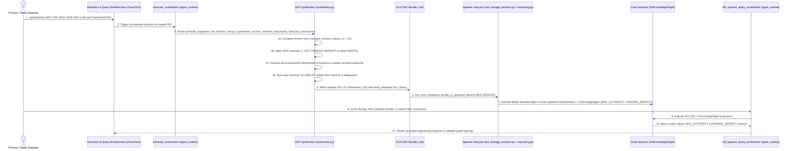

# Specification: Management of Change (MOC) Authority, Topological Lifecycle & Document Revision Hardening

**Document ID:** `SPEC-20261005-MOC-AND-DOCUMENT-UPDATE-LIFECYCLE`  
**Status:** Draft — Pending Pre-Code Stakeholder Alignment (Phase 2 SDD Sub-Gate)  
**Date:** `2026-10-05`  
**Target Runtime:** Dual-Runtime (`agent_runtime` on Gemini Enterprise Agent Platform + `cloud_run` on Google Cloud Run)  

---

## 1. Problem Statement & Objectives

### 1.1 Context & Motivation
In chemical process plants, engineering changes frequently take effect through approved **Management of Change (MOC)** or **Engineering Change Notice (ECN)** packages weeks or months before the underlying master P&ID (`pid/`) or Process Data Sheet (`data_sheets/`) is redrafted into a new revision. Additionally, when revised drawings or data sheets are issued, they may arrive out of chronological revision order (`Rev Z0` ingested after `Rev Z1`), use a completely new filename convention (`2026_AsBuilt_Reactor_Datasheet.pdf` superseding `DS-D2304_Decomposer_Reactor_Z1.pdf`), decommission obsolete instruments or process tie-ins, or resolve prior cross-document discrepancies.

Our architectural walkthrough of [`extracter_agent/okf/synthesizer.py`](../../extracter_agent/okf/synthesizer.py) and [`query_agent/spanner/lineage_extractor.py`](../../query_agent/spanner/lineage_extractor.py) identified **five (5) specific gaps** in the current document update and MOC lifecycle:

1. **Gap 1 — MOC Updates Misclassified as Unauthorized Conflicts (`⚠️ CONFLICT`):**
   - Previously, [`_is_same_source_or_revision_update()`](../../extracter_agent/okf/synthesizer.py#L517-L537) only returned `True` when two citations shared the same normalized filename stem. Because an MOC document (`MOC-2026-042_...pdf`) has a different filename stem from the base P&ID (`PID-23-0013_...pdf`) or Data Sheet (`DS-D2304_...pdf`), any parameter or setpoint change authorized by an MOC was treated as an unauthorized cross-document contradiction (`⚠️ CONFLICT`), keeping the outdated value as primary and tagging the MOC as `CONFLICTING` in Cloud Spanner (`FactLineageEdges`).
2. **Gap 2 — Strictly Additive Topological Merging & Dual-Tag Ghost Edges (`CONNECTS_TO` & `MONITORS_OR_TRIPS`):**
   - Previously, [`merge_equipment_entity_with_existing()`](../../extracter_agent/okf/synthesizer.py#L936-L998) merged `instruments` and `connections` strictly additively (`ikey not in inst_idx`, `ckey not in conn_idx`) and used [`_merge_non_destructive_field()`](../../extracter_agent/okf/synthesizer.py#L739-L758) on `target_tag`, `source_tag`, and `setpoint`, producing concatenated strings like `"D-2320 (D-2310)"`. When [`lineage_extractor.py`](../../query_agent/spanner/lineage_extractor.py#L946-L982) scanned the row with `_EQUIP_TAG_RE`, it created active `CONNECTS_TO` edges to **both** the new and old equipment tags (`D-2320` and `D-2310`), and decommissioned instruments or lines could never be removed from active graph traversals.
3. **Gap 3 — No Cross-Filename Supersession (`superseded_sources` / Title-Block `doc_code`):**
   - When a newly ingested PDF replaced a prior document under a completely different filename format, [`_normalize_base_source_id()`](../../extracter_agent/okf/synthesizer.py#L493-L515) produced distinct stems, causing the platform to treat the replacement file as a competing document instead of superseding the old file.
4. **Gap 4 — Blind Revision Overwrite Without Rank Comparison:**
   - When `_is_same_source_or_revision_update()` returned `True`, [`_merge_parameter_lists()`](../../extracter_agent/okf/synthesizer.py#L734) blindly overwrote the existing parameter (`merged[idx] = new_p.model_copy(deep=True)`) without comparing revision ranks (`Z1` vs `Z0`, `R2` vs `R1`, `Rev B` vs `Rev A`), allowing an older revision ingested out of order to overwrite a newer revision.
5. **Gap 5 — Stale `⚠️ CONFLICT` Bullets Persisting in `## Hazards & Safeguards`:**
   - When a new revision or MOC aligned previously conflicting parameter values, the parameter table row was updated cleanly, but [`merge_equipment_entity_with_existing()`](../../extracter_agent/okf/synthesizer.py#L1000-L1014) carried over all `existing_hazards` strings unchanged, leaving resolved `⚠️ CONFLICT — <Topic>:` bullets stranded in `## Hazards & Safeguards`.

### 1.2 Goals
1. **Authoritative MOC Override + `PENDING_REDRAFT` Lineage (Requirement A1):**
   - When an approved MOC/ECN updates a parameter, setpoint, or connection, update the active value/topology in-place so the MOC value is the active primary value.
   - Preserve the prior un-redrafted P&ID/Data Sheet value in `notes` with a `🔄 MOC PENDING REDRAFT` callout and record structured `MOCChangeRecord` entries in YAML frontmatter (`entity_metadata.moc_history`) and a dedicated `## Management of Change (MOC) & Revision History` Markdown section.
   - Differentiate `source_role = "MOC_AUTHORITY"` and `source_role = "PENDING_REDRAFT"` in Cloud Spanner `FactLineageEdges` (`has_conflict = FALSE`), reserving `⚠️ CONFLICT` (`has_conflict = TRUE`, `source_role = "CONFLICTING"`) strictly for unauthorized cross-document discrepancies.
2. **Topological Decommissioning & Clean Stream Rerouting (Requirement A2):**
   - Support explicit `removed_instruments: list[str]` and `removed_connections: list[str]` in [`EquipmentEntity`](../../extracter_agent/models/domain.py) and [`generate_equipment_okf_tool`](../../extracter_agent/tools/okf_tools.py) so decommissioned `MONITORS_OR_TRIPS` and `CONNECTS_TO` edges are removed from active OKF tables and cascaded out of Cloud Spanner (`OkfKnowledgeGraph`).
   - Replace `source_tag`, `target_tag`, `setpoint`, `function`, `service`, and `pipe_spec` in-place when updated by a newer revision or an authoritative MOC, and scope `ProcessConnectionEdge` tag extraction in [`lineage_extractor.py`](../../query_agent/spanner/lineage_extractor.py) to the endpoint columns so historical notes never generate ghost `CONNECTS_TO` edges.
3. **3-Part Document Update & Revision Comparison Hardening (Requirement A3):**
   - Support explicit `superseded_sources: list[str]` (and title-block `doc_code` matching) so renamed replacement files cleanly supersede prior PDFs and purge obsolete `sources:` entries from YAML frontmatter.
   - Implement deterministic revision rank comparison (`extract_revision_token` and `compare_revision_tokens`) supporting industrial revision tiers (`AS-BUILT`/`IFC` $>$ `Z0..Zn` $>$ `R0..Rn`/`REV 0..n` $>$ `A..Z`/`DRAFT`) so out-of-order ingestion of an older revision never downgrades a newer revision.
   - Automatically prune resolved `⚠️ CONFLICT — <Topic>:` bullets from `## Hazards & Safeguards` whenever `merged_design` and `merged_ops` no longer have an active conflict on `<Topic>`.
4. **Canonical `reference/raw/moc/` Subfolder & Synthetic MOC Fixture (Requirement A4):**
   - Add `reference/raw/moc/` (`reference/raw/moc/README.md`) as a 6th canonical subfolder in [`pdf_tools.py`](../../extracter_agent/tools/pdf_tools.py), [`extracter_agent/static/index.html`](../../extracter_agent/static/index.html), and [`scripts/generate_synthetic_reference.py`](../../scripts/generate_synthetic_reference.py), while recognizing MOC documents placed in any subfolder.
   - Generate a 21st synthetic engineering PDF (`reference/raw/moc/MOC-2026-042_D2304_Quench_and_Setpoint_Upgrade_R1.pdf`) to test and demonstrate end-to-end MOC extraction, `PENDING_REDRAFT` lineage, setpoint override, and topological decommissioning.

### 1.3 Non-Goals
- Breaking existing Cloud Spanner DDL schemas (`query_agent/spanner/schema.sql` already defines `FactLineageEdges.source_role` as `STRING(64) NOT NULL`, requiring zero destructive DDL migrations).
- Using regex or keyword heuristics for agent intent routing (all ADK agent routing and PDF extraction remain 100% cognitive and model-driven on `gemini-3.8-flash` per Rule 11).
- Modifying or writing into `reference/raw/` at agent runtime (preserving Rule 14 Reference Immutability).

---

## 2. System Architecture & Component Interaction

### 2.1 Runtime Boundary & Separation of Responsibilities

| Dimension | Conversational AI Agents & Reasoning Engine (`agent_runtime`) | Web Frontend, API Gateway & Streaming Proxies (`cloud_run`) |
| :--- | :--- | :--- |
| **Target Runtime** | **Gemini Enterprise Agent Platform (`agent_runtime`)** | **Google Cloud Run (`cloud_run`)** |
| **Deployed Artifacts** | 1. **`extracter_orchestrator`** (`extracter_agent/agent/orchestrator.py`)<br>2. **`okf_spanner_query_orchestrator`** (`query_agent/agent/orchestrator.py`) | 1. **`extracter-agent-web`** (`extracter_agent/web_server.py`)<br>2. **`okf-query-agent-web`** (`query_agent/web_server.py`) |
| **Deployment Mechanism** | `./deploy.sh --target agent_runtime` & `./deploy.sh --target query_agent` | Google Cloud Build (`cloudbuild.yaml`) + Terraform via Infrastructure Manager |
| **Core Responsibilities** | Cognitive PDF extraction of base documents, revisions, and MOC/ECN packages; deterministic OKF `.md` synthesis (`synthesizer.py`); Spanner Graph-RAG & `PENDING_REDRAFT`/`CONFLICT` lineage auditing. | 3-Pane Extraction & Spanner Graph Workbenches, rendering `moc/` category files, `MOC_AUTHORITY` / `PENDING_REDRAFT` badges, and `/healthz` probes. |
| **Governance Rule** | [`_agents/rules/google_adk_and_agent_runtime.md`](../../_agents/rules/google_adk_and_agent_runtime.md) | [`_agents/rules/devops_security_and_quality_standards.md`](../../_agents/rules/devops_security_and_quality_standards.md) |

### 2.2 Sequence / Interaction Diagram: MOC & Document Revision Lifecycle



---

## 3. Data Models & Type Contracts

### 3.1 MOC & Revision Lifecycle Domain Models ([`extracter_agent/models/domain.py`](../../extracter_agent/models/domain.py))

```python
class MOCChangeRecord(BaseModel):
    """Structured record of an approved Management of Change (MOC / ECN) applied to an entity."""

    moc_id: str = Field(..., description="Unique MOC or ECN identifier, e.g., 'MOC-2026-042'")
    source_file: str = Field(..., description="Source PDF filename or path, e.g., 'moc/MOC-2026-042_D2304_Quench_and_Setpoint_Upgrade_R1.pdf'")
    title: str = Field(default="", description="Title of the MOC/ECN package")
    effective_date: str = Field(default="", description="Approval or effective date (YYYY-MM-DD)")
    summary: str = Field(default="", description="Concise engineering summary of the authorized change and technical rationale")
    affected_parameters: list[str] = Field(
        default_factory=list,
        description="List of parameter names updated by this MOC (e.g., ['High-High Temperature Trip Setpoint'])",
    )
    affected_instruments: list[str] = Field(
        default_factory=list,
        description="List of instrument tags added, modified, or decommissioned by this MOC (e.g., ['TXSHH-1301A/B/C'])",
    )
    affected_connections: list[str] = Field(
        default_factory=list,
        description="List of stream or piping line numbers added, rerouted, or decommissioned by this MOC",
    )
    pending_redraft_sources: list[str] = Field(
        default_factory=list,
        description="Base P&IDs, PFDs, or Data Sheets whose redraft is pending to reflect this MOC (e.g., ['PID-23-0013_Decomposer_Reactor_Z1.pdf'])",
    )
```

Additions to [`EquipmentEntity`](../../extracter_agent/models/domain.py#L46-L70):
```python
class EquipmentEntity(BaseModel):
    # Existing fields preserved:
    tag: str
    title: str
    equipment_type: str
    description: str
    design_parameters: list[EngineeringParameter] = Field(default_factory=list)
    operating_parameters: list[EngineeringParameter] = Field(default_factory=list)
    instruments: list[InstrumentLoop] = Field(default_factory=list)
    connections: list[ProcessConnection] = Field(default_factory=list)
    hazards_and_notes: list[str] = Field(default_factory=list)
    related_concepts: list[str] = Field(default_factory=list)
    source_files: list[str] = Field(default_factory=list)
    # New lifecycle fields:
    superseded_sources: list[str] = Field(
        default_factory=list,
        description="Prior source PDF filenames or document codes explicitly superseded by this update (enables cross-filename supersession)",
    )
    removed_instruments: list[str] = Field(
        default_factory=list,
        description="Instrument tags decommissioned/removed by this revision or MOC (e.g., ['TI-1399'])",
    )
    removed_connections: list[str] = Field(
        default_factory=list,
        description="Process stream or piping line numbers decommissioned/removed by this revision or MOC (e.g., ['1\"-SC-2304-A'])",
    )
    moc_history: list[MOCChangeRecord] = Field(
        default_factory=list,
        description="Structured audit log of Management of Change (MOC / ECN) packages applied to this equipment",
    )
```

### 3.2 Revision Rank Comparator & MOC Detection Contracts ([`extracter_agent/okf/synthesizer.py`](../../extracter_agent/okf/synthesizer.py))

```python
def extract_revision_token(source_str: str) -> str:
    """
    Extract the revision token from a source filename or citation string.
    Examples:
      - 'DS-D2304_Decomposer_Reactor_Z1.pdf (p. 2)' -> 'Z1'
      - 'STD-PHA-001_Risk_Assessment_R2.pdf' -> 'R2'
      - 'Drawing_Rev_B.pdf' -> 'B'
      - '2026_AsBuilt_Reactor_Datasheet.pdf' -> 'ASBUILT'
    Returns '' if no recognizable revision token is present.
    """

def compare_revision_tokens(rev_a: str, rev_b: str) -> int:
    """
    Deterministic comparator for two engineering revision tokens:
      - Returns +1 if rev_a > rev_b (rev_a is newer)
      - Returns -1 if rev_a < rev_b (rev_a is older)
      - Returns  0 if rev_a == rev_b or if either token is empty/incomparable
    Revision Hierarchy:
      Tier 4: AS-BUILT / IFC / FINAL
      Tier 3: Z<number> (e.g., Z2 > Z1 > Z0)
      Tier 2: R<number> / REV<number> / <number> (e.g., R2 > R1 > R0)
      Tier 1: Alphabetic Draft/Review revisions (e.g., C > B > A) or PRELIMINARY / DRAFT (Tier 0)
    """

def is_moc_source(source_str: str, explicit_moc_sources: set[str] | None = None) -> bool:
    """
    Return True if `source_str` represents an authorizing Management of Change (MOC),
    Engineering Change Notice (ECN), or Field Change Request (FCR) document.
    Matches:
      - Any source in `explicit_moc_sources` (derived from `entity.moc_history`)
      - Subfolder prefix `moc/`
      - Document code prefix `MOC-`, `ECN-`, or `FCR-` (case-insensitive)
    """
```

### 3.3 Cloud Spanner Lineage Edge Role Extension ([`query_agent/models/schemas.py`](../../query_agent/models/schemas.py))

```python
class FactLineageEdge(BaseModel):
    """Edge from FactAssertionNode to RawSourceDocNode (FactLineageEdges)."""

    assertion_id: str
    doc_id: str
    concept_id: str
    cited_page: str = ""
    citation_raw: str = ""
    source_role: Literal[
        "PRIMARY",
        "CONFLICTING",
        "MOC_AUTHORITY",
        "PENDING_REDRAFT",
        "CONCEPT_CITATION",
    ] = "PRIMARY"
```

---

## 4. API Contracts & External Integrations

### 4.1 Updated ADK `FunctionTool` Signatures ([`extracter_agent/tools/okf_tools.py`](../../extracter_agent/tools/okf_tools.py))

1. **`generate_equipment_okf_tool`:**
   - Adds optional parameters:
     - `superseded_sources: list[str] | None = None`: Explicit list of old PDF filenames or document codes superseded by the newly ingested document (handles completely changed filename conventions).
     - `removed_instruments: list[str] | None = None`: List of decommissioned instrument tags to remove from active `Instrumentation & Control Loops (P&ID)` and Spanner `InstrumentControlEdges`.
     - `removed_connections: list[str] | None = None`: List of decommissioned stream/line numbers to remove from active `Connections & Stream Summary` and Spanner `ProcessConnections`.
     - `moc_history: list[dict[str, Any]] | None = None`: Structured list of `MOCChangeRecord` dicts when the update is authorized by an MOC/ECN package.
2. **`generate_okf_concept_tool`:**
   - Adds optional parameter:
     - `superseded_sources: list[str] | None = None`: Removes superseded PDF sources from the concept's `sources:` frontmatter list when merging with an existing `.md` file.
3. **`find_raw_documents_tool` ([`extracter_agent/tools/pdf_tools.py`](../../extracter_agent/tools/pdf_tools.py)):**
   - Expands `SUBFOLDER_CATEGORIES` to `["data_sheets", "pid", "pfd", "standards", "operating_manuals", "moc"]`.
4. **`audit_pdf_provenance_and_conflicts_tool` ([`query_agent/tools/spanner_tools.py`](../../query_agent/tools/spanner_tools.py)):**
   - Returns both `CONFLICTING` (unauthorized discrepancies where `has_conflict = TRUE`) and `MOC_AUTHORITY` / `PENDING_REDRAFT` (authorized MOC overrides awaiting base drawing redraft) so engineers can audit both unresolved conflicts and pending P&ID/Data Sheet redraft backlogs.

### 4.2 FastAPI Web Workbench Endpoints
All HTTP endpoints on `extracter_agent/web_server.py` and `query_agent/web_server.py` remain 100% backward-compatible:
- `GET /api/files` on `extracter-agent-web`: Automatically includes files under `reference/raw/moc/` with category `"moc"`.
- `GET /api/spanner/concept/{concept_id:path}` on `okf-query-agent-web`: Returns `lineage_edges` including `source_role` values `MOC_AUTHORITY` and `PENDING_REDRAFT` alongside `PRIMARY` and `CONFLICTING`.

---

## 5. UI/UX & Behavioral Specifications

1. **Extraction Workbench UI ([`extracter_agent/static/index.html`](../../extracter_agent/static/index.html)):**
   - Displays the `moc` category (`Management of Change (MOC)`) in the left-pane Raw PDF tree alongside `data_sheets`, `pid`, `pfd`, `standards`, and `operating_manuals`.
   - Renders `🔄 MOC PENDING REDRAFT` callouts and the `## Management of Change (MOC) & Revision History` Markdown section in the center OKF preview pane.
2. **Spanner Graph & Retrieval Workbench UI ([`query_agent/static/index.html`](../../query_agent/static/index.html)):**
   - In the Entity Dossier / Provenance drawer, renders distinct badges for `MOC_AUTHORITY` (cyan/teal badge) and `PENDING_REDRAFT` (amber/blue badge) vs `CONFLICTING` (red warning badge) so operators immediately distinguish authorized MOC overrides from unauthorized engineering conflicts.

---

## 6. DevOps, Security, Cloud & Agent Governance Checklist

| Rule | Area | Requirement / Architecture Specification |
| :--- | :--- | :--- |
| **Rule 1** | **SCM & Multi-Branch** | Single GitHub repository; feature changes verified on active branch with clean working tree. |
| **Rule 2** | **Code Quality** | Automated static analysis (`ruff check`) and strict Pydantic v2 type validation across `extracter_agent` and `query_agent`. |
| **Rule 3** | **SAST & CodeMender** | Pre-build vulnerability scan and verification documented in `docs/codemender-*.md`. |
| **Rule 4** | **Artifact Analysis** | Zero new unvetted third-party dependencies required. |
| **Rule 5** | **Cloud Build** | `cloudbuild.yaml` runs full `pytest tests/ evals/ -v` suite before container packaging. |
| **Rule 6** | **Cloud Run Observability**| `/healthz` liveness probes maintained on both `extracter-agent-web` and `okf-query-agent-web`. |
| **Rule 7** | **Post-Deploy Smoke Test** | Automated smoke tests verify `/healthz` and API responses. |
| **Rule 8** | **Unified `.env` Management**| Unified `.env` / `.env.example` structure preserved with zero hardcoded secrets or confidential plant identifiers. |
| **Rule 9 & 10** | **Terraform & IAM** | Zero `allUsers` IAM bindings; Pattern 3 (`invoker_iam_disabled = true`) preserved. |
| **Rule 11** | **Google ADK & Agent Runtime** | `extracter_orchestrator` and `okf_spanner_query_orchestrator` use 100% cognitive model-driven reasoning (`gemini-3.8-flash`); zero regex/keyword routing. |
| **Rule 12** | **Live Agent Evaluation** | Evaluation datasets updated and verified with `pytest evals/test_eval_benchmarks.py`. |
| **Rule 13** | **Root Cause Investigation** | Mandatory 4-Step RCA protocol enforced on any failing unit, property-based, or evaluation test. |
| **Rule 14** | **Reference Immutability** | `reference/raw/` remains strictly read-only at agent runtime; synthetic MOC PDF is generated deterministically by `scripts/generate_synthetic_reference.py`. |

---

## 7. Step-by-Step Implementation Plan & Test Design

> [!IMPORTANT]
> Every step defines both deterministic **Unit Tests** and generative **Property-Based Tests (PBT)** (`hypothesis`). If any test fails during execution, we strictly follow the **4-Step Root Cause Investigation Protocol** (`_agents/rules/ai_sdlc_and_sdd_standards.md`).

### Step 1: Domain Models, Revision Rank Comparator & MOC Source Identification
- **Implementation:**
  - Add `MOCChangeRecord` and new lifecycle fields (`superseded_sources`, `removed_instruments`, `removed_connections`, `moc_history`) to [`EquipmentEntity`](../../extracter_agent/models/domain.py) in `extracter_agent/models/domain.py`.
  - Implement `extract_revision_token()`, `compare_revision_tokens()`, `is_moc_source()`, and `superseded_sources` support in `_is_same_source_or_revision_update()` in [`extracter_agent/okf/synthesizer.py`](../../extracter_agent/okf/synthesizer.py).
  - Extend [`FactLineageEdge.source_role`](../../query_agent/models/schemas.py) in `query_agent/models/schemas.py` with `"MOC_AUTHORITY"` and `"PENDING_REDRAFT"`.
- **Deterministic Unit Tests (`tests/test_moc_and_revision_lifecycle.py`):**
  - Test `extract_revision_token()` and `compare_revision_tokens()` across `Z0`/`Z1`/`Z2`, `R1`/`R2`, `Rev A`/`Rev B`, `DRAFT` vs `Z1`, and `Z1` vs `AS-BUILT`.
  - Test `is_moc_source()` across `moc/MOC-2026-042.pdf`, `MOC-2026-042 (p. 1)`, `ECN-105.pdf`, and standard P&IDs/Data Sheets.
  - Test `_is_same_source_or_revision_update()` with explicit `superseded_sources` where filenames have completely different naming schemes.
- **Property-Based Tests (PBT) (`tests/test_moc_and_revision_lifecycle.py`):**
  - Verify with `hypothesis` that `compare_revision_tokens(a, b)` satisfies **antisymmetry** (`compare_revision_tokens(a, b) == -compare_revision_tokens(b, a)`), **reflexivity** (`compare_revision_tokens(a, a) == 0`), and **monotonicity** (`Z{n+k} > Z{n}` and `R{n+k} > R{n}` for all integers $n \ge 0, k \ge 1$).
  - Verify `MOCChangeRecord` and `EquipmentEntity` JSON/YAML round-trip serialization invariants across arbitrary fuzzed inputs.
- **Completion Criteria:** 100% unit and Hypothesis property tests passing for Step 1.

### Step 2: OKF Synthesizer — MOC Override (`PENDING_REDRAFT`), Topological Removals/Reroutes & Auto-Clearing Resolved Conflicts
- **Implementation:**
  - Update [`_merge_parameter_lists()`](../../extracter_agent/okf/synthesizer.py#L650-L736) in `extracter_agent/okf/synthesizer.py` to:
    1. Respect `compare_revision_tokens()` when merging same-document revisions so an older revision (`Z0` ingested after `Z1`) does not overwrite the newer value (`Z1`).
    2. Handle authoritative MOC overrides (`is_moc_source`): promote the MOC value to primary active `value`/`unit`, record `🔄 MOC PENDING REDRAFT: Supersedes prior value '<old_val>' in [<old_src>] pending drawing/datasheet redraft.` in `notes`, retain both citations in `source`, and prevent false-positive `⚠️ CONFLICT` hazard generation.
    3. Keep the MOC value active even if an un-redrafted base P&ID/Data Sheet is re-ingested after the MOC.
  - Update [`merge_equipment_entity_with_existing()`](../../extracter_agent/okf/synthesizer.py#L761-L1062) and [`synthesize_equipment_markdown()`](../../extracter_agent/okf/synthesizer.py#L228-L355) to:
    1. Filter out any existing instruments in `removed_instruments` and connections in `removed_connections`.
    2. Replace `setpoint`, `function`, `service`, `source_tag`, `target_tag`, and `pipe_spec` in-place when updated by a same-source revision (`new_rev >= old_rev`) or an authoritative MOC (`is_moc_source`), recording prior state in `moc_history` / `notes` without leaving dual tags in `source_tag`/`target_tag`.
    3. Remove `superseded_sources` from the merged `source_files` list so YAML frontmatter `sources:` only references active documents.
    4. Automatically remove any `⚠️ CONFLICT — <Topic>:` bullet from `existing_hazards` if `<Topic>` no longer has `(CONFLICT:` in `merged_design` or `merged_ops`.
    5. Render `## Management of Change (MOC) & Revision History` in the OKF `.md` body and persist `moc_history` in YAML frontmatter `entity_metadata`.
- **Deterministic Unit Tests (`tests/test_moc_and_revision_lifecycle.py`):**
  - Test MOC override on `D-2304` (`TXSHH-1301` trip setpoint updated from `115.0 °C` to `112.0 °C` by `MOC-2026-042`), verifying active value is `112.0 °C`, `🔄 MOC PENDING REDRAFT` is present, and zero `⚠️ CONFLICT` hazard bullet is emitted for that parameter.
  - Test out-of-order ingestion (`Z1` followed by `Z0` -> `Z1` stays active; `MOC-2026-042` followed by un-redrafted `PID-23-0013_Z1` -> MOC value stays active).
  - Test topological removal (`removed_instruments=["TI-1399"]`, `removed_connections=["1\"-SC-2304-A"]`) and stream reroute (`target_tag` updated from `D-2310` to `D-2320` without `"D-2320 (D-2310)"` concatenation).
  - Test cross-filename supersession (`superseded_sources=["DS-D2304_Decomposer_Reactor_Z1.pdf"]`) and auto-clearing of resolved `⚠️ CONFLICT — Internal Design Pressure:` bullets when a revised P&ID aligns pressure to `11.0 kg/cm²g`.
- **Property-Based Tests (PBT) (`tests/test_moc_and_revision_lifecycle.py`):**
  - Verify with `hypothesis` that for any generated sequence of equipment merges:
    1. All tags in `removed_instruments` and lines in `removed_connections` are guaranteed absent from the synthesized active tables.
    2. Out-of-order ingestion of `{Doc}_Z0` and `{Doc}_Z1` is **commutative** with respect to the active parameter value (both orders converge to the `Z1` value).
    3. Resolved parameter conflicts never leave orphaned `⚠️ CONFLICT — <Param>:` bullets in `## Hazards & Safeguards`.
- **Completion Criteria:** All synthesizer unit and property-based tests passing.

### Step 3: Spanner Lineage Extractor & Graph Edge Precision (`MOC_AUTHORITY`, `PENDING_REDRAFT` & Endpoint-Scoped `CONNECTS_TO`)
- **Implementation:**
  - Update [`query_agent/spanner/lineage_extractor.py`](../../query_agent/spanner/lineage_extractor.py) so:
    1. When a `FactAssertion` row contains `🔄 MOC PENDING REDRAFT` (and not `(CONFLICT:`), `has_conflict` is `False`, the MOC source citation edge is assigned `source_role = "MOC_AUTHORITY"`, and the prior base drawing citation edge is assigned `source_role = "PENDING_REDRAFT"`.
    2. When extracting `ProcessConnectionEdge` (`CONNECTS_TO`) from `## Connections & Stream Summary` tables, extract connected equipment tags from the dedicated endpoint column (`Connected Equipment` / `Source/Target` / `From/To`) rather than scanning the `Notes` column, preventing historical notes from creating ghost `CONNECTS_TO` edges in `OkfKnowledgeGraph`.
  - Update [`query_agent/tools/spanner_tools.py`](../../query_agent/tools/spanner_tools.py) (`audit_pdf_provenance_and_conflicts_tool`) and [`query_agent/static/index.html`](../../query_agent/static/index.html) to surface `MOC_AUTHORITY` and `PENDING_REDRAFT` lineage roles clearly alongside `CONFLICTING`.
- **Deterministic Unit Tests (`tests/test_moc_and_revision_lifecycle.py` & `tests/test_query_agent_unit.py`):**
  - Verify `parse_okf_markdown_file()` on an MOC-updated `.md` concept produces `FactLineageEdge` records with `source_role="MOC_AUTHORITY"` and `source_role="PENDING_REDRAFT"`, `has_conflict=False` on MOC-updated facts, and exact `ProcessConnectionEdge` endpoints after a stream reroute or connection removal.
- **Property-Based Tests (PBT) (`tests/test_moc_and_revision_lifecycle.py`):**
  - Verify with `hypothesis` that `parse_okf_markdown_file()` on synthesized equipment Markdown never produces `CONNECTS_TO` edges for `removed_connections` or historical tags mentioned only in `notes`, and maps every `🔄 MOC PENDING REDRAFT` row to at least one `MOC_AUTHORITY` and one `PENDING_REDRAFT` lineage edge.
- **Completion Criteria:** Spanner lineage extractor and query agent unit + PBT suites passing.

### Step 4: ADK Tool Registries, Cognitive Orchestrator Prompts, `reference/raw/moc/` & Synthetic MOC Fixture
- **Implementation:**
  - Update [`extracter_agent/tools/okf_tools.py`](../../extracter_agent/tools/okf_tools.py) (`generate_equipment_okf_tool`, `generate_okf_concept_tool`) to expose `superseded_sources`, `removed_instruments`, `removed_connections`, and `moc_history`.
  - Update [`extracter_agent/tools/pdf_tools.py`](../../extracter_agent/tools/pdf_tools.py) (`SUBFOLDER_CATEGORIES`) and [`extracter_agent/static/index.html`](../../extracter_agent/static/index.html) to include `moc`.
  - Update [`extracter_agent/agent/orchestrator.py`](../../extracter_agent/agent/orchestrator.py) (`ORCHESTRATOR_INSTRUCTIONS`) and [`query_agent/agent/orchestrator.py`](../../query_agent/agent/orchestrator.py) so both ADK agents understand MOC authority, `PENDING_REDRAFT` lineage, `superseded_sources`, and topological removals/reroutes.
  - Create `reference/raw/moc/README.md` and update [`scripts/generate_synthetic_reference.py`](../../scripts/generate_synthetic_reference.py) to deterministically generate the 21st synthetic PDF (`reference/raw/moc/MOC-2026-042_D2304_Quench_and_Setpoint_Upgrade_R1.pdf`) and synchronize `evals/datasets/raw_file_by_file_eval.jsonl`.
- **Deterministic Unit & Benchmark Tests:**
  - Update and run `tests/test_pdf_unit.py`, `tests/test_agent_unit.py`, `tests/test_web_server_and_ui.py`, `tests/test_sanitization_and_synthetic_dataset.py`, and `evals/test_eval_benchmarks.py`.
- **Property-Based Tests (PBT):**
  - Verify with `hypothesis` that all 21 synthetic PDFs across the 6 canonical subfolders (`data_sheets`, `pid`, `pfd`, `standards`, `operating_manuals`, `moc`) are valid, parseable PDFs with 1:1 matching entries in `raw_file_by_file_eval.jsonl` and zero confidential tokens.
- **Completion Criteria:** All unit, property-based, and benchmark evaluation tests passing (`100%` pass rate), `ruff check` clean, and `specs/plan/PROGRESS_REPORT_20261005.md` updated.

---

## 8. Plan Progress Tracking & Living Spec Synchronization

- **Linked Progress Report:** [`specs/plan/PROGRESS_REPORT_20261005.md`](../plan/PROGRESS_REPORT_20261005.md)
- **Step Status Matrix:**
  - [ ] Step 1: Domain Models, Revision Rank Comparator & MOC Source Identification
  - [ ] Step 2: OKF Synthesizer — MOC Override (`PENDING_REDRAFT`), Topological Removals/Reroutes & Auto-Clearing Resolved Conflicts
  - [ ] Step 3: Spanner Lineage Extractor & Graph Edge Precision (`MOC_AUTHORITY`, `PENDING_REDRAFT` & Endpoint-Scoped `CONNECTS_TO`)
  - [ ] Step 4: ADK Tool Registries, Cognitive Orchestrator Prompts, `reference/raw/moc/` & Synthetic MOC Fixture
